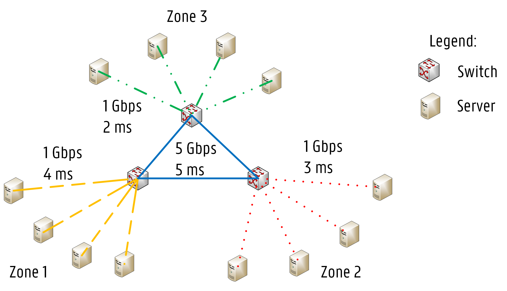
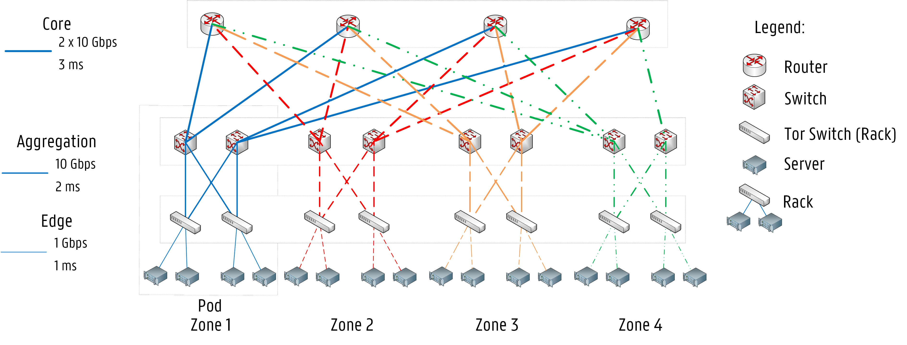
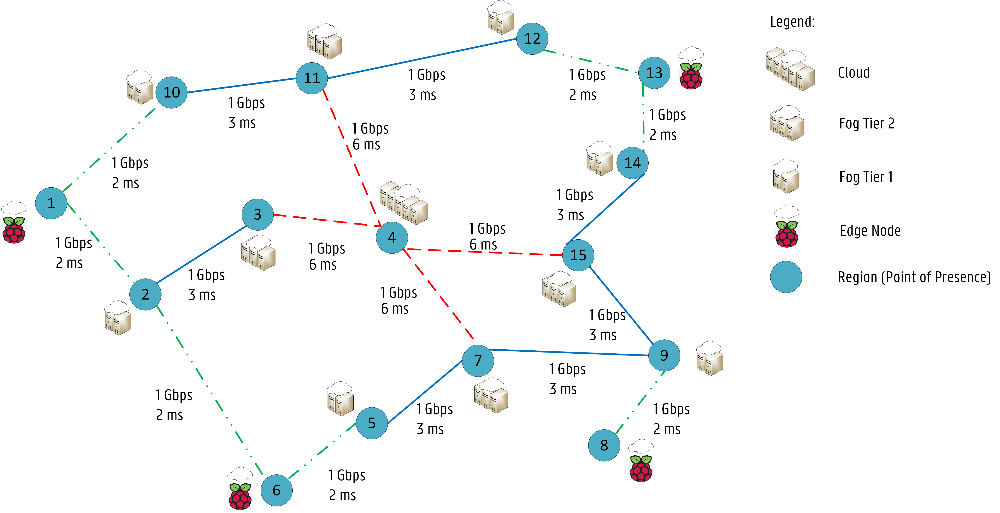
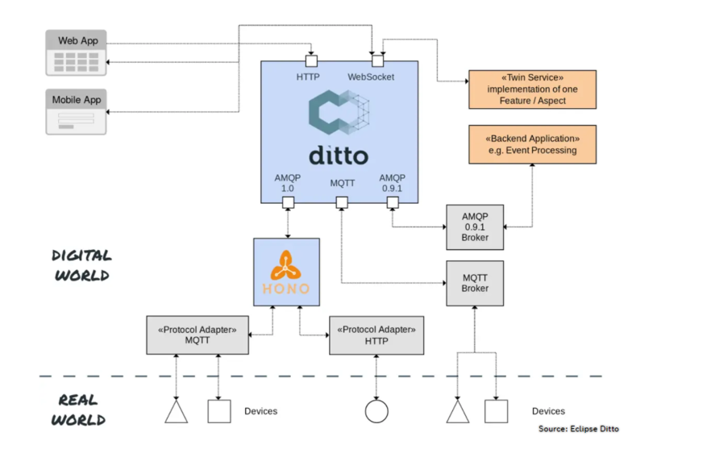
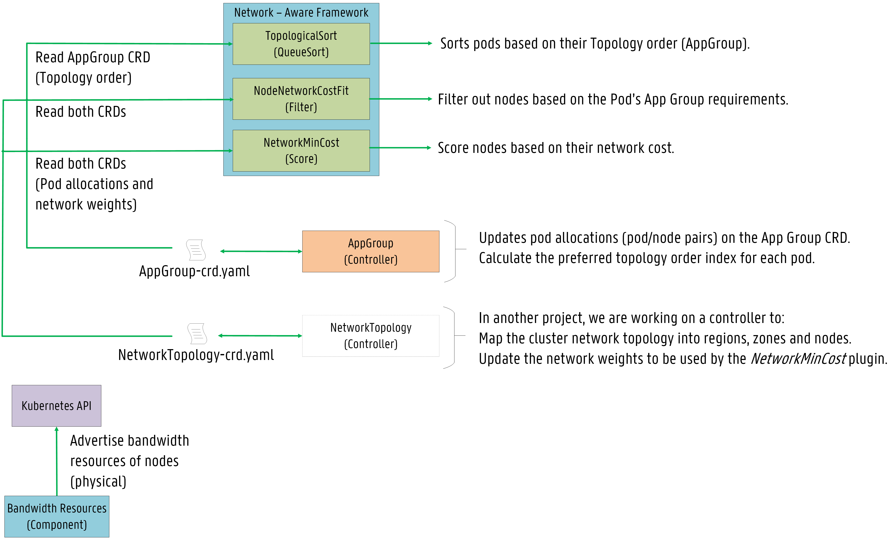
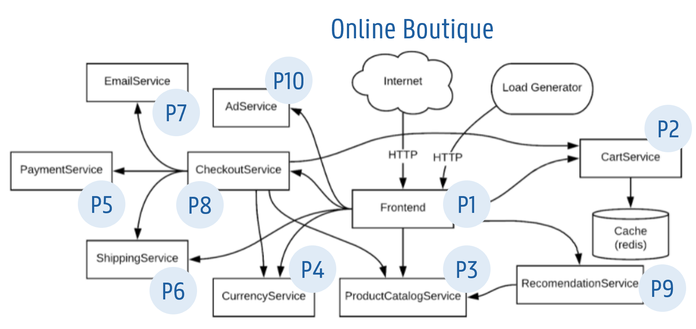
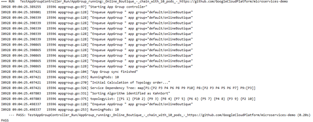
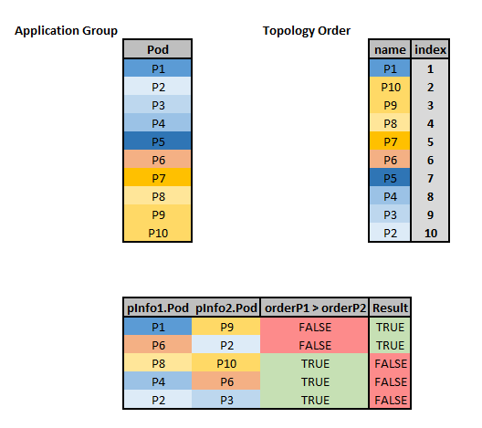
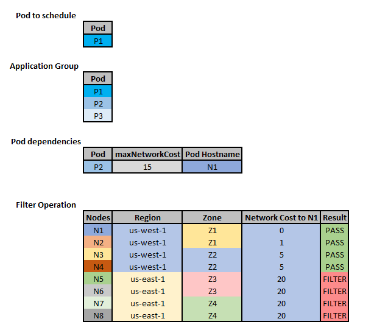
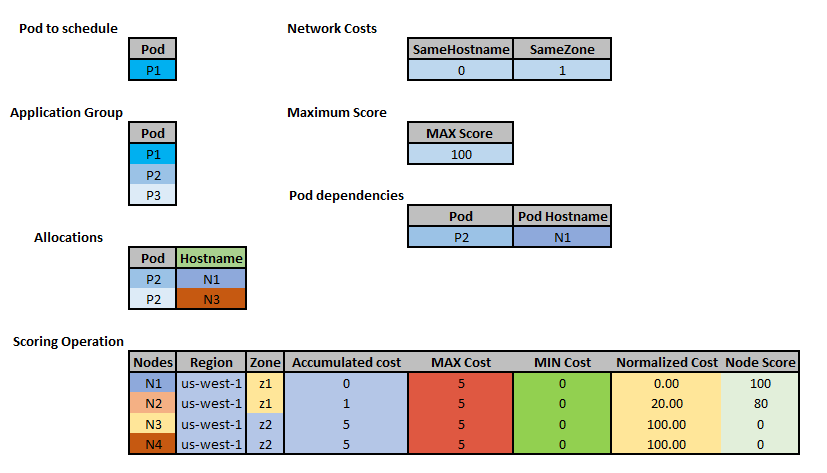

# Network-Aware Scheduling

## Table of Contents

<!-- toc -->
- [Summary](#summary)
- [Motivation](#motivation)
  - [Goals](#goals)
  - [Non-Goals](#non-goals)
  - [Use cases / Topologies](#use-cases--topologies)
    - [1 - Spark/Database applications running in Data centers or small scale cluster topologies](#1---sparkdatabase-applications-running-in-data-centers-or-small-scale-cluster-topologies)
    - [2 - Cloud2Edge application running on a multi-region geo-distributed cluster.](#2---cloud2edge-application-running-on-a-multi-region-geo-distributed-cluster)
- [Proposal - Design &amp; Implementation details](#proposal---design--implementation-details)
  - [Overview of the System Design](#overview-of-the-system-design)
  - [Application Group CRD](#application-group-crd)
    - [Example](#example)
    - [AppGroup Test based on Online Boutique](#appgroup-test-based-on-online-boutique)
  - [Network Topology CRD](#network-topology-crd)
    - [Example](#example-1)
  - [The inclusion of bandwidth in the scheduling process](#the-inclusion-of-bandwidth-in-the-scheduling-process)
    - [Bandwidth Requests via extended resources](#bandwidth-requests-via-extended-resources)
    - [Bandwidth Limitations via the Bandwidth CNI plugin](#bandwidth-limitations-via-the-bandwidth-cni-plugin)
    - [Example](#example-2)
  - [The Network-aware scheduling Plugins](#the-network-aware-scheduling-plugins)
    - [Description of the <code>TopologicalSort</code> plugin](#description-of-the--plugin)
      - [<code>TopologicalSort</code> Example](#-example)
    - [Description of the <code>NetworkOverhead</code> plugin](#description-of-the--plugin-1)
      - [Extension point: Filter](#extension-point-filter)
      - [<code>NetworkOverhead</code> Filter Example](#-filter-example)
      - [Extension point: Score](#extension-point-score)
      - [<code>NetworkOverhead</code> Score Example](#-score-example)
- [Known limitations](#known-limitations)
- [Test plans](#test-plans)
- [Production Readiness Review Questionnaire](#production-readiness-review-questionnaire)
  - [Scalability](#scalability)
  - [Troubleshooting](#troubleshooting)
- [Graduation criteria](#graduation-criteria)
- [Implementation history](#implementation-history)
<!-- /toc -->

# Summary

This proposal introduces an end-to-end solution to model/weight a cluster's network latency and 
topological information, and leverage that to better schedule latency- and bandwidth-sensitive workloads.

# Motivation

Many applications are latency-sensitive, demanding lower latency between microservices in the application.
Scheduling policies that aim to reduce costs or increase resource efficiency are not enough for applications
where end-to-end latency becomes a primary objective.

Applications such as the Internet of Things (IoT), multi-tier web services, and video streaming services
would benefit the most from network-aware scheduling policies, which consider latency and bandwidth
in addition to the default resources (e.g., CPU and memory) used by the scheduler.

Users encounter latency issues frequently when using multi-tier applications.
These applications usually include tens to hundreds of microservices with complex interdependencies.
Distance from servers is usually the primary culprit.
The best strategy is to reduce the latency between chained microservices in the same application,
according to the prior work about [Service Function Chaining](https://www.sciencedirect.com/science/article/pii/S1084804516301989) (SFC).

Besides, bandwidth plays an essential role for those applications with high volumes of data transfers 
among microservices. For example, multiple replicas in a database application may require frequent 
copies to ensure data consistency. [Spark jobs](https://spark.apache.org/) may have frequent data transfers 
among map and reduce nodes. Insufficient network capacity in nodes would lead to increasing delay or packet 
drops, which will degrade the Quality of Service (QoS) for applications.

We propose two **Network-Aware Scheduling Plugins** for Kubernetes that focus on delivering low latency to end-users
and ensuring bandwidth reservations in pod scheduling.

This work significantly extends the previous work open-sourced [here](https://github.com/jpedro1992/sfc-controller) 
that implements a latency-aware scheduler extender based on the [scheduler extender](https://github.com/kubernetes/community/blob/master/contributors/design-proposals/scheduling/scheduler_extender.md) design.

## Goals

- Define microservice dependencies in an Application via custom resources (**AppGroup CRD**).
- Describe the network topology for the underlying cluster via weights between regions (`topology.kubernetes.io/region`) and zones (`topology.kubernetes.io/zone`) via custom resources (**NetworkTopology CRD**).
- Make existing scheduler plugins aware of network bandwidth by advertise the nodes' (physical) bandwidth capacity as [extended resources](https://kubernetes.io/docs/tasks/administer-cluster/extended-resource-node/).
- Provide a **QueueSort** plugin [TopologicalSort](https://en.wikipedia.org/wiki/Topological_sorting), which orders pods to be scheduled in an **AppGroup** based on their dependencies.
- Provide **network-aware Filter & Score** plugins to filter out nodes based 
on microservice dependencies defined in **AppGroup** and score nodes with lower network costs (described in **NetworkTopology**) higher to achieve latency-aware scheduling.  

## Non-Goals

- Descheduling due to unexpected outcomes is not addressed in this proposal.
- The conflict between plugins in this proposal and other plugins are not studied in this proposal. 
Users are welcome to try plugins in this proposal with other plugins (e.g., `RequestedToCapacityRatio`, 
`BalancedAllocation`). However, a higher weight must be given to our plugin ensuring low network costs 
are preferred.

## Use cases / Topologies 

### 1 - Spark/Database applications running in Data centers or small scale cluster topologies

Network-aware scheduling examines the infrastructure topology, 
so network latency and bandwidth between nodes are considered while making scheduling decisions.
Data centers with fat-tree topology or cluster topology can benefit from our network-aware framework, 
as network conditions (i.e., network latency, available bandwidth) between nodes can vary according to their 
locations in the infrastructure. 

<p align="center"></p>

<p align="center"></p>

Deploying microservices on different sets of nodes will impact the application's response time. 
For specific applications, latency and bandwidth requirements can be critical.  
For example, in a [Redis cluster](https://redis.io/topics/cluster-tutorial), 
master nodes need to synchronize data with slave nodes frequently. Namely, there are dependencies between the 
masters and the slaves. High latency or low bandwidth between masters and slaves can lead to slow CRUD operations.

<p align="center"></p>

### 2 - Cloud2Edge application running on a multi-region geo-distributed cluster.

Multi-region Geo-distributed scenarios benefit the most from our framework and network-aware plugins. 

<p align="center"></p>

High latency is a big concern in these topologies, especially for IoT applications 
(e.g., [Eclipse Hono](https://github.com/eclipse/hono), [Eclipse Cloud2Edge](https://www.eclipse.org/packages/packages/cloud2edge/)). 
For example, in the Cloud2Edge platform, there are several dependencies among the several APIs and MQTT brokers where devices connect to:

<p align="center"></p>

# Proposal - Design & Implementation details

## Overview of the System Design

The proposal introduces two [Custom Resources (CRs)](https://kubernetes.io/docs/concepts/extend-kubernetes/api-extension/custom-resources/) 
defined as Custom Resource Definitions (CRDs): 

- **AppGroup CRD**: abstracts the service topology to maintain application microservice dependencies. 
- **NetworkTopology CRD**: abstracts the network infrastructure to establish network weights between regions and zones in the cluster.
 
Thus, both application and infrastructure network topology are considered during scheduling. 

The proposal also presents a bandwidth resource component (DaemonSet) to advertise bandwidth resources 
as **extended resources** to allow already available filter/scoring plugins (e.g., `PodFitsResources`, 
`BalancedAlocation`) to consider bandwidth allocation.

As an initial design, we plan to implement two plugins:  
- A **QueueSort** function named `TopologicalSort` sorts pods based on their topology order. 
Workload dependencies are defined in the AppGroup CRD and then the AppGroup controller via topology sorting algorithms calculates the preferred sequence to schedule these workloads. 
The plugin favors pods with lower indexes. 

- A **Filter & Score** plugin named `NetworkOverhead` where nodes are filtered out if they cannot support the 
network requirements of the Pod's AppGroup or scored based on network weights ensuring network latency is minimized for pods belonging to the same application.

Further explanations are given below on how the proposed plugins interact with both CRDs. 

<p align="center"></p>

## Application Group CRD

We designed an [AppGroup CRD](https://github.com/jpedro1992/scheduler-plugins/blob/kepDev/manifests/appgroup/crd.yaml) for service chains leveraging on the [Pod Group](https://github.com/kubernetes-sigs/scheduler-plugins/blob/master/kep/42-podgroup-coscheduling/README.md) concept introduced for the Co-scheduling plugin. 

The AppGroup associates different workloads (e.g., pods) based on service topology information.

<!-- CRD commented:
```yaml
# App Group CRD spec
apiVersion: apiextensions.k8s.io/v1
kind: CustomResourceDefinition
metadata:
  annotations:
    api-approved.kubernetes.io: "To be Defined" # edited manually
    controller-gen.kubebuilder.io/version: v0.6.2
  creationTimestamp: null
  name: appgroups.scheduling.sigs.x-k8s.io
spec:
  group: scheduling.sigs.x-k8s.io
  names:
    kind: AppGroup
    listKind: AppGroupList
    plural: appgroups
    singular: appgroup
    shortNames:
      - ag
      - ags
  scope: Namespaced
  versions:
  - name: v1alpha1
    schema:
      openAPIV3Schema:
        description: AppGroup establishes a service dependency graph among different Pods.
        properties:
          apiVersion:
            description: 'APIVersion defines the versioned schema of this representation
              of an object. Servers should convert recognized schemas to the latest
              internal value, and may reject unrecognized values. More info: https://git.k8s.io/community/contributors/devel/sig-architecture/api-conventions.md#resources'
            type: string
          kind:
            description: 'Kind is a string value representing the REST resource this
              object represents. Servers may infer this from the endpoint the client
              submits requests to. Cannot be updated. In CamelCase. More info: https://git.k8s.io/community/contributors/devel/sig-architecture/api-conventions.md#types-kinds'
            type: string
          metadata:
            type: object
          spec:
            description: AppGroup defines the number of Pods and which Pods belong to the group.
            properties:
              numMembers:
                format: int32
                type: integer
                minimum: 1
                description: Number of Pods belonging to the App Group
              topologySortingAlgorithm:
                type: string
                description: The algorithm for TopologyOrder (Status)
              workloads:
                description: The workloads belonging to the group array of AppGroupWorkload
                items:
                  description: AppGroupWorkload contains information about one Workload.
                  properties:
                    workload:
                      items:
                        description: Workload Reference (name, apiVersion, Kind)
                        properties:
                          kind:
                            description: Kind is a string value representing the REST resource.
                            type: string
                          apiVersion:
                            description: APIVersion defines the versioned schema of an object. 
                            type: string 
                          namespace:
                            description: Represents the namespace of the Object
                            type: string
                          name: 
                            description: Represents the name of the Object
                            type: string
                        required:
                        - kind
                        - apiVersion
                        - namespace
                        - name
                        type: object
                    dependencies:
                      items:
                        description: DependenciesList establishes dependencies between workloads.
                        properties:
                          workload:
                            items:
                              description: Workload Reference (name, apiVersion, Kind)
                              properties:
                                kind:
                                  description: Kind is a string value representing the REST resource.
                                  type: string
                                apiVersion:
                                  description: APIVersion defines the versioned schema of an object. 
                                  type: string 
                                namespace:
                                  description: Represents the namespace of the Object
                                  type: string
                                name: 
                                  description: Represents the name of the Object
                                  type: string
                              required:
                              - kind
                              - apiVersion
                              - namespace
                              - name
                              type: object
                          minBandwidth:
                            anyOf:
                            - type: integer
                            - type: string
                            description: Bandwidth demand between two workloads.
                            pattern: ^(\+|-)?(([0-9]+(\.[0-9]*)?)|(\.[0-9]+))(([KMGTPE]i)|[numkMGTPE]|([eE](\+|-)?(([0-9]+(\.[0-9]*)?)|(\.[0-9]+))))?$
                            x-kubernetes-int-or-string: true
                          maxNetworkCost:
                            type: integer
                            default: 0
                            minimum: 0
                            maximum: 10000
                            format: int64
                            description: The max Network Cost between two workloads.
                        required:
                        - workload
                        type: object
                      type: array
                  required:
                  - workload
                  type: object
                type: array
            required:
            - numMembers
            - topologySortingAlgorithm
            - workloads
            type: object
          status:
            description: Record the number of workload allocations and the favored topology order.
            properties:
              runningWorkloads:
                description: The number of actively running workloads (e.g., pods).
                format: int32
                type: integer
                minimum: 0
              scheduleStartTime:
                description: ScheduleStartTime of the AppGroup
                format: date-time
                type: string
              topologyCalculationTime:
                description: topologyCalculationTime of the AppGroup
                format: date-time
                type: string
              topologyOrder:
                description: The optimal order to schedule workloads on this App Group based on a given algorithm.
                items:
                  description: Workload reference and Priority index
                  properties:
                    workload:
                      items:
                        description: Workload Reference (Kind, apiVersion, namespace, name)
                        properties:
                          kind:
                            description: Kind is a string value representing the REST resource.
                            type: string
                          apiVersion:
                            description: APIVersion defines the versioned schema of an object. 
                            type: string 
                          namespace:
                            description: Represents the namespace of the Object
                            type: string
                          name: 
                            description: Represents the name of the Object
                            type: string
                          required:
                          - kind
                          - apiVersion
                          - namespace
                          - name
                          type: object    
                    index:
                      type: integer
                      default: 1
                      minimum: 1
                      format: int64
                      description: Priority index for each workload (e.g., 1, 2, ...)
                          (1 means workload should be scheduled first in the AppGroup)
                  type: object
                type: array
            type: object
        type: object
    served: true
    storage: true
status:
  acceptedNames:
    kind: ""
    plural: ""
  conditions: []
  storedVersions: []
```
-->

### Example

<p align="center"></p>

```yaml
# Example App Group CRD spec
apiVersion: scheduling.sigs.x-k8s.io/v1alpha1
kind: AppGroup
metadata:
  name: a1
spec:
  numMembers: 3
  topologySortingAlgorithm: KahnSort
  workloads: 
    - workload:
        kind: Deployment
        apiVersion: apps/v1
        namespace: default
        name: P1
      dependencies:
        - workload: 
            kind: Deployment
            apiVersion: apps/v1
            namespace: default
            name: P2
          minBandwidth: "100Mi"
          maxNetworkCost: 30
    - workload: 
        kind: Deployment
        apiVersion: apps/v1
        namespace: default
        name: P2
      dependencies:
        - workload:
            kind: Deployment
            apiVersion: apps/v1
            namespace: default
            name: P3
          minBandwidth: "250Mi"
          maxNetworkCost: 20
    - workload:
        kind: Deployment
        apiVersion: apps/v1
        namespace: default
        name: P3
```

An AppGroup controller updates the AppGroup CR regarding the preferred topology order for scheduling workloads. 

Currently, six algorithms are supported for topological sorting: 

- [**KahnSort**](https://www.geeksforgeeks.org/topological-sorting-indegree-based-solution/).
- [**TarjanSort**](https://www.geeksforgeeks.org/tarjan-algorithm-find-strongly-connected-components/). 
- Alternate Kahn. 
- Alternate Tarjan.
- Reverse Kahn. 
- Reverse Tarjan. 

Alternate Kahn modifies the order given by Kahn by selecting the first element of Kahn as its first element, 
the last of Kahn as its second, the second of Kahn as its third, and so on. 
AlternateTarjan follows the same pattern of AlternateKahn and modifies the order of Tarjan. 

ReverseKahn and ReverseTarjan essentially reverse the order given by Kahn and Tarjan, respectively. 

The implementation is based on the work open-sourced [here](https://github.com/otaviokr/topological-sort).
Each workload has an index based on the sorting algorithm. An index of 1 means the workload should be allocated first in the AppGroup.

```go
// AppGroupController is a controller that process App groups using provided Handler interface
type AppGroupController struct {
	eventRecorder   record.EventRecorder
	agQueue         workqueue.RateLimitingInterface
	agLister        schedlister.AppGroupLister
	podLister       corelister.PodLister
	agListerSynced  cache.InformerSynced
	podListerSynced cache.InformerSynced
	agClient        schedclientset.Interface
}
```

```go
// +genclient
// +k8s:deepcopy-gen:interfaces=k8s.io/apimachinery/pkg/runtime.Object

// AppGroup is a collection of Pods belonging to the same application
type AppGroup struct {
	metav1.TypeMeta `json:",inline"`

	// Standard object's metadata.
	// +optional
	metav1.ObjectMeta `json:"metadata,omitempty" protobuf:"bytes,1,opt,name=metadata"`

	// AppGroupSpec defines the Min and Max for Quota.
	// +optional
	Spec AppGroupSpec `json:"spec,omitempty" protobuf:"bytes,2,opt,name=spec"`

	// AppGroupStatus defines the observed use.
	// +optional
	Status AppGroupStatus `json:"status,omitempty" protobuf:"bytes,3,opt,name=status"`
}

// AppGroupSpec represents the template of a app group.
type AppGroupSpec struct {
	// NumMembers defines the number of Pods belonging to the App Group
	NumMembers int32 `json:"numMembers,omitempty" protobuf:"bytes,1,opt,name=numMembers"`

	// The preferred Topology Sorting Algorithm
	TopologySortingAlgorithm string `json:"topologySortingAlgorithm,omitempty" protobuf:"bytes,2,opt,name=topologySortingAlgorithm"`

	// Workloads defines the workloads belonging to the Appgroup
	Workloads AppGroupWorkloadList `json:"workloads,omitempty" protobuf:"bytes,3,opt,name=workloads, casttype=AppGroupWorkloadList"`
}

// AppGroupWorkloadList contains an array of AppGroupWorkload objects.
// +protobuf=true
type AppGroupWorkloadList []AppGroupWorkload

// AppGroupWorkload represents the Workloads belonging to the App Group.
// +protobuf=true
type AppGroupWorkload struct {
	// Workload reference Info.
	Workload AppGroupWorkloadInfo `json:"workload,omitempty" protobuf:"bytes,1,opt,name=workload, casttype=AppGroupWorkloadInfo"`

	// Dependencies of the Workload. 
	Dependencies DependenciesList `json:"dependencies,omitempty" protobuf:"bytes,2,opt,name=dependencies, casttype=DependenciesList"`
}

// AppGroupWorkloadInfo contains information about one workload.
// +protobuf=true
type AppGroupWorkloadInfo struct {
	// Kind of the workload; info: https://git.k8s.io/community/contributors/devel/sig-architecture/api-conventions.md#types-kinds" 
	Kind string `json:"kind,omitempty" protobuf:"bytes,1,opt,name=kind"`

	// Name represents the workload, info: http://kubernetes.io/docs/user-guide/identifiers#names
	Name string `json:"name,omitempty" protobuf:"bytes,2,opt,name=name"`

	// ApiVersion defines the versioned schema of an object. 
	//+optional 
	APIVersion string `json:"apiVersion,omitempty" protobuf:"bytes,3,opt,name=apiVersion"`
	
	// Namespace of the workload
	//+optional
	Namespace string `json:"namespace,omitempty" protobuf:"bytes,4,opt,name=namespace"`
}

// DependenciesInfo contains information about one dependency.
// +protobuf=true
type DependenciesInfo struct {
	// Workload reference Info.
	Workload AppGroupWorkloadInfo `json:"workload,omitempty" protobuf:"bytes,1,opt,name=workload, casttype=AppGroupWorkloadInfo"`

	// MinBandwidth between workloads
	// +optional
	MinBandwidth resource.Quantity `json:"minBandwidth,omitempty" protobuf:"bytes,2,opt,name=minBandwidth"`

	// Max Network Cost between workloads
	// +optional
	MaxNetworkCost int64 `json:"maxNetworkCost,omitempty" protobuf:"bytes,3,opt,name=maxNetworkCost"`
}

// DependenciesList contains an array of DependenciesInfo objects.
// +protobuf=true
type DependenciesList []DependenciesInfo

// AppGroupStatus represents the current state of a app group.
type AppGroupStatus struct {
	// The number of actively running workloads (e.g., pods).
	// +optional
	RunningWorkloads int32 `json:"runningWorkloads,omitempty" protobuf:"bytes,1,opt,name=runningWorkloads"`

	// ScheduleStartTime of the group
	ScheduleStartTime metav1.Time `json:"scheduleStartTime,omitempty" protobuf:"bytes,2,opt,name=scheduleStartTime"`

	// TopologyCalculationTime of the group
	TopologyCalculationTime metav1.Time `json:"topologyCalculationTime,omitempty" protobuf:"bytes,3,opt,name=topologyCalculationTime"`

	// Topology order for TopSort plugin (QueueSort)
	TopologyOrder TopologyList `json:"topologyOrder,omitempty" protobuf:"bytes,4,opt,name=topologyOrder,casttype=TopologyList"`
}

// AppGroupTopologyInfo represents the calculated order for a given Workload.
// +protobuf=true
type AppGroupTopologyInfo struct {
    // Workload reference Info. 
    Workload AppGroupWorkloadInfo `json:"workload,omitempty" protobuf:"bytes,1,opt,name=workload, casttype=AppGroupWorkloadInfo"`
    
    // Topology index. 
    Index int32  `json:"index,omitempty" protobuf:"bytes,2,opt,name=index"`
}

// TopologyList contains an array of TopologyInfo.
// +protobuf=true
type TopologyList []AppGroupTopologyInfo

// +k8s:deepcopy-gen:interfaces=k8s.io/apimachinery/pkg/runtime.Object

// AppGroupList is a collection of app groups.
type AppGroupList struct {
	metav1.TypeMeta `json:",inline"`
	// Standard list metadata
	// +optional
	metav1.ListMeta `json:"metadata,omitempty"`

	// Items is the list of AppGroup
	Items []AppGroup `json:"items"`
}
```

### AppGroup Test based on Online Boutique

In this test, an AppGroup is created for the [Online Boutique application](https://github.com/GoogleCloudPlatform/microservices-demo).
It consists of 11 workloads each one corresponding to a group of Pods, which we named from P1 - P11. 

<p align="center"></p>

As shown below, the preferred order for the KahnSort algorithm is P1, P10, P9, P8, P7, P6, P5, P4, P3, P2, P11. 

We attribute an **index** to each workload to evaluate their topology preference in the **Less function of the TopologicalSort plugin** described [here](#description-of-the-topologicalsort).
The topology list corresponds to:

```go
topologyList = [(P1 1) (P10 2) (P9 3) (P8 4) (P7 5) (P6 6) (P5 7) (P4 8) (P3 9) (P2 10) (P11 11)]
```

<p align="center"></p>

Significant differences in the ordering of workloads are obtained depending on which topology algorithm 
is selected, as shown in the next Table:

<div align="center">

| Sorting Algorithm     | Topological order |
| -------------         |   ------------- |
|  Kahn                 | P1, P10, P9, P8, P7, P6, P5, P4, P3, P2, P11. |
|  Alternate Kahn       | P1, P11, P10, P2, P9, P3, P8, P4, P7, P5, P6. |
|  Reverve Kahn         | P11, P2, P3, P4, P5, P6, P7, P8, P9, P10, P1. |
|  Tarjan               | P1, P8, P7, P5, P4, P2, P11, P9, P10, P6, P3. |
|  Alternate Tarjan     | P1, P3, P8, P6, P7, P10, P5, P9, P4, P11, P2. |
|  Reverve Tarjan       | P3, P6, P10, P9, P11, P2, P4, P5, P7, P8, P1. |

</div>

## Network Topology CRD

We also designed a [NetworkTopology CRD](https://github.com/jpedro1992/scheduler-plugins/blob/kepDev/manifests/networktopology/crd.yaml) leveraging on the current [NodeResourceTopology CRD](https://github.com/kubernetes-sigs/scheduler-plugins/tree/master/pkg/noderesourcetopology).
The goal is to store and update network costs for nodes across regions, zones, or within zones.  

As an initial design, network weights can be manually defined in a single NetworkTopology CR where network costs between
zones and between regions are specified.

As a separate project, we are providing a [networkTopology controller](https://github.com/jpedro1992/network-topology-controller) in the future. The controller is designed to react to node additions, updates, or removals, and also update the network weights based on latency measurements. 

A [netperf component](https://github.com/jpedro1992/pushing-netperf-metrics-to-prometheus/tree/main) has been developed to execute netperf tests based on the nodes available in the infrastructure. It allows estimating the latency between nodes in the cluster, especially different latency percentiles (i.e., 50th, 90th, and 99th percentile). Latency probing for all pairwise nodes is costly for large-scale clusters. Hence, the initial design assumes that the intra-zone cost between nodes is homogeneous and only the latencies between zones and regions need to be measured.

These measurements are stored and updated in a configmap as key-value pairs with **origin** and **destination** as labels. Then, the networkTopology controller accesses the configmap to extract the netperf measurements and calculates accurate network costs across regions and zones in the cluster. The networkTopology controller can then dynamically update the CR accordingly, so scheduling plugins always use the updated network weights instead of the one-time manually configured weights. 

The periodical probing of the network latency via the netperf component is only necessary for one pair of nodes between zones/regions. One-time probing between a single pair of nodes is sufficient if nodes within a zone have similar connections. Therefore, the probing is limited, avoiding significant overhead for large-scale clusters.
 
Furthermore, the networkTopology controller can work with any customized software components that update the configmap. Thus, cloud administrators/developers are free to use different components to obtain network costs according to their own preferences. 

Also, the networkTopology controller will maintain the available bandwidth capacity (i.e., bandwidthAllocatable) between regions and zones in the cluster. Pod allocations and corresponding workload dependencies are read from an AppGroup lister, and bandwidth reservations are saved in the networkTopology CR based on pod deployments.

<!-- CRD commented:
```yaml
# Network CRD spec
apiVersion: apiextensions.k8s.io/v1
kind: CustomResourceDefinition
metadata:
  annotations:
    api-approved.kubernetes.io: "To be Defined" # edited manually
    controller-gen.kubebuilder.io/version: v0.6.2
  creationTimestamp: null
  name: networktopologies.scheduling.sigs.x-k8s.io
spec:
  group: scheduling.sigs.x-k8s.io
  names:
    kind: NetworkTopology
    listKind: NetworkTopologyList
    plural: networktopologies
    singular: networktopology
    shortNames:
      - net-topo
      - nt
  scope: Namespaced
  versions:
    - name: v1alpha1
      schema:
        openAPIV3Schema:
          description: Network Topology describes the cluster network topology.
          properties:
            apiVersion:
              description: 'APIVersion defines the versioned schema of this representation
              of an object. Servers should convert recognized schemas to the latest
              internal value, and may reject unrecognized values. More info: https://git.k8s.io/community/contributors/devel/sig-architecture/api-conventions.md#resources'
              type: string
            kind:
              description: 'Kind is a string value representing the REST resource this
              object represents. Servers may infer this from the endpoint the client
              submits requests to. Cannot be updated. In CamelCase. More info: https://git.k8s.io/community/contributors/devel/sig-architecture/api-conventions.md#types-kinds'
              type: string
            metadata:
              type: object
            spec:
              description: NetworkTopology defines the zones and regions of the cluster.
              properties:
                weights:
                  description: The weights of the cluster (WeightList)
                  items:
                    description: WeightInfo contains information about weights of a given algorithm.
                    properties:
                      name:
                        type: string
                        description: Algorithm Name (e.g., UserDefined)
                      costList:
                        description: Define weights for cross regions and zones in the cluster (CostList)
                        items:
                          description: OriginInfo contains information about one region.
                          properties:
                            topologyKey:
                               type: string
                               description: Topology Key (e.g., "topology.kubernetes.io/region", "topology.kubernetes.io/zone")
                            originCosts:
                               description: OriginCosts contains an array of OriginInfo objects (OriginList).
                               items:
                                 description: OriginInfo contains information about one origin.
                                 properties:
                                   origin:
                                     type: string
                                     description: Origin Name
                                   costs:
                                     description: Costs contains an array of CostInfo objects.
                                     items:
                                       description: CostInfo contains costs related to one origin.
                                       properties:
                                         destination:
                                           type: string
                                           description: Region name (Destination)
                                         bandwidthCapacity:
                                           anyOf:
                                           - type: integer
                                           - type: string
                                           description: Bandwidth Capacity between Origin and Destination.
                                           pattern: ^(\+|-)?(([0-9]+(\.[0-9]*)?)|(\.[0-9]+))(([KMGTPE]i)|[numkMGTPE]|([eE](\+|-)?(([0-9]+(\.[0-9]*)?)|(\.[0-9]+))))?$
                                           x-kubernetes-int-or-string: true
                                         bandwidthAllocated:
                                           anyOf:
                                           - type: integer
                                           - type: string
                                           description: Bandwidth allocated between Origin and Destination.
                                           pattern: ^(\+|-)?(([0-9]+(\.[0-9]*)?)|(\.[0-9]+))(([KMGTPE]i)|[numkMGTPE]|([eE](\+|-)?(([0-9]+(\.[0-9]*)?)|(\.[0-9]+))))?$
                                           x-kubernetes-int-or-string: true
                                         networkCost:
                                           type: integer
                                           default: 0
                                           minimum: 0
                                           format: int64
                                           description: Cost from Origin to Destination
                                       required:
                                       - destination
                                       - bandwidthCapacity
                                       - networkCost
                                       type: object
                                     type: array
                                 required:
                                 - origin
                                 - costs
                                 type: object
                               type: array
                          required:
                          - topologyKey
                          - originCosts
                          type: object
                        type: array  
                    required:
                    - name
                    - costList
                    type: object
                  type: array
                configmapName:
                  description: ConfigmapName to be used for cost calculation
                  type: string
              required:
              - weights
              - configmapName
              type: object
            status:
              description: Record nodeCount and weight calculation time.
              properties:
                nodeCount:
                  description: The number of nodes in the cluster.
                  format: int64
                  type: integer
                  minimum: 0
                weightCalculationTime:
                  description: weightCalculationTime for calculated weights
                  format: date-time
                  type: string
              type: object
          type: object
      served: true
      storage: true
status:
  acceptedNames:
    kind: ""
    plural: ""
  conditions: []
  storedVersions: []
```
-->

### Example

Let's consider the following NetworkTopology CRD as an example: 

```yaml
# Example Network CRD 
apiVersion: scheduling.sigs.x-k8s.io/v1alpha1
kind: NetworkTopology
metadata:
  name: net-topology-test
  namespace: default
spec:
  configMapName: "netperfMetrics"
  weights:
    # Region label: "topology.kubernetes.io/region"
    # Zone Label:   "topology.kubernetes.io/zone"
    # 2 Regions:  us-west-1
    #             us-east-1
    # 4 Zones:    us-west-1: z1, z2
    #             us-east-1: z3, z4
    - name: "UserDefined"
      costList: # Define weights between regions or between zones 
        - topologyKey: "topology.kubernetes.io/region" # region costs
          originCosts:
            - origin: "us-west-1"
              costs:
                - destination: "us-east-1"
                  bandwidthCapacity: "10Gi"
                  networkCost: 20
            - origin: "us-east-1"
              costs:
                - destination: "us-west-1"
                  bandwidthCapacity: "10Gi"
                  networkCost: 20
        - topologyKey: "topology.kubernetes.io/zone" # zone costs
          originCosts:
            - origin: "z1"
              costs:
                - destination: "z2"
                  bandwidthCapacity: "1Gi"
                  networkCost: 5
            - origin: "z2"
              costs:
                - destination: "z1"
                  bandwidthCapacity: "1Gi"
                  networkCost: 5
            - origin: "z3"
              costs:
                - destination: "z4"
                  bandwidthCapacity: "1Gi"
                  networkCost: 10
            - origin: "z4"
              costs:
                - destination: "z3"
                  bandwidthCapacity: "1Gi"
                  networkCost: 10
```

```go
// +genclient
// +k8s:deepcopy-gen:interfaces=k8s.io/apimachinery/pkg/runtime.Object

// NetworkTopology defines network costs in the cluster between regions and zones
type NetworkTopology struct {
	metav1.TypeMeta `json:",inline"`

	// Standard object's metadata.
	// +optional
	metav1.ObjectMeta `json:"metadata,omitempty" protobuf:"bytes,1,opt,name=metadata"`

	// NetworkTopologySpec defines the Min and Max for Quota.
	// +optional
	Spec NetworkTopologySpec `json:"spec,omitempty" protobuf:"bytes,2,opt,name=spec"`

	// NetworkTopologyStatus defines the observed use.
	// +optional
	Status NetworkTopologyStatus `json:"status,omitempty" protobuf:"bytes,3,opt,name=status"`
}

// NetworkTopologySpec represents the template of a NetworkTopology.
type NetworkTopologySpec struct {
	// The manual defined weights of the cluster
	Weights WeightList `json:"weights,omitempty" protobuf:"bytes,1,rep,name=weights,casttype=WeightList"`

	// ConfigmapName to be used for cost calculation (To be used by the Network Topology Controller)
	ConfigmapName string `json:"configmapName,omitempty" protobuf:"bytes,2,opt,name=configmapName"`
}

// NetworkTopologyStatus represents the current state of a Network Topology.
type NetworkTopologyStatus struct {
	// The total number of nodes in the cluster
	NodeCount int64 `json:"nodeCount,omitempty" protobuf:"bytes,1,opt,name=nodeCount"`

	// The calculation time for the weights in the network topology CRD
	WeightCalculationTime metav1.Time `json:"weightCalculationTime,omitempty" protobuf:"bytes,2,opt,name=weightCalculationTime"`
}

// WeightList contains an array of WeightInfo objects.
// +protobuf=true
type WeightList []WeightInfo

// CostList contains an array of TopologyInfo objects.
// +protobuf=true
type CostList []TopologyInfo

// WeightInfo contains information about all network costs for a given algorithm.
// +protobuf=true
type WeightInfo struct {
	// Algorithm Name for network cost calculation (e.g., userDefined)
	Name string `json:"name,omitempty" protobuf:"bytes,1,opt,name=name"`

	// Costs between regions and zones
	CostList CostList `json:"costList,omitempty" protobuf:"bytes,2,rep,name=costList,casttype=CostList"`
}

// TopologyInfo contains information about network costs for a particular Topology Key.
// +protobuf=true
type TopologyInfo struct {
	// Topology key (e.g., "topology.kubernetes.io/region", "topology.kubernetes.io/zone").
	TopologyKey string `json:"topologyKey,omitempty" protobuf:"bytes,1,opt,name=topologyKey"`

	// OriginCosts for a particular origin.
	OriginCosts OriginList `json:"originCosts,omitempty" protobuf:"bytes,2,rep,name=originCosts,casttype=OriginList"`
}

// OriginList contains an array of OriginInfo objects.
// +protobuf=true
type OriginList []OriginInfo

// OriginInfo contains information about network costs for a particular Origin.
// +protobuf=true
type OriginInfo struct {
	// Name of the origin (e.g., Region Name, Zone Name).
	Origin string `json:"origin,omitempty" protobuf:"bytes,1,opt,name=origin"`

	// Costs for the particular origin.
	Costs []CostInfo `json:"costs,omitempty" protobuf:"bytes,2,rep,name=costs,casttype=CostInfo"`
}

// CostInfo contains information about networkCosts.
// +protobuf=true
type CostInfo struct {
	// Name of the destination (e.g., Region Name, Zone Name).
	Destination string `json:"destination,omitempty" protobuf:"bytes,1,opt,name=destination"`

	// Bandwidth capacity between origin and destination.
	// +optional
	BandwidthCapacity resource.Quantity `json:"bandwidthCapacity,omitempty" protobuf:"bytes,2,opt,name=bandwidthCapacity"`

	// Bandwidth allocatable between origin and destination.
	// +optional
	BandwidthAllocatable resource.Quantity `json:"bandwidthAllocatable,omitempty" protobuf:"bytes,3,opt,name=bandwidthAllocatable"`

	// Network Cost between origin and destination (e.g., Dijkstra shortest path, etc)
	NetworkCost int64 `json:"networkCost,omitempty" protobuf:"bytes,4,opt,name=networkCost"`
}

// +k8s:deepcopy-gen:interfaces=k8s.io/apimachinery/pkg/runtime.Object

// NetworkTopologyList is a collection of netTopologies.
type NetworkTopologyList struct {
	metav1.TypeMeta `json:",inline"`
	// Standard list metadata
	// +optional
	metav1.ListMeta `json:"metadata,omitempty"`

	// Items is the list of NetworkTopology
	Items []NetworkTopology `json:"items"`
}
```

## The inclusion of bandwidth in the scheduling process 

### Bandwidth Requests via extended resources

We plan to advertise the node's (physical) bandwidth capacity of the cluster via [extended resources](https://kubernetes.io/docs/tasks/administer-cluster/extended-resource-node/). 
Bandwidth resources will be advertised as extended resources based on a bandwidth resource component open-sourced [here](https://github.com/jpedro1992/bandwidth-as-an-extended-resource). 
These component will send HTTP requests to the Kubernetes API server regarding the node's bandwidth capacity. 
Also, a PATCH request can be sent manually as the following example:  

```HTTP
PATCH /api/v1/nodes/<your-node-name>/status HTTP/1.1
Accept: application/json
Content-Type: application/json-patch+json
Host: k8s-master:8080

[
  {
    "op": "add",
    "path": "/status/capacity/network.aware.com~1bandwidth",
    "value": "10000000000" 
  }
]
```

Here, the bandwidth capacity of the node is equal to 10 Gbps. 
We prefer to specify bandwidth in sizes of 1 bps (bits per second):

- 1 Mbit/s = 1000000
- 1 Gbit/s = 1000000000
- 10 Gbit/s = 10000000000

The output will show that the Node has a capacity of 10 Gbps:

```HTTP
"capacity": {
  "cpu": "2",
  "memory": "2049008iK",
  "network.aware.com/bandwidth": "10000000000",
```

### Bandwidth Limitations via the Bandwidth CNI plugin

Bandwidth limitations will be enforced through the [bandwidth CNI plugin](https://kubernetes.io/docs/concepts/extend-kubernetes/compute-storage-net/network-plugins/).  
This CNI plugin supports pod ingress and egress traffic shaping to limit container bandwidth.
Containers share the host network bandwidth when deployed on the same node. 
Limiting container bandwidth can prevent mutual interference and improve network stability.

The addition of `kubernetes.io/ingress-bandwidth` and `kubernetes.io/egress-bandwidth` annotations 
to the pod configuration file ensures bandwidth limitations are respected:

```yaml
# Example Pod deployment with bandwidth limitations
apiVersion: v1
kind: Pod
metadata:
  annotations:
    kubernetes.io/ingress-bandwidth: 1M
    kubernetes.io/egress-bandwidth: 1M
 ``` 

By installing [Calico](https://docs.projectcalico.org/reference/cni-plugin/configuration) as the networking 
plugin, the bandwidth CNI plugin is already installed as default.

### Example 

This example shows how extended resources can be combined with bandwidth limitations in the pod configuration file:

```yaml
# Example Pod deployment:  
# bandwidth requests (Extended Resources)
# bandwidth limitations (bandwidth CNI plugin)
apiVersion: v1
kind: Pod
metadata:
  name: network-aware-bandwidth-example
  annotations:
      kubernetes.io/ingress-bandwidth: 10M
      kubernetes.io/egress-bandwidth: 10M
spec:
  containers:
  - name: network-aware-bandwidth-example
    image: example
    resources:
      requests:
        network.aware.com/bandwidth: 10000000 # 10M
      limits:
        network.aware.com/bandwidth: 10000000 # 10M  
 ``` 

This allows to perform filter / score algorithms based on bandwidth resources (e.g., `PodFitsHostResources`, `MostRequested`, `BalancedAllocation`).

## The Network-aware scheduling Plugins

### Description of the `TopologicalSort` plugin

**Extension point: QueueSort**

Pods belonging to an AppGroup should be sorted based on their topology information. 
The `TopologicalSort` plugin compares the pods' index available in the AppGroup CRD for the preferred sorting algorithm. 

If pods do not belong to an AppGroup or belong to different AppGroups, we follow the 
strategy of the **less function** provided by the [QoS plugin](https://github.com/kubernetes-sigs/scheduler-plugins/tree/master/pkg/qos).

```go
// Less is the function used by the activeQ heap algorithm to sort pods.
// Sort Pods based on their App Group and corresponding service topology.
// Otherwise, follow the strategy of the QueueSort Plugin
func (ts *TopologicalSort) Less(pInfo1, pInfo2 *framework.QueuedPodInfo) bool {
    // 1) Check if both pods belong to an AppGroup
    (...)
    // 2) If one of them does not belong -> Return: Follow the Less function of the QoS Sort plugin. 
    (...)
    // 3) Check if both pods belong to the same AppGroup
    (...)
    // 4) If Pods belong to the same App Group -> Get AppGroup from AppGroup lister
    (...)
        // 4.1) Binary search to find both order indexes since topology list is ordered by Workload Name
        (...)
        // 4.2) Return: a lower index is better, thus invert result!
        return !(order(pInfo1) > order(pInfo2))
    // 5) Pods do not belong to the same App Group: return and follow the strategy from the QoS plugin
    (...)
}
```

#### `TopologicalSort` Example

Let's consider the Online Boutique application shown previously. 
The AppGroup consists of 11 workloads (11 groups of pods) and the topology order based on the KahnSort algorithm is **P1, P10, P9, P8, P7, P6, P5, P4, P3, P2, P11.**

The plugin favors low indexes. Thus, depending on the two pods evaluated in the Less function, the result (bool) is the following: 

<p align="center"></p>


### Description of the `NetworkOverhead` plugin

#### Extension point: Filter 

Workload dependencies established in the AppGroup CR must be respected.

This plugin focuses on `maxNetworkCost` requirements. 

Nodes providing higher network costs than the `maxNetworkCost` requirement must be filtered out. 

Several dependencies may exist since multiple pods can be already deployed on the network. 

As an initial design, we plan to filter out nodes that unmet a higher number of dependencies to reduce the number of nodes being scored. 

Also, `minBandwidth` requirements will be considered at a later stage. 
based on the bandwidth capacity / allocatable available in each region / zone. 
The bandwidth allocatable in each region or zone will be handled by the Network Topology controller previously mentioned.  

```go
// Filter : evaluate if node can respect maxNetworkCost requirements
func (pl *NetworkOverhead) Filter(ctx context.Context, cycleState *framework.CycleState, pod *v1.Pod, nodeInfo *framework.NodeInfo) *framework.Status {
    // 1) Check if Pod belongs to an AppGroup
    (...)
    // 2) Check if pods already available (AppGroup lister), otherwise return
    (...)
    // 3) Check Dependencies of the given pod 
    (...)
    // 4) Retrieve network costs from the NetworkTopology CRD based on the region and zone of the node being filtered    
    (...)
    // 5) Save them in a map to search for costs faster
    (...)
    // 6) Main Procedure: check if the node is able to meet maxNetworkCost requirements
        // For Loop: check all workloads allocated in the cluster and see if dependencies are met if pod is allocated on the node
        (...) // If the node being filtered and the pod's hostname is the same node -> numOK = numOK + 1 (dependency respected)
        (...) // If Nodes belong to the same zone -> numOK = numOK + 1 (dependency respected)
        (...) // Otherwise, retrieve the cost from the map:  
        (...) // If the cost (retrieved from map) <= dependency MaxNetworkCost -> numOK = numOK + 1 (dependency respected)             
        (...) // Otherwise: (cost > dependency MaxNetworkCost) -> numNotOK = numNotOK + 1 (dependency not respected)

    // 7) If the number of unmet dependencies is higher than the number of respected dependencies: return framework.Unschedulable
    if numNotOK > numOK{
        return framework.NewStatus(framework.Unschedulable, fmt.Sprintf("Node %v does not meet several 
            network requirements from Pod dependencies: OK: %v NotOK: %v", nodeInfo.Node().Name, numOK, numNotOK))
    // 8) Otherwise, node can schedule the pod: return nil 
    return nil
}
```
<!-- extra details in the for loop:
   // For each pod already allocated: retrieved from AppGroup lister
            // For each pod dependency
                // If the pod allocated is an established dependency
                    // If the Pod hostname is the node being filtered
                        // this dependency is respected: +1
                    // If Nodes are not the same
                        // Get NodeInfo from pod Hostname
                        // Get zone and region from Pod Hostname
                        // If Nodes belong to the same region
                            // If Nodes belong to the same zone
                                // this dependency is respected: +1
                            // Nodes belong to different zones, check maxNetworkCost
                                // if the nodeCost (retrieved from map) <= dependency MaxNetworkCost
                                    // this dependency is respected: +1
                                // else: 
                                    // dependency is not respected: -1
                        // Nodes belong to a different region
                            //  Retrieve the cost (region) from the map (origin: region, destination: pod hostname's region )
                            // if the nodeCost (retrieved from map) <= dependency MaxNetworkCost
                                // this dependency is respected: +1
                            // else: 
                                // dependency is not respected: -1
-->

#### `NetworkOverhead` Filter Example

Let's consider the following AppGroup CRD for the appGroup `A1` containing three workloads representing pods `P1 - P3`:

```yaml
# Example App Group CRD spec
apiVersion: scheduling.sigs.x-k8s.io/v1alpha1
kind: AppGroup
metadata:
  name: a1
spec:
  numMembers: 3
  topologySortingAlgorithm: KahnSort
  workloads: 
    - workload:
        kind: Deployment
        apiVersion: apps/v1
        namespace: default
        name: P1
      dependencies:
        - workload: 
            kind: Deployment
            apiVersion: apps/v1
            namespace: default
            name: P2
          minBandwidth: "100Mi"
          maxNetworkCost: 30
    - workload: 
        kind: Deployment
        apiVersion: apps/v1
        namespace: default
        name: P2
      dependencies:
        - workload:
            kind: Deployment
            apiVersion: apps/v1
            namespace: default
            name: P3
          minBandwidth: "250Mi"
          maxNetworkCost: 20
    - workload:
        kind: Deployment
        apiVersion: apps/v1
        namespace: default
        name: P3
```

Then, workloads already allocated in the cluster are retrieved via an AppGroup lister. Two pods have already been allocated: one instance of `P2` in node `N1` and one instance of `P3` in node `N4`. 

Also, the kubernetes cluster has two regions `us-west-1` and `us-east-1`, four zones `Z1 - Z4` and eight nodes `N1 - N8`. 

The NetworkTopology CRD is the following:

```yaml
# Example Network CRD 
apiVersion: scheduling.sigs.x-k8s.io/v1alpha1
kind: NetworkTopology
metadata:
  name: net-topology-test
  namespace: default
spec:
  configMapName: "netperfMetrics"
  weights:
    # Region label: "topology.kubernetes.io/region"
    # Zone Label:   "topology.kubernetes.io/zone"
    # 2 Regions:  us-west-1
    #             us-east-1
    # 4 Zones:    us-west-1: z1, z2
    #             us-east-1: z3, z4
    - name: "UserDefined"
      costList: # Define weights between regions or between zones 
        - topologyKey: "topology.kubernetes.io/region" # region costs
          originCosts:
            - origin: "us-west-1"
              costs:
                - destination: "us-east-1"
                  bandwidthCapacity: "10Gi"
                  networkCost: 20
            - origin: "us-east-1"
              costs:
                - destination: "us-west-1"
                  bandwidthCapacity: "10Gi"
                  networkCost: 20
        - topologyKey: "topology.kubernetes.io/zone" # zone costs
          originCosts:
            - origin: "z1"
              costs:
                - destination: "z2"
                  bandwidthCapacity: "1Gi"
                  networkCost: 5
            - origin: "z2"
              costs:
                - destination: "z1"
                  bandwidthCapacity: "1Gi"
                  networkCost: 5
            - origin: "z3"
              costs:
                - destination: "z4"
                  bandwidthCapacity: "1Gi"
                  networkCost: 10
            - origin: "z4"
              costs:
                - destination: "z3"
                  bandwidthCapacity: "1Gi"
                  networkCost: 10
```

Thus, the cluster topology corresponds to the following network graph:
 
<p align="center"></p>

Now, let's consider that we need to schedule one pod corresponding to the workload `P1`. 
`P2` is an established dependency of `P1`. 

So, nodes that do not respect its network cost requirement (i.e., `maxNetworkCost: 15`) will be filtered out:

<p align="center"></p>

#### Extension point: Score

We propose a scoring function to favor nodes with the lowest combined network cost based on the pod's AppGroup.

Workload allocations are retrieved via an AppGroup lister. 

Network weights among regions and zones in the cluster are available in the NetworkTopology CR. 
 
First, we check if pods are already running for the Pod's AppGroup. Otherwise, we score all candidate nodes equally.

Second, we retrieve network costs related to the node being scored. 

Finally, we score the node based on the accumulated network cost related to the workload's dependencies defined in the AppGroup CR. 
The accumulated cost is returned as the score:

```go
// Score : evaluate score for a node
func (pl *NetworkOverhead) Score(ctx context.Context, cycleState *framework.CycleState, pod *v1.Pod, nodeName string) (int64, *framework.Status) 
    // 1) Check if pod belongs to an AppGroup -> return: score all nodes equally
    (...)
    // 2) Check if workloads are already allocated (Appgroup lister), otherwise score all nodes equally 
    (...)
    // 3) Check Dependencies of the given pod 
    (...)
    // 4) Retrieve network costs from the NetworkTopology CR based on the region and zone of the node being scored
    (...)
    // 5) Save them in a map to search for costs faster
    (...)
    // 6) Main Procedure: score the node based on workload allocations and network costs among regions and zones (accumulated cost path)
        // For Loop: check all workloads allocated in the cluster and score nodes based on the pod's dependencies already allocated
        (...) // If the node being scored and the pod's hostname is the same node -> sum = sum + 0
        (...) // If Nodes belong to the same zone -> sum = sum + 1
        (...) // Otherwise, retrieve the cost from the map and add to sum -> sum = sum + cost

    // 7) Return: Accumulated cost as score
    score = sum
    return score, framework.NewStatus(framework.Success, "Accumulated cost added as score, normalization ensures lower costs are favored")
}
```

Then, we get the maximum and minimum costs for all candidate nodes to normalize the values between 0 and 100. 
After normalization, **nodes with lower costs are favored** since it also corresponds to lower latency:

```go
// NormalizeScore : normalize scores
func (pl *NetworkOverhead) NormalizeScore(ctx context.Context, state *framework.CycleState, pod *v1.Pod, scores framework.NodeScoreList) *framework.Status {
	// Lower scores correspond to lower latency
	// 1) Get Min and Max Scores to normalize between framework.MaxNodeScore and framework.MinNodeScore
	(...)
	// 2) If all nodes were given the minimum score, return
    (...)
    // 3) Loop: for all scores 
        (...) // If max != min
            (...) // node_normalized_cost = MAX_SCORE * ( ( nodeScore - minCost) / (maxCost - minCost)
            (...) // nodeScore = MAX_SCORE - node_normalized_cost
        (...) // Else: If maxCost = minCost, avoid division by 0
            (...) // node_normalized_cost = MAX_SCORE * - minCost
            (...) // nodeScore = MAX_SCORE - node_normalized_cost

    // 4) Return after the loop finishes 
    return nil
}
```

<!-- previous normalization:
    // Lower scores correspond to lower latency
   	// Get Min and Max Scores to normalize between framework.MaxNodeScore and framework.MinNodeScore
   	minCost, maxCost := GetMinMaxScores(scores)
   
   	// If all nodes were given the minimum score, return
   	if minCost == 0 && maxCost == 0 {
   		return nil
   	}
   
   	var normCost float64
   	for i := range scores {
   		if maxCost != minCost { // If max != min
   			// node_normalized_cost = MAX_SCORE * ( ( nodeScore - minCost) / (maxCost - minCost)
   			// nodeScore = MAX_SCORE - node_normalized_cost
   			normCost = float64(framework.MaxNodeScore) * float64(scores[i].Score-minCost) / float64(maxCost-minCost)
   			scores[i].Score = framework.MaxNodeScore - int64(normCost)
   		} else { // If maxCost = minCost, avoid division by 0
   			normCost = float64(scores[i].Score - minCost)
   			scores[i].Score = framework.MaxNodeScore - int64(normCost)
   		}
   	}
   	return nil
-->

We plan to combine our scoring plugin with other scoring plugins (e.g., `BalancedAllocation`, `LeastRequestedPriority`, etc). 
We will attribute a higher weight to our plugin to prefer decisions focused on low latency. 
For instance, consider the following scheduler config as an example:

```yaml
apiVersion: kubescheduler.config.k8s.io/v1beta2
kind: KubeSchedulerConfiguration
leaderElection:
  leaderElect: false
clientConnection:
  kubeconfig: "REPLACE_ME_WITH_KUBE_CONFIG_PATH"
profiles:
- schedulerName: network-aware-scheduler
  plugins:
    queueSort:
      enabled:
      - name: TopologicalSort
      disabled:
      - name: "*"
    filter:
      enabled:
      - name: NetworkOverhead
    score:
      disabled: # Preferably avoid the combination of NodeResourcesFit with NetworkOverhead
      - name: NodeResourcesFit
      enabled: # A higher weight is given to NetworkOverhead to favor allocation schemes with lower latency.
      - name: NetworkOverhead
        weight: 5
      - name: BalancedAllocation
        weight: 1
  pluginConfig:
  - name: TopologicalSort
    args:
      namespaces:
      - "default"
  - name: NetworkOverhead
    args:
      namespaces:
      - "default"
      weightsName: "UserDefined" # weights applied by the plugin
      networkTopologyName: "net-topology-test" # networkTopology CR used by the plugin
```

#### `NetworkOverhead` Score Example

Let's consider the AppGroup CR and NetworkTopology CR shown for the Filter example [here](#networkoverhead-filter-example)

After filtering nodes with the `NetworkOverhead` plugin, four nodes remain as candidate nodes for the pod corresponding to the workload `P1`. 

Nodes with the lowest combined network costs will be scored higher: 

<p align="center"></p>

# Known limitations

- CRDs installation:

    The `TopologicalSort` plugin depends on the specification of an AppGroup CR.
    
    The `NetworkOverhead` plugin depends on both CRs (AppGroup and NetworkTopology). 
    Otherwise, it is not able to filter / score nodes.
    
    Without both CRDs, the plugins `TopologicalSort` and `NetworkOverhead` (scoring) will follow a default 
    strategy: queue sorting based on the QoS plugin and scoring all nodes equally, respectively.
    
- QueueSort extension point:

    The `TopologicalSort` plugin makes use of the QueueSort extension point, so 
    it can't be combined with other plugins also accessing this extension point. 
    Therefore, when pods do not belong to an AppGroup, we follow the strategy implemented by the QoS sort plugin. 

# Test plans

Unit tests and Integration tests will be added: 

- Unit Tests
    - For both CRs (AppGroup and NetworkTopology) concerning the controllers and respective informers.
    - For the two plugins: `TopologicalSort` and `NetworkOverhead`.
- Integration Tests
    - Default configurations (plugins enabled / disabled).
    - Impact of all plugins in the scheduling flow (performance, resource usage).
    - Impact of both CRs (AppGroup and NetworkTopology).
- End-to-end tests
    - Comprehensive E2E testing would graduate the framework from Alpha to Beta.

# Production Readiness Review Questionnaire

## Scalability

*   Will enabling / using this feature result in any new API calls? 

    No.

*   Will enabling / using this feature result in introducing new API types? 

    No.

*   Will enabling / using this feature result in any new calls to the cloud provider? 

    No.

*   Will enabling / using this feature result in increasing size or count of the existing API objects? 

    No.

*   Will enabling / using this feature result in increasing time taken by any operations covered by [existing SLIs/SLOs](https://git.k8s.io/community/sig-scalability/slos/slos.md#kubernetes-slisslos)? 

    Experiments are planned to evaluate the overhead of our design in different topologies. 

    Nevertheless, it should be a negligible increase concerning execution time since our plugins extract 
    topology information from the NetworkTopology CR and application information from the AppGroup CR.   

*   Will enabling / using this feature result in non-negligible increase of resource usage (CPU, RAM, disk, IO, ...) in any components? 

    No - Metrics / Information are available in both CRs and only pulled by our plugins when needed. 
    It should be a negligible increase in terms of resource usage. 
    
    Experiments are planned to evaluate the overhead of both CRs and the AppGroup controller.  
    
    In addition, the algorithms provided run in linear and logarithmic time for the number of nodes.


## Troubleshooting

*   How does this feature react if the API server and/or etcd is unavailable? 

     Running pods are not affected. Any new submissions would be rejected by scheduler.

*   What are other known failure modes?

     N/A

*   What steps should be taken if SLOs are not being met to determine the problem?

     N/A

# Graduation criteria

- Alpha 
    - [ ]  The design and implementation of the [AppGroup CRD](https://github.com/diktyo-io/appgroup-api).
    - [ ]  The design and implementation of the [NetworkTopology CRD](https://github.com/diktyo-io/networktopology-api).
    - [ ]  The implementation of the [AppGroup controller](https://github.com/diktyo-io/appgroup-controller) (AppGroup CRD).
    - [ ]  The implementation of the [NetworkTopology controller](https://github.com/diktyo-io/networktopology-controller) (NetworkTopology CRD).
    - [ ]  The development of the bandwidth resource component.
    - [ ]  The implementation of the `TopologicalSort` plugin.
    - [ ]  The implementation of the `NetworkOverhead` plugin.
    - [ ]  Unit tests and integration tests from Test plans.

- Beta 
    - [ ]  Add E2E tests.
    - [ ]  Provide beta-level documentation.

# Implementation history

- 2021-9-9: Presentation to the Kubernetes sig-scheduling community. 
Received feedback and comments on the design and implementation. Recording available [here](https://youtu.be/D9jSqUiaq1Q). 
- 2021-11-4: Initial KEP sent out for review, including Summary, Motivation, Proposal, Test plans and Graduation criteria.
- 2022-01-11: KEP v0.1 sent out for review after receiving feedback on the initial KEP.
- 2022-01-19: KEP v0.1 revised after feedback. Further details added. 
- 2022-02-02: KEP v0.1 updated after revision. Further API modifications. 
- 2022-09-06: Creation of the [Diktyo-io community](https://github.com/diktyo-io) for releasing additional network-aware components. 
- 2022-12-08: Initial [PR](https://github.com/kubernetes-sigs/scheduler-plugins/pull/432) merged in sig-scheduling. 