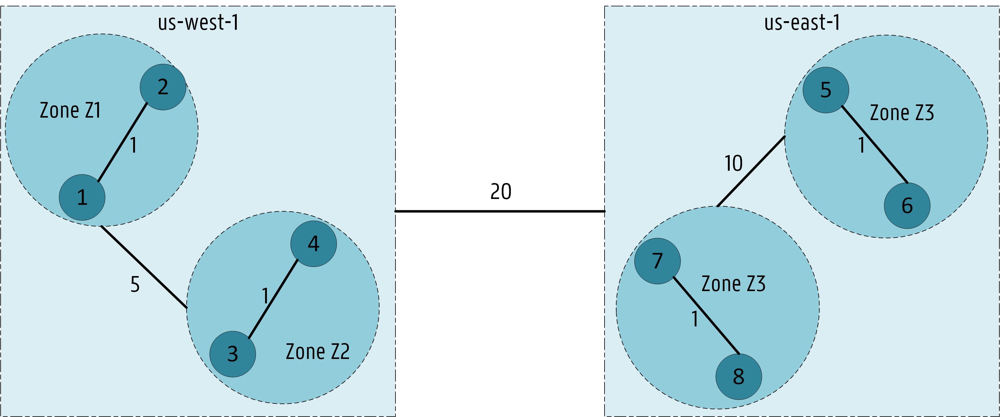

# Network-Aware Scheduling

## Table of Contents

<!-- toc -->
- [Summary](#summary)
- [Motivation](#motivation)
  - [Goals](#goals)
  - [Non-Goals](#non-goals)
- [Use cases/Topologies](#use-cases--topologies)
  - [1 - Spark/Database applications running in Data centers or small scale cluster topologies](#1---sparkdatabase-applications-running-in-data-centers-or-small-scale-cluster-topologies)
  - [2 - Cloud2Edge application running on a multi-region geo-distributed cluster](#2---cloud2edge-application-running-on-a-multi-region-geo-distributed-cluster)
- [Proposal - Design & Implementation Details](#proposal---design--implementation-details)
  - [Overview of the System Design](#overview-of-the-system-design)
  - [Application Group CRD (AppGroup)](#application-group-crd-appgroup)
  - [Network Topology CRD (NetworkTopology)](#network-topology-crd-networktopology)
  - [The inclusion of bandwidth in the scheduling process](#the-inclusion-of-bandwidth-in-the-scheduling-process)
    - [Bandwidth Requests via extended resources](#bandwidth-requests-via-extended-resources)
    - [Bandwidth Limitations via the Bandwidth CNI plugin](#bandwidth-limitations-via-the-bandwidth-cni-plugin)
  - [Plugins](#plugins)
    - [Description of the `TopologicalSort`](#description-of-the-topologicalsort)
    - [Description of the `NodeNetworkCostFit`](#description-of-the-nodenetworkcostfit)
    - [Description of the `NetworkMinCost`](#description-of-the-networkmincost)
- [Known limitations](#known-limitations)
- [Test plans](#test-plans)
- [Production Readiness Review Questionnaire](#production-readiness-review-questionnaire)
    - [Scalability](#scalability)
    - [Troubleshooting](#troubleshooting)
- [Graduation criteria](#graduation-criteria)
- [Implementation history](#implementation-history)
<!-- /toc -->

# Summary

This proposal describes the behavior of the Network-Aware Scheduling framework
that considers latency and bandwidth in the scheduling decision-making process.

The proposal introduces two custom resources, **AppGroup CRD** and **NetworkTopology CRD**, to maintain 
both the service topology information from application microservice dependencies and the infrastructure 
network topology where network weights are established between regions and zones in the cluster. 
Thus, both application and infrastructure network topology are considered during scheduling. 

The proposal also presents a bandwidth resource component (DaemonSet) to advertise bandwidth resources 
as **extended resources** to allow already available filter/scoring plugins (e.g., `PodFitsResources`, 
`BalancedAlocation`) to consider bandwidth allocation.

To tackle latency and bandwidth in the scheduling process, three plugins are proposed in this document: 
- `TopologicalSort` (**QueueSort**).
- `NodeNetworkCostFit` (**Filter**).
- `NetworkMinCost` (**Score**).

# Motivation

Many applications are latency-sensitive, demanding lower latency between microservices in the application.
Scheduling policies that aim to reduce costs or increase resource efficiency are not enough for applications
where end-to-end latency becomes a primary objective.
Applications such as the Internet of Things (IoT), multi-tier web services, and video streaming services
would benefit the most from network-aware scheduling policies, which consider latency and bandwidth
in addition to the default resources (e.g., CPU and memory) used by the scheduler.

Users encounter latency issues frequently when using multi-tier applications.
These applications usually include tens to hundreds of microservices with complex interdependencies/chains.
Distance from servers with chained microservices deployed is usually the primary culprit.
The best strategy is to reduce the latency between chained microservices in the same application,
according to the prior work about [Service Function Chaining](https://www.sciencedirect.com/science/article/pii/S1084804516301989) (SFC).

Besides, bandwidth plays an essential role for those applications with high volumes of data transfers among microservices.
For example, multiple replicas in a database application may require frequent copies to ensure data consistency.
[Spark jobs](https://spark.apache.org/) may have frequent data transfers among map and reduce nodes.
Insufficient network capacity in nodes would lead to increasing delay or packet drops,
which will degrade the quality of service for applications.

We propose a **Network-Aware Scheduling framework** for Kubernetes that focus on delivering low latency to end-users
and ensuring bandwidth reservations in pod scheduling.

This work significantly extends the previous work open-sourced [here](https://github.com/jpedro1992/sfc-controller) 
that implements a latency-aware scheduler extender based on the [scheduler extender](https://github.com/kubernetes/community/blob/master/contributors/design-proposals/scheduling/scheduler_extender.md) design.

## Goals

- Provide a network-aware framework to extend scheduling features of Kubernetes by considering latency and bandwidth.
- Consider different pods as an Application:    
    - The creation of an **Application Group (AppGroup) CRD**.
- Define network weights between regions (`topology.kubernetes.io/region`) and zones (`topology.kubernetes.io/zone`) in the cluster:
    - The creation of a **Network Topology (NetworkTopology) CRD**.
- The advertising of the nodes (physical) bandwidth capacity as [extended resources](https://kubernetes.io/docs/tasks/administer-cluster/extended-resource-node/): 
    - Bandwidth requests and limitations allow filtering overloaded nodes (bandwidth) considered for scheduling.
    - Consider bandwidth requests for scoring plugins (e.g., `MostRequested`, `BalancedAllocation`). 
- Establish a specific order to allocate Pods based on their AppGroup CRD:
    - Implementation of a **QueueSort** plugin based on [Topology Sorting](https://en.wikipedia.org/wiki/Topological_sorting#:~:text=In%20computer%20science%2C%20a%20topological,before%20v%20in%20the%20ordering).
- Filter out nodes based on microservice dependencies among pods belonging to the same application:
    - Implementation of a **Filter** plugin based on the AppGroup CRD.
- Near-optimal scheduling decisions based on network costs:
    - Implementation of a **Score** plugin that scores higher nodes with lower network costs.    

## Non-Goals

- Descheduling due to unexpected outcomes is not addressed in this proposal.
- The conflict between plugins in this proposal and other plugins are not studied in this proposal. Users are welcome to try plugins
  in this proposal with other plugins (e.g., `RequestedToCapacityRatio`, `BalancedAllocation`). However, a higher weight must be given to
  our plugin ensuring low network costs are preferred.

## Use cases / Topologies 

### 1 - Spark/Database applications running in Data centers or small scale cluster topologies

Network-aware scheduling examines the infrastructure topology, 
so latencies and bandwidth between nodes are considered while making scheduling decisions.
Data centers with fat-tree topology or cluster topology can benefit from our network-aware framework, 
as network conditions between nodes vary according to their positions in the topologies.

<p align="center"></p>

<p align="center"></p>

Network latency and available bandwidths between nodes can vary according to their locations in the infrastructure.
Deploying microservices on different sets of nodes will impact the application's response time. 
For specific applications, latency and bandwidth requirements can be critical.  
For example, in a [Redis cluster](https://redis.io/topics/cluster-tutorial), 
master nodes need to synchronize data with slave nodes frequently. Namely, there are dependencies between the masters and the slaves.
High latencies or low bandwidths between masters and slaves can lead to slow CRUD operations.

<p align="center"></p>

### 2 - Cloud2Edge application running on a multi-region geo-distributed cluster.

Multi-region Geo-distributed scenarios benefit the most from our framework and network-aware plugins. 

<p align="center"></p>

High latency is a big concern in these topologies, especially for IoT applications (e.g., [Eclipse Hono](https://github.com/eclipse/hono), [Eclipse Cloud2Edge](https://www.eclipse.org/packages/packages/cloud2edge/)). 
For example, in the Cloud2Edge platform, there are several dependencies among the several APIs and MQTT brokers where devices connect to:

<p align="center"></p>

# Proposal - Design & Implementation details

## Overview of the System Design

As an initial design, we plan to implement three plugins:  
- A **QueueSort** function named `TopologicalSort`:
    - Pods are sorted based on their established dependencies.
- A **Filter** function named `NodeNetworkCostFit`:
    - Nodes are filtered out if they cannot support the network requirements of the Pod's AppGroup.
- A **Score** function called `NetworkMinCost`:
    - Nodes are scored based on network weights ensuring network latency is minimized for pods belonging to the same application.

A [Custom Resource Definition (CRD)](https://kubernetes.io/docs/concepts/extend-kubernetes/api-extension/custom-resources/) has been designed to establish an Application Group (AppGroup CRD). 

Also, another CRD (NetworkTopology CRD) establishes network weights among the regions and zones in the cluster to be used by the scoring plugin.

Further explanations are given below on how the proposed plugins interact with both CRDs. 

<p align="center"></p>

## Application Group CRD (AppGroup)

We designed an AppGroup CRD for service chains based on the [Pod Group](https://github.com/kubernetes-sigs/scheduler-plugins/blob/master/kep/42-podgroup-coscheduling/README.md) concept introduced for the Co-scheduling plugin. 
The PodGroup establishes a collection of pods of the same type, while the proposed AppGroup associates different pods based on service topology information. 
The AppGroup CRD also records pod allocations (i.e., node/pod pairs) under the status part.

```yaml
# App Group CRD spec
apiVersion: apiextensions.k8s.io/v1
kind: CustomResourceDefinition
metadata:
  annotations:
    api-approved.kubernetes.io: "To be Defined" # edited manually
    controller-gen.kubebuilder.io/version: v0.6.2
  creationTimestamp: null
  name: appgroup.scheduling.sigs.k8s.io
spec:
  group: scheduling.sigs.k8s.io
  names:
    kind: AppGroup
    listKind: AppGroupList
    plural: Appgroups
    shortNames:
      - ag
      - ags
    singular: appgroup
  scope: Namespaced
  versions:
  - name: v1alpha1
    schema:
      openAPIV3Schema:
        description: AppGroup establishes a service dependency graph among different Pods.
        properties:
          apiVersion:
            description: 'APIVersion defines the versioned schema of this representation
              of an object. Servers should convert recognized schemas to the latest
              internal value, and may reject unrecognized values. More info: https://git.k8s.io/community/contributors/devel/sig-architecture/api-conventions.md#resources'
            type: string
          kind:
            description: 'Kind is a string value representing the REST resource this
              object represents. Servers may infer this from the endpoint the client
              submits requests to. Cannot be updated. In CamelCase. More info: https://git.k8s.io/community/contributors/devel/sig-architecture/api-conventions.md#types-kinds'
            type: string
          metadata:
            type: object
          spec:
              description: AppGroup defines the number of Pods and which Pods belong to the group.
              properties:
                numMembers:
                  format: int32
                  type: integer
                  minimum: 1
                  description: Number of Pods belonging to the App Group
                topologySortingAlgorithm:
                  type: string
                  description: The preferred algorithm to be applied in the Topoogy order calculation (Status)
                Pods:
                  type: array
                  description: The Pods belonging to the group
                  items:
                    type: object
                    properties:
                      podName:
                        type: string
                        description: Name of the Pod.
                      dependencies:
                        type: array
                        items:
                          description: DependenciesList establishes dependencies between pods.
                          type: object
                          properties:
                            podName:
                              description: Name of the Pod.
                              type: string
                            minBandwidth:
                              anyOf:
                                - type: integer
                                - type: string
                              description: Minimum bandwidth demand between both Pods.
                              pattern: ^(\+|-)?(([0-9]+(\.[0-9]*)?)|(\.[0-9]+))(([KMGTPE]i)|[numkMGTPE]|([eE](\+|-)?(([0-9]+(\.[0-9]*)?)|(\.[0-9]+))))?$
                              x-kubernetes-int-or-string: true
                            maxNetworkCost:
                              type: integer
                              default: 1
                              minimum: 0
                              maximum: 100
                              format: int64
                              description: The maximum network cost between both Pods.
                            required:
                              - podName
          status:
            description: Record Pod Allocations (Pod id, hostnames).
            properties:
              runningPods:
                description: The number of actively running pods.
                format: int32
                type: integer
                minimum: 0
              scheduled:
                type: array
                additionalProperties:
                  podName:
                    type: string
                    description: Name of the Pod.
                  replicaID:
                    type: string
                    description: Pod ID
                  hostname:
                    type: string
                    description: Hostname allocating Pod instance
              scheduleStartTime:
                description: ScheduleStartTime of the AppGroup
                format: date-time
                type: string
              topologyCalculationTime:
                description: topologyCalculationTime of the AppGroup
                format: date-time
                type: string
              topologyOrder:
                description: The optimal order to schedule pods on this App Group based on a given algorithm.
                type: array
                items:
                  description: Pod Name and Pod Priority index
                  type: object
                    podName:
                      type: string
                      description: Name of the Pod.
                    index:
                      type: integer
                      default: 1
                      minimum: 1
                      format: int64
                      description: Priority index for each Pod (e.g., 1, 2, ...)
                        (1 means pod should be scheduled first in the AppGroup)
            type: object
        type: object
    served: true
    storage: true
status:
  acceptedNames:
    kind: ""
    plural: ""
  conditions: []
  storedVersions: []
```

### Example

<p align="center"></p>

```yaml
# Example App Group CRD spec
apiVersion: scheduling.sigs.k8s.io/v1alpha1
kind: AppGroup
metadata:
  name: A1
spec:
  numMembers: 3
  topologySortingAlgorithm: KahnSort
  Pods:
    - podName: P1
      dependencies:
        - podName: P2
          minBandwidth: "100Mi"
          maxNetworkCost: 15
    - podName: P2
      dependencies:
        - podName: P3
          minBandwidth: "250Mi"
          maxNetworkCost: 20
    - podName: P3
```

An AppGroup controller updates the AppGroup CRD regarding the pods already scheduled in the cluster and the preferred topology order for pod allocations. 

Currently, four algorithms are supported for topological sorting: 
**[KahnSort](https://www.geeksforgeeks.org/topological-sorting-indegree-based-solution/),
[TarjanSort](https://www.geeksforgeeks.org/tarjan-algorithm-find-strongly-connected-components/), 
ReverseKahn, ReverseTarjan**. 

ReverseKahn and ReverseTarjan essentially invert the order given by KahnSort and TarjanSort, respectively.  

The implementation is based on the work open-sourced [here](https://github.com/otaviokr/topological-sort).
Each pod has an index based on the sorting algorithm. An index of 1 means the pod should be allocated first in the AppGroup.

```go
// AppGroupController is a controller that process App groups using provided Handler interface
type AppGroupController struct {
	eventRecorder   record.EventRecorder
	agQueue         workqueue.RateLimitingInterface
	agLister        schedlister.AppGroupLister
	podLister       corelister.PodLister
	agListerSynced  cache.InformerSynced
	podListerSynced cache.InformerSynced
	agClient        schedclientset.Interface
}
```

```go
// +genclient
// +k8s:deepcopy-gen:interfaces=k8s.io/apimachinery/pkg/runtime.Object

// AppGroup is a collection of Pods belonging to the same application
type AppGroup struct {
	metav1.TypeMeta `json:",inline"`

	// Standard object's metadata.
	// +optional
	metav1.ObjectMeta `json:"metadata,omitempty" protobuf:"bytes,1,opt,name=metadata"`

	// AppGroupSpec defines the Min and Max for Quota.
	// +optional
	Spec AppGroupSpec `json:"spec,omitempty" protobuf:"bytes,2,opt,name=spec"`

	// AppGroupStatus defines the observed use.
	// +optional
	Status AppGroupStatus `json:"status,omitempty" protobuf:"bytes,3,opt,name=status"`
}

// AppGroupSpec represents the template of a app group.
type AppGroupSpec struct {
	// NumMembers defines the number of Pods belonging to the App Group
	NumMembers int32 `json:"numMembers,omitempty"`

	// The preferred Topology Sorting Algorithm
	TopologySortingAlgorithm string `json:"topologySortingAlgorithm,omitempty"`

	// Pods defines the pods belonging to the group
	Pods AppGroupPodList `json:"pods,omitempty"`
}

// AppGroupPod represents the number of Pods belonging to the App Group.
// +protobuf=true
type AppGroupPod struct {
	// Name of the Pod.
	PodName      string           `json:"name" protobuf:"bytes,1,opt,name=name"`

	// Dependencies of the Pod.
	Dependencies DependenciesList `json:"dependencies,omitempty" protobuf:"bytes,2,opt,name=dependencies"`
}

// AppGroupPodList contains an array of Pod objects.
// +protobuf=true
type AppGroupPodList []AppGroupPod

// DependenciesInfo contains information about one dependency.
// +protobuf=true
type DependenciesInfo struct {
	// Name of the Pod.
	PodName string `json:"podName" protobuf:"bytes,1,opt,name=podName"`

	// MinBandwidth between pods 
	// +optional
	MinBandwidth resource.Quantity `json:"type" protobuf:"bytes,2,opt,name=minBandwidth"`

	// Max Network Cost between pods 
	// +optional
	MaxNetworkCost int64 `json:"type" protobuf:"bytes,3,opt,name=maxNetworkCost"`
}

// DependenciesList contains an array of ResourceInfo objects.
// +protobuf=true
type DependenciesList []DependenciesInfo

// AppGroupStatus represents the current state of a app group.
type AppGroupStatus struct {
	// The number of actively running pods.
	// +optional
	RunningPods int32 `json:"runningPods,omitempty"`

	// PodsScheduled defines pod allocations (Pod name, Pod id, hostname).
	// +optional
	PodsScheduled ScheduledList `json:"podsScheduled,omitempty"`

	// ScheduleStartTime of the group
	ScheduleStartTime metav1.Time `json:"scheduleStartTime,omitempty"`

	// TopologyCalculationTime of the group
	TopologyCalculationTime metav1.Time `json:"topologyCalculationTime,omitempty"`

	// Topology order for TopSort plugin (QueueSort)
	TopologyOrder TopologyList `json:"topologyOrder,omitempty"`
}

// AppGroupScheduled represents the Pod Affinities of a given Pod
// +protobuf=true
type ScheduledInfo struct {
	// Pod Name
	PodName string `json:"podName" protobuf:"bytes,1,opt,name=podName"`

	// Replica ID
	ReplicaID string `json:"replicaID" protobuf:"bytes,2,opt,name=replicaID"`

	// Pod Hostname
	Hostname string `json:"hostname,omitempty" protobuf:"bytes,3,opt,name=hostname"`
}

// ScheduledList contains an array of Pod Affinities.
// +protobuf=true
type ScheduledList []ScheduledInfo

// AppGroupTopology represents the calculated order for the given AppGroup
// +protobuf=true
type TopologyInfo struct {
	PodName string `json:"podName" protobuf:"bytes,1,opt,name=podName"`
	Index   int32  `json:"index" protobuf:"bytes,2,opt,name=index"`
}

// TopologyList contains an array of Pod orders for TopologySorting algorithm.
// +protobuf=true
type TopologyList []TopologyInfo

// +k8s:deepcopy-gen:interfaces=k8s.io/apimachinery/pkg/runtime.Object

// AppGroupList is a collection of app groups.
type AppGroupList struct {
	metav1.TypeMeta `json:",inline"`
	// Standard list metadata
	// +optional
	metav1.ListMeta `json:"metadata,omitempty"`

	// Items is the list of AppGroup
	Items []AppGroup `json:"items"`
}
```

### AppGroup Test based on Online Boutique

In this test, an AppGroup is created for the [Online Boutique application](https://github.com/GoogleCloudPlatform/microservices-demo).
It consists of 10 pods, which we named from P1 - P10. 

<p align="center"></p>

As shown below, the preferred order for the KahnSort algorithm is P1, P10, P9, P8, P7, P6, P5, P4, P3, P2. 

We attribute an **index** to each pod to evaluate their topology preference in the **Less function of the TopologicalSort plugin** described [here](#description-of-the-topologicalsort-queuesort).
The topology list corresponds to:

```go
topologyList = [(P1 1) (P10 2) (P9 3) (P8 4) (P7 5) (P6 6) (P5 7) (P4 8) (P3 9) (P2 10)]
```

<p align="center"></p>

## Network Topology CRD (NetworkTopology)

We also designed a NetworkTopology CRD based on the current [NodeResourceTopology CRD](https://github.com/kubernetes-sigs/scheduler-plugins/tree/master/pkg/noderesourcetopology).
The goal is to establish network costs between regions and zones in the cluster.  

As an initial design, weights can be manually defined in a single NetworkTopology CRD where all network weights are available.

As a future plan, we are currently working on another project, where we are designing a [networkTopology controller](https://github.com/jpedro1992/network-topology-controller)  
that will react to node additions, updates, or removals. Also, it will update the network weights based on latency measurements. 

Experiments will evaluate the performance and feasibility of the network topology CRD. 
We argue that a single CRD might impact the system's performance concerning execution time to find the network weights for 
a given region or zone while deploying multiple CRDs has an overhead regarding the system's memory to save all CRDs. 

```yaml
# Network CRD spec
apiVersion: apiextensions.k8s.io/v1
kind: CustomResourceDefinition
metadata:
  annotations:
    api-approved.kubernetes.io: "To be Defined" # edited manually
    controller-gen.kubebuilder.io/version: v0.6.2
  creationTimestamp: null
  name: networkTopology.scheduling.sigs.k8s.io
spec:
  group: scheduling.sigs.k8s.io
  names:
    kind: NetworkTopology
    listKind: NetworkTopologyList
    plural: networktopologies
    shortNames:
      - net-topo
      - nt
    singular: networktopology
  scope: Namespaced
  versions:
    - name: v1alpha1
      schema:
        openAPIV3Schema:
          description: Network Topology describes the cluster network topology.
          properties:
            apiVersion:
              description: 'APIVersion defines the versioned schema of this representation
              of an object. Servers should convert recognized schemas to the latest
              internal value, and may reject unrecognized values. More info: https://git.k8s.io/community/contributors/devel/sig-architecture/api-conventions.md#resources'
              type: string
            kind:
              description: 'Kind is a string value representing the REST resource this
              object represents. Servers may infer this from the endpoint the client
              submits requests to. Cannot be updated. In CamelCase. More info: https://git.k8s.io/community/contributors/devel/sig-architecture/api-conventions.md#types-kinds'
              type: string
            metadata:
              type: object
            spec:
              type: object
              properties:
                weights:
                  type: array
                  description: weightList contains an array of weightInfo objects.
                  items:
                    name:
                      type: string
                      description: The name of the weights (e.g., UserDefined)
                    regionCostList:
                      description: Define weights for cross regions in the cluster
                        type: object
                        properties:
                          origin:
                            type: string
                            description: Region Name (Origin)
                          costs:
                            type: array
                            description: Costs contains an array of CostInfo objects.
                            items:
                              destination:
                                type: string
                                description: Region name (Destination)
                              bandwidthCapacity:
                                anyOf:
                                  - type: integer
                                  - type: string
                                description: Bandwidth Capacity between Origin and Destination.
                                pattern: ^(\+|-)?(([0-9]+(\.[0-9]*)?)|(\.[0-9]+))(([KMGTPE]i)|[numkMGTPE]|([eE](\+|-)?(([0-9]+(\.[0-9]*)?)|(\.[0-9]+))))?$
                                x-kubernetes-int-or-string: true
                              bandwidthAllocated:
                                anyOf:
                                  - type: integer
                                  - type: string
                                description: Bandwidth allocated between Origin and Destination.
                                pattern: ^(\+|-)?(([0-9]+(\.[0-9]*)?)|(\.[0-9]+))(([KMGTPE]i)|[numkMGTPE]|([eE](\+|-)?(([0-9]+(\.[0-9]*)?)|(\.[0-9]+))))?$
                                x-kubernetes-int-or-string: true
                              networkCost:
                                type: integer
                                default: 1
                                minimum: 0
                                maximum: 100
                                format: int64
                                description: Cost from Origin to Destination
                    zoneCostList:
                      description: Define weights for zones in the cluster. Only for zones in the same region!
                        type: object
                        properties:
                          origin:
                            type: string
                            description: Zone Name (Origin)
                          costs:
                            type: array
                            description: Costs contains an array of CostInfo objects.
                            items:
                              destination:
                                type: string
                                description: Zone name (Destination)
                              bandwidthCapacity:
                                anyOf:
                                  - type: integer
                                  - type: string
                                description: Bandwidth Capacity between Origin and Destination.
                                pattern: ^(\+|-)?(([0-9]+(\.[0-9]*)?)|(\.[0-9]+))(([KMGTPE]i)|[numkMGTPE]|([eE](\+|-)?(([0-9]+(\.[0-9]*)?)|(\.[0-9]+))))?$
                                x-kubernetes-int-or-string: true
                              bandwidthAllocated:
                                anyOf:
                                  - type: integer
                                  - type: string
                                description: Bandwidth allocated between Origin and Destination.
                                pattern: ^(\+|-)?(([0-9]+(\.[0-9]*)?)|(\.[0-9]+))(([KMGTPE]i)|[numkMGTPE]|([eE](\+|-)?(([0-9]+(\.[0-9]*)?)|(\.[0-9]+))))?$
                                x-kubernetes-int-or-string: true
                              networkCost:
                                type: integer
                                default: 1
                                minimum: 0
                                maximum: 100
                                format: int64
                                description: Cost from Origin to Destination
                          type: object
          type: object
      served: true
      storage: true
status:
  acceptedNames:
    kind: ""
    plural: ""
  conditions: []
  storedVersions: []
```

### Example

Let's consider the following NetworkTopology CRD as an example: 

```yaml
# Example Network CRD 
apiVersion: scheduling.sigs.k8s.io/v1alpha1
kind: NetworkTopology
metadata:
  name: net-topology-test
  namespace: test-namespace
spec:
  weights:
    # Region label: "topology.kubernetes.io/region"
    # Zone Label:   "topology.kubernetes.io/zone"
    # 2 Regions:  us-west-1
    #             us-east-1
    # 4 Zones:    us-west-1: z1, z2
    #             us-east-1: z3, z4
    name: "UserDefined"
    regionCostList: # Define weights between regions
      - origin: "us-west-1"
        costs:
          - destination: "us-east-1"
            bandwidthCapacity: "10Gi"
            networkCost: 20
      - origin: "us-east-1"
        costs:
          - destination: "us-west-1"
            bandwidthCapacity: "10Gi"
            networkCost: 20
    zoneCostList: # Define weighs between zones belonging to the same region!
      - origin: "z1"
        costs:
          - destination: "z2"
            bandwidthCapacity: "1Gi"
            networkCost: 5
      - origin: "z2"
          costs:
            - destination: "z1"
              bandwidthCapacity: "1Gi"
              networkCost: 5
      - origin: "z3"
          costs:
            - destination: "z4"
              bandwidthCapacity: "1Gi"
              networkCost: 10
      - origin: "z4"
          costs:
            - destination: "z3"
              bandwidthCapacity: "1Gi"
              networkCost: 10
```

```go
// +genclient
// +k8s:deepcopy-gen:interfaces=k8s.io/apimachinery/pkg/runtime.Object

// NetworkTopology defines network costs in the cluster between regions and zones
type NetworkTopology struct {
	metav1.TypeMeta `json:",inline"`

	// Standard object's metadata.
	// +optional
	metav1.ObjectMeta `json:"metadata,omitempty" protobuf:"bytes,1,opt,name=metadata"`

	// NetworkTopologySpec defines the Min and Max for Quota.
	// +optional
	Spec NetworkTopologySpec `json:"spec,omitempty" protobuf:"bytes,2,opt,name=spec"`
}

// NetworkTopologySpec represents the template of a NetworkTopology.
type NetworkTopologySpec struct {
	// The manual defined weights of the cluster
	Weights WeightList `json:"weights,omitempty"`
}

// WeightList contains an array of WeightInfo objects.
// +protobuf=true
type WeightList []WeightInfo

// CostList contains an array of OriginInfo objects.
// +protobuf=true
type CostList []OriginInfo

// WeightInfo contains information about all network costs for a given algorithm.
// +protobuf=true
type WeightInfo struct {
	// The name of the weightInfo (e.g., UserDefined)
	Name string `json:"name" protobuf:"bytes,1,opt,name=name"`

	// Costs between regions
	RegionCostList CostList `json:"regionCostList" protobuf:"bytes,2,opt,name=regionCostList"`

	// Costs between zones
	ZoneCostList CostList `json:"zoneCostList" protobuf:"bytes,3,opt,name=zoneCostList"`
}

// OriginInfo contains information about network costs for a particular Origin.
// +protobuf=true
type OriginInfo struct {
	// The name of the origin (e.g., Region Name, Zone Name).
	Origin string `json:"origin" protobuf:"bytes,1,opt,name=origin"`

	// Costs for the particular origin.
	Costs []CostInfo `json:"destination" protobuf:"bytes,2,opt,name=destination"`
}

// CostInfo contains information about networkCosts.
// +protobuf=true
type CostInfo struct {
	// Name of the destination (e.g., Region Name, Zone Name).
	Destination string `json:"destination" protobuf:"bytes,1,opt,name=destination"`

	// Bandwidth capacity between origin and destination. 
	// +optional
	BandwidthCapacity resource.Quantity `json:"bandwidthCapacity" protobuf:"bytes,2,opt,name=bandwidthCapacity"`

	// Bandwidth allocatable between origin and destination.
	// +optional
	BandwidthAllocatable resource.Quantity `json:"bandwidthAllocatable" protobuf:"bytes,3,opt,name=bandwidthAllocatable"`

	// Network Cost between origin and destination
	NetworkCost int64 `json:"networkCost" protobuf:"bytes,4,opt,name=networkCost"`
}

// +k8s:deepcopy-gen:interfaces=k8s.io/apimachinery/pkg/runtime.Object

// NetworkTopologyList is a collection of netTopologies.
type NetworkTopologyList struct {
	metav1.TypeMeta `json:",inline"`
	// Standard list metadata
	// +optional
	metav1.ListMeta `json:"metadata,omitempty"`

	// Items is the list of AppGroup
	Items []NetworkTopology `json:"items"`
}
```

## The inclusion of bandwidth in the scheduling process 

### Bandwidth Requests via extended resources

We plan to advertise the node's (physical) bandwidth capacity of the cluster via [extended resources](https://kubernetes.io/docs/tasks/administer-cluster/extended-resource-node/). 
Bandwidth resources will be advertised as extended resources based on a bandwidth resource component open-sourced [here](https://github.com/jpedro1992/bandwidth-as-an-extended-resource). 
These component will send HTTP requests to the Kubernetes API server regarding the node's bandwidth capacity. 
Also, a PATCH request can be sent manually as the following example:  

```HTTP
PATCH /api/v1/nodes/<your-node-name>/status HTTP/1.1
Accept: application/json
Content-Type: application/json-patch+json
Host: k8s-master:8080

[
  {
    "op": "add",
    "path": "/status/capacity/network.aware.com~1bandwidth",
    "value": "10000000000" 
  }
]
```

Here, the bandwidth capacity of the node is equal to 10 Gbps. 
We prefer to specify bandwidth in sizes of 1 bps (bits per second):

- 1 Mbit/s = 1000000
- 1 Gbit/s = 1000000000
- 10 Gbit/s = 10000000000

The output will show that the Node has a capacity of 10 Gbps:

```HTTP
"capacity": {
  "cpu": "2",
  "memory": "2049008iK",
  "network.aware.com/bandwidth": "10000000000",
```

### Bandwidth Limitations via the Bandwidth CNI plugin

Bandwidth limitations will be enforced through the [bandwidth CNI plugin](https://kubernetes.io/docs/concepts/extend-kubernetes/compute-storage-net/network-plugins/).  
This CNI plugin supports pod ingress and egress traffic shaping to limit container bandwidth.
Containers share the host network bandwidth when deployed on the same node. 
Limiting container bandwidth can prevent mutual interference and improve network stability.

The addition of `kubernetes.io/ingress-bandwidth` and `kubernetes.io/egress-bandwidth` annotations 
to the pod configuration file ensures bandwidth limitations are respected:

```yaml
# Example Pod deployment with bandwidth limitations
apiVersion: v1
kind: Pod
metadata:
  annotations:
    kubernetes.io/ingress-bandwidth: 1M
    kubernetes.io/egress-bandwidth: 1M
 ``` 

By installing [Calico](https://docs.projectcalico.org/reference/cni-plugin/configuration) as the networking 
plugin, the bandwidth CNI plugin is already installed as default.

### Example 

This example shows how extended resources can be combined with bandwidth limitations in the pod configuration file:

```yaml
# Example Pod deployment:  
# bandwidth requests (Extended Resources)
# bandwidth limitations (bandwidth CNI plugin)
apiVersion: v1
kind: Pod
metadata:
  name: network-aware-bandwidth-example
  annotations:
      kubernetes.io/ingress-bandwidth: 10M
      kubernetes.io/egress-bandwidth: 10M
spec:
  containers:
  - name: network-aware-bandwidth-example
    image: example
    resources:
      requests:
        network.aware.com/bandwidth: 10000000 # 10M
      limits:
        network.aware.com/bandwidth: 10000000 # 10M  
 ``` 

This allows to perform filter / score algorithms based on bandwidth resources (e.g., `PodFitsHostResources`, `MostRequested`, `BalancedAllocation`).

## Plugins

### Description of the `TopologicalSort`

**Extension point: QueueSort**

Pods belonging to an AppGroup should be sorted based on their topology information. 
The `TopologicalSort` plugin compares the pods' index available in the AppGroup CRD for the preferred sorting algorithm. 

If pods do not belong to an AppGroup or belong to different AppGroups, we follow the 
strategy of the **less function** provided by the [QoS plugin](https://github.com/kubernetes-sigs/scheduler-plugins/tree/master/pkg/qos).

```go
// Less is the function used by the activeQ heap algorithm to sort pods.
// Sort Pods based on their App Group and corresponding service topology.
// Otherwise, follow the strategy of the QueueSort Plugin
func (ts *TopologicalSort) Less(pInfo1, pInfo2 *framework.QueuedPodInfo) bool {
	p1AppGroup := util.GetAppGroupLabel(pInfo1.Pod)
	p2AppGroup := util.GetAppGroupLabel(pInfo2.Pod)

	if len(p1AppGroup) == 0 || len(p2AppGroup) == 0 { // Follow QoS Sort
		s := &qos.Sort{}
		return s.Less(pInfo1, pInfo2)
	}

	if p1AppGroup == p2AppGroup { // Pods belong to the same App Group
		klog.Infof("Pods: %v and %v from the same appGroup %v", pInfo1.Pod.Name, pInfo2.Pod.Name, p1AppGroup)
		agName := p1AppGroup
		appGroup, err := findAppGroupTopologicalSort(agName, ts)

		if err != nil {
			klog.ErrorS(err, "Error while returning AppGroup")
			s := &qos.Sort{}
			return s.Less(pInfo1, pInfo2)
		}

		// Binary search to find both order index since topology list is ordered by Pod Name
		var orderP1 = networkAwareUtil.FindPodOrder(appGroup.Status.TopologyOrder, pInfo1.Pod.Name)
		var orderP2 = networkAwareUtil.FindPodOrder(appGroup.Status.TopologyOrder, pInfo2.Pod.Name)

		klog.Infof("Pod %v order: %v and Pod %v order: %v.", pInfo1.Pod.Name, orderP1, pInfo2.Pod.Name, orderP2)

		// Lower is better, thus invert result!
		return !(orderP1 > orderP2)
	} else { // Pods do not belong to the same App Group: follow the strategy from the QoS plugin
		klog.Infof("Pod %v and %v do not belong to the same appGroup %v", pInfo1.Pod.Name, pInfo2.Pod.Name, p1AppGroup)
		s := &qos.Sort{}
		return s.Less(pInfo1, pInfo2)
	}
}
```

#### `TopologicalSort` Example

Let's consider the Online Boutique application shown previously. 
The AppGroup consists of 10 pods and the topology order based on the KahnSort algorithm is **P1, P10, P9, P8, P7, P6, P5, P4, P3, P2.**

The plugin favors low indexes. Thus, depending on the two pods evaluated in the Less function, the result (bool) is the following: 

<p align="center"></p>


### Description of the `NodeNetworkCostFit` 

**Extension point: Filter**

Pod dependencies established in the AppGroup CRD must be respected.

This plugin focuses on `maxNetworkCost` requirements. 

Nodes providing higher network costs than the `maxNetworkCost` requirement are filtered out. 

Several dependencies may exist since multiple pods can be already deployed on the network. 

As an initial design, we plan to filter out nodes that unmet a higher number of dependencies to reduce the number of nodes being scored. 

Also, `minBandwidth` requirements will be considered at a later stage 
based on the bandwidth capacity / allocatable available in each region / zone. 
The bandwidth allocatable in each region or zone will be handled by the Network Topology controller previously mentioned.  

```go
// Filter : evaluate if node can respect maxNetworkCost requirements
func (pl *NodeNetworkCostFit) Filter(ctx context.Context, cycleState *framework.CycleState, pod *v1.Pod, nodeInfo *framework.NodeInfo) *framework.Status {
    // Check if Pod belongs to an AppGroup
    (...)
    // Check if pods already available, otherwise return
    (...)
    // Check Dependencies of the given pod 
    (...)
    // Retrieve network costs from the AppGroup CRD based on the region and zone of the node being filtered
    // Save them in a map to search for costs faster
    (...)
    // Main Procedure of NodeNetworkCostFit 
    var numOK int64 = 0
    var numNotOK int64 = 0 
    // check if maxNetworkCost fits 
    for _, podAllocated := range appGroup.Status.PodsScheduled { // For each pod already allocated 
        for _, d := range dependencyList { // For each pod dependency
    		if podAllocated.PodName == d.PodName { // If the pod allocated is an established dependency
    			if podAllocated.Hostname == nodeInfo.Node().Name { // If the Pod hostname is the node being filtered, requirements are checked via extended resources
    				numOK += 1
    			} else { // If Nodes are not the same
    				// Get NodeInfo from pod Hostname
    				podHostname, err := pl.handle.SnapshotSharedLister().NodeInfos().Get(podAllocated.Hostname)
    				if err != nil {
    					return framework.NewStatus(framework.Error, "pod hostname not found")
    				}
    
    				// Get zone and region from Pod Hostname
    				regionPodHostname := networkAwareUtil.GetNodeRegion(podHostname.Node())
    				zonePodHostname:= networkAwareUtil.GetNodeZone(podHostname.Node())
    
    				if regionPodHostname == "" && zonePodHostname == "" { // Node has no zone and region defined
    					numNotOK += 1
    				} else if region == regionPodHostname{ // If Nodes belong to the same region
    					if zone == zonePodHostname{ // If Nodes belong to the same zone
    						numOK += 1
    					} else { // belong to a different zone, check maxNetworkCost
    						cost, costOK := costMap[networkAwareUtil.CostKey{ // Retrieve the cost from the map (origin: zone, destination: pod zoneHostname)
    							Origin:      zone, // Time Complexity: O(1)
    							Destination: zonePodHostname,
    						}]
    						if costOK {
    							if cost <= d.MaxNetworkCost{
    								numOK += 1
    							}else{
    								numNotOK += 1
    							}
    						}
    					}
    				} else{ // belong to a different region
    					cost, costOK := costMap[networkAwareUtil.CostKey{ // Retrieve the cost from the map (origin: zone, destination: pod zoneHostname)
    						Origin:      region, // Time Complexity: O(1)
    						Destination: regionPodHostname,
    					}]
    					if costOK{
    						if cost <= d.MaxNetworkCost{
    							numOK += 1
    						}else{
    							numNotOK += 1
    						}
    					}
    				}
    			}
    		}
    	}
    }
    klog.V(6).Infof("NumNotOk: %v / numOK: %v ", numNotOK, numOK)
    
    if numNotOK > numOK{
    	return framework.NewStatus(framework.Unschedulable,
    		fmt.Sprintf("Node %v does not meet several network requirements from Pod dependencies: OK: %v NotOK: %v", nodeInfo.Node().Name, numOK, numNotOK))
    }
    return nil
}
```

#### `NodeNetworkCostFit` Example

Let's consider the following AppGroup CRD for the appGroup `A1` containing three pods `P1 - P3`:

```yaml
# Example App Group CRD spec
apiVersion: scheduling.sigs.k8s.io/v1alpha1
kind: AppGroup
metadata:
  name: A1
spec:
  numMembers: 3
  topologySortingAlgorithm: KahnSort
  Pods:
    - podName: P1
      dependencies:
        - podName: P2
          maxNetworkCost: 15
    - podName: P2
      dependencies:
        - podName: P3
          maxNetworkCost: 20
    - podName: P3
```

At a given moment, the status part is the following: 

 ```yaml
# Status from App Group CRD 
(...)        
          status: 
            properties:
              podsScheduled:
                - podName: P2
                  replicaID: pod2-replica1
                  hostname: N1
                - podName: P3
                  replicaID: pod3-replica1
                  hostname: N4
              (...)   
```

Two pods have already been allocated: one replica of `P2` in node `N1` and one replica of `P3` in node `N4`. 

Also, the kubernetes cluster has two regions `us-west-1` and `us-east-1`, four zones `Z1 - Z4` and eight nodes `N1 - N8`. 

The NetworkTopology CRD is the following:

```yaml
# Example Network CRD 
apiVersion: scheduling.sigs.k8s.io/v1alpha1
kind: NetworkTopology
metadata:
  name: net-topology-test
  namespace: test-namespace
spec:
  weights:
    # Region label: "topology.kubernetes.io/region"
    # Zone Label:   "topology.kubernetes.io/zone"
    # 2 Regions:  us-west-1
    #             us-east-1
    # 4 Zones:    us-west-1: Z1, Z2
    #             us-east-1: Z3, Z4
    # 8 nodes:    z1: N1, N2
    #             z2: N3, N4
    #             z3: N5, N6
    #             z4: N7, N8 
    name: "UserDefined"
    regionCostList: # Define weights between regions
      - origin: "us-west-1"
        costs:
          - destination: "us-east-1"
            bandwidthCapacity: "10Gi"
            networkCost: 20
      - origin: "us-east-1"
        costs:
          - destination: "us-west-1"
            bandwidthCapacity: "10Gi"
            networkCost: 20
    zoneCostList: # Define weighs between zones belonging to the same region!
      - origin: "Z1"
        costs:
          - destination: "Z2"
            bandwidthCapacity: "1Gi"
            networkCost: 5
      - origin: "Z2"
          costs:
            - destination: "Z1"
              bandwidthCapacity: "1Gi"
              networkCost: 5
      - origin: "Z3"
          costs:
            - destination: "Z4"
              bandwidthCapacity: "1Gi"
              networkCost: 10
      - origin: "z4"
          costs:
            - destination: "Z3"
              bandwidthCapacity: "1Gi"
              networkCost: 10
```

Thus, the cluster topology corresponds to the following network graph:
 
<p align="center"></p>

Now, let's consider that we need to schedule the pod `P1`. `P2` is an established dependency of `P1`. 

So, nodes that do not respect its network cost requirement (i.e., `maxNetworkCost: 15`) will be filtered out:

<p align="center"></p>

### Description of the `NetworkMinCost` 

**Extension point: Score**

We propose a scoring plugin called `NetworkMinCost` to favor nodes with the lowest combined network cost based on the pod's AppGroup.

Pod allocations (pod name, pod id, pod hostname) are available in the AppGroup CRD updated by the controller. 

Network weights among regions and zones in the cluster are available in the NetworkTopology CRD. 
 
First, we check if pods are already running for the Pod's AppGroup. Otherwise, we score all candidate nodes equally.

Second, we retrieve network costs related to the node being scored. 

Finally, we score the node based on the accumulated network cost related to the pod's established dependencies. 
The accumulated cost is returned as the score:

```go
// Score : evaluate score for a node
func (pl *NetworkMinCost) Score(ctx context.Context, cycleState *framework.CycleState, pod *v1.Pod, nodeName string) (int64, *framework.Status) 
    // Check if pod belongs to an AppGroup 
    (...)
    // Check if pods already available, otherwise return
    (...)
    // Check Dependencies of the given pod 
    (...)
    // Retrieve network costs from the AppGroup CRD based on the region and zone of the node being scored
    // Save them in a map to search for costs faster
    (...)
    // Main Procedure of NetworkMinCost
    var cost int64 = 0
    // calculate accumulated shortest path
    for _, podAllocated := range appGroup.Status.PodsScheduled { // For each pod already allocated
    	for _, d := range dependencyList { // For each pod dependency
    		if podAllocated.PodName == d.PodName { // If the pod allocated is an established dependency
    			if podAllocated.Hostname == nodeName{ // If the Pod hostname is the node being scored
    				cost += SameHostname
    			} else{ // If Nodes are not the same
    				// Get NodeInfo from pod Hostname
    				podHostname, err := pl.handle.SnapshotSharedLister().NodeInfos().Get(podAllocated.Hostname)
    				if err != nil {
    					return score, framework.NewStatus(framework.Error, fmt.Sprintf("getting pod hostname %q from Snapshot: %v", podHostname, err))
    				}
    				// Get zone and region from Pod Hostname
    				regionPodHostname := networkAwareUtil.GetNodeRegion(podHostname.Node())
    				zonePodHostname:= networkAwareUtil.GetNodeZone(podHostname.Node())
    
    				if regionPodHostname == "" && zonePodHostname == "" { // Node has no zone and region defined
    					cost += MaxCost
    				} else if region == regionPodHostname{ // If Nodes belong to the same region
    					if zone == zonePodHostname{ // If Nodes belong to the same zone
    						cost += SameZone
    					} else { // belong to a different zone
    						value, ok := costMap[networkAwareUtil.CostKey{ // Retrieve the cost from the map (origin: zone, destination: pod zoneHostname)
    							Origin:      zone, // Time Complexity: O(1)
    							Destination: zonePodHostname,
    						}]
    						if ok {
    							cost += value // Add the cost to the sum
    						} else {
    							cost += MaxCost
    						}
    					}
    				} else{ // belong to a different region
    					value, ok := costMap[networkAwareUtil.CostKey{ // Retrieve the cost from the map (origin: region, destination: pod regionHostname)
    						Origin:      region, // Time Complexity: O(1)
    						Destination: regionPodHostname,
    					}]
    					if ok {
    						cost += value // Add the cost to the sum
    					} else {
    						cost += MaxCost
    					}
    				}
    			}
    		}
    	}
    }
    
    // Return Accumulated Cost as score
    score = cost
    
    klog.V(6).Infof("pod:%s; node:%s; finalScore=%d", pod.GetName(), nodeName, score)
    return score, framework.NewStatus(framework.Success, "Accumulated cost added as score, normalization ensures lower costs are favored")
}
```

Then, we get the maximum and minimum costs for all candidate nodes to normalize the values between 0 and 100. 
After normalization, **nodes with lower costs are favored** since it also corresponds to lower latency:

```go
// NormalizeScore : normalize scores
func (pl *NetworkMinCost) NormalizeScore(ctx context.Context, state *framework.CycleState, pod *v1.Pod, scores framework.NodeScoreList) *framework.Status {
	// Lower scores correspond to lower latency
	// Get Min and Max Scores to normalize between framework.MaxNodeScore and framework.MinNodeScore
	minCost, maxCost := GetMinMaxScores(scores)

	// If all nodes were given the minimum score, return
	if minCost == 0 && maxCost == 0 {
		return nil
	}

	var normCost float64
	for i := range scores {
		if maxCost != minCost { // If max != min
			// node_normalized_cost = MAX_SCORE * ( ( nodeScore - minCost) / (maxCost - minCost)
			// nodeScore = MAX_SCORE - node_normalized_cost
			normCost = float64(framework.MaxNodeScore) * float64(scores[i].Score-minCost) / float64(maxCost-minCost)
			scores[i].Score = framework.MaxNodeScore - int64(normCost)
		} else { // If maxCost = minCost, avoid division by 0
			normCost = float64(scores[i].Score - minCost)
			scores[i].Score = framework.MaxNodeScore - int64(normCost)
		}
	}
	return nil
}
```

We plan to combine our scoring plugin with other scoring plugins (e.g., `BalancedAllocation`, `LeastRequestedPriority`, etc). 
We will attribute a higher weight to our plugin to prefer decisions focused on low latency. 
For instance, consider the following scheduler policy config file as an example:

```json
{
"kind" : "Policy",
"apiVersion" : "v1",
"predicates" : [
	{"name" : "PodFitsPorts"},
	{"name" : "PodFitsResources"},
	{"name" : "NoDiskConflict"},
	{"name" : "NoVolumeZoneConflict"},
	{"name" : "MatchNodeSelector"},
	{"name" : "HostName"}
],
"priorities" : [
	{"name" : "LeastRequestedPriority", "weight" : 1},
	{"name" : "BalancedResourceAllocation", "weight" : 1},
	{"name" : "NetworkMinCost", "weight" : 5}
]
}
```

#### `NetworkMinCost` Example

Let's consider the AppGroup CRD and NetworkTopology CRD shown for the `NodeNetworkCostFit` example [here](#nodeappgroupmaxnetworkcostfit-example).

After filtering nodes with the `NodeNetworkCostFit` plugin, four nodes remain as candidate nodes for the pod `P1`. 

Nodes with the lowest combined network costs will be scored higher: 

<p align="center"></p>

# Known limitations

- CRDs installation:

    The `TopologicalSort` plugin depends on the specification of an AppGroup CRD for different pods.
    
    The `NodeNetworkCostFit` plugin depends on both CRDs (AppGroup CRD and NetworkTopology CRD). Otherwise, it is not able to filter out nodes.
    
    The `NetworkMinCost` plugin depends on both CRDs (AppGroup CRD and NetworkTopology CRD).

    Without both CRDs, the plugins `TopologicalSort` and `NetworkMinCost` will follow a default strategy: queue sorting based on the QoS plugin and scoring all nodes equally, respectively.
    
- QueueSort extension point:

    The `TopologicalSort` plugin makes use of the QueueSort extension point, so 
    it can't be combined with other plugins also accessing this extension point. 
    Therefore, when pods do not belong to an AppGroup, we follow the strategy implemented by the QoS sort plugin. 

# Test plans

Unit tests and Integration tests will be added: 

- Unit Tests
    - For both CRDs (AppGroup and NetworkTopology) concerning the controllers and respective informers.
    - For the three plugins: `TopologicalSort`, `NodeNetworkCostFit` and `NetworkMinCost`.
- Integration Tests
    - Default configurations (plugins enabled / disabled).
    - Impact of all plugins in the scheduling flow (performance, resource usage).
    - Impact of both CRDs (AppGroup and NetworkTopology).
- End-to-end tests
    - Comprehensive E2E testing would graduate the framework from Alpha to Beta.

# Production Readiness Review Questionnaire

## Scalability

*   Will enabling / using this feature result in any new API calls? 

    No.

*   Will enabling / using this feature result in introducing new API types? 

    No.

*   Will enabling / using this feature result in any new calls to the cloud provider? 

    No.

*   Will enabling / using this feature result in increasing size or count of the existing API objects? 

    No.

*   Will enabling / using this feature result in increasing time taken by any operations covered by [existing SLIs/SLOs](https://git.k8s.io/community/sig-scalability/slos/slos.md#kubernetes-slisslos)? 

    Experiments are planned to evaluate the overhead of our design in different topologies. 

    Nevertheless, it should be a negligible increase concerning execution time since our scoring plugin extracts topology information 
    from the NetworkTopology CRD and application information from the AppGroup CRD.   

*   Will enabling / using this feature result in non-negligible increase of resource usage (CPU, RAM, disk, IO, ...) in any components? 

    No - Metrics / Information are available in both CRDs and only pulled by our plugins when needed. 
    It should be a negligible increase in terms of resource usage. 
    
    Experiments are planned to evaluate the overhead of both CRDs and the AppGroup controller.  
    
    In addition, the algorithms provided run in linear and logarithmic time for the number of nodes.


## Troubleshooting

*   How does this feature react if the API server and/or etcd is unavailable? 

     Running pods are not affected. Any new submissions would be rejected by scheduler.

*   What are other known failure modes?

     N/A

*   What steps should be taken if SLOs are not being met to determine the problem?

     N/A

# Graduation criteria

- Alpha 
    - [ ]  The implementation of the AppGroup controller (AppGroup CRD).
    - [ ]  The development of the bandwidth resource component.
    - [ ]  The implementation of the `TopologicalSort` plugin.
    - [ ]  The implementation of the `NodeNetworkCostFit` plugin.
    - [ ]  The implementation of the `NetworkMinCost` plugin.
    - [ ]  Unit tests and integration tests from Test plans.

- Beta 
    - [ ]  Add E2E tests.
    - [ ]  Provide beta-level documentation.

# Implementation history

- 2021-9-9: Presentation to the Kubernetes sig-scheduling community. 
Received feedback and comments on the design and implementation. Recording available [here](https://youtu.be/D9jSqUiaq1Q). 
- 2021-11-4: Initial KEP sent out for review, including Summary, Motivation, Proposal, Test plans and Graduation criteria.
