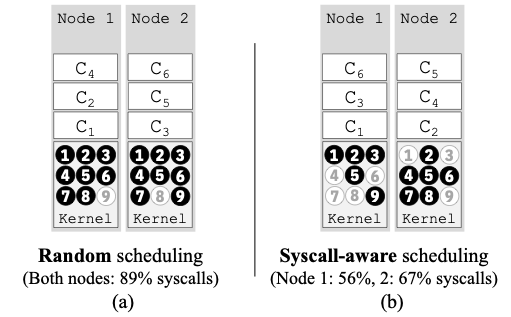

# KEP: SySched  - System call-based scheduling

## Summary

We propose the use of pod placement as a way to improve the security of nodes in a cluster. Specifically, we propose a new scheduler scoring plugin (SySched) that enables the ranking of feasible nodes based on the relative risks of pods' system call usage. Key to this risk calculation is the Excess System Call (ExS) metric, which measures the amount of excess system call a pod is exposed to on a given node. The benefits of this approach are the following:

1.  reduce the number of victim pods that can be impacted by a "bad" pod
2.  reduce the number of nodes in a cluster that can be impacted by a "bad" pod
3.  minimizes the "excess" system calls across all pods on a node and all nodes in a cluster
4.  minimizes attack surface areas of a node (reduce needed system calls on a node)

## Motivation

Securing  Kubernetes workloads despite the inevitability of vulnerabilities is a critical  task. Particularly devastating are vulnerabilities in the host kernel that are exploitable via system calls to escalate privileges and break out of containment, as demonstrated by the infamous Dirty COW or the recent Dirty Pipe vulnerability. As a result, a pod's security depends on its neighboring pods and their system call usage since pods share a highly-privileged kernel on a host.  Yet cloud providers strive to increase pod density to improve host utilization by multiplexing workloads from different users and tenants on the same set of physical nodes, providing ample opportunities for distrusting containers to become "bad neighbors."

 While pod-centric security schemes such as seccomp are necessary, they alone are insufficient. We introduce a practical way to curtail the impact of these types of threats by leveraging a new security-aware pod scheduling scheme that we've developed for Kubernetes to co-locate pods based on their system call usage. So even if such attacks were successful, we show that it would impact fewer victim pods (up to 40% less) on fewer nodes (up to 1/3 less) in the cluster than the existing scheduler.
 
### Goals

1. No changes to the core scheduler; need only implement the features as a Scoring plugin
2.  No impact when the scoring plugin is disabled
3.  When scoring plugin is enabled:
	-  Works in conjunction with other scoring plugins
	-  No impact if pod does not have an associated system call profile
	-  Improve pod security:

4.  Reduce the number of victim pods that can be impacted by a "bad" pod
5.  Reduce the number of nodes in a cluster that can be impacted by a "bad" pod
6.  Minimizes the "excess" system calls across all pods on a node and all nodes in a cluster
7.  Minimizes attack surface areas of a node (reduce needed system calls on a node)

### Non-goals

1.  Use other pod security attributes as part of scheduling metric (only considering system call in initial version)
2.  Use existing Taint mechanism to implement above
3.  Descheduling or rescheduling a pod after placement if the system call condition on the node changes during a pod's lifetime.
4.  Automatically generating a system call profile of a pod

## Proposal

### User Stories

Administrator deploys the scheduler with the SySched scoring plugin enabled. Users may deploy their pod as usual. As pods are scheduled, the pods are automatically placed according to the pod's specified constraints and our security metric discussed above.

 #### Story 1

<b>Figure 1. Scheduling algorithm and pod placement example</b>

Figure 1  illustrates how our scoring algorithm works and how pods are placed. The figure shows the placement of six pods (C1, C2, C3, C4, C5,and  C6)  in  two  nodes  (Node 1  and  Node 2).  The  numbers inside a rectangular box for a pod indicate the system calls the pod use, i.e., C1 {1, 2, 3, 5}, C2 {4, 7, 8}, C3 {1, 3, 5, 9}, C4 {2, 5, 6, 8}, C5 {2, 4, 5, 7}, and C6 {2, 7, 8}. Initially, to schedule pod C1, the ExS  scores for both Node 1 and Node 2 are the same (i.e., 0), since there are no pods running on the nodes (Figure 1(a)). Thus, our algorithm randomly picks one of the two nodes, Node 1 in this case, and updates its system call usage list using the system calls of C1 (Figure 1(b)). The ExS  scores for scheduling pods C2 are 7 and 0 for Node 1 and Node 2, respectively (Figure 1(b)). In this case, the scheduling algorithm picks Node 2 since Node 2 has a lower ExS  score. Figure 1(c) shows the updated system call lists for Node 2. This process repeats for all incoming pods. After all pods are placed, the cluster-wide ExS score in this example is 12, i.e., ExS1 is 5 and ExS2 is 7, where 1 and 2 are node numbers.

<b>Figure 2: Syscall-aware scheduling reduces host attack surfaces</b>

Figure 2 highlights the opportunities not only for reducing the exposure to extraneous system calls (i.e., ExS score) but also the node’s attack surface. Imagine an OS with nine total system calls. On such a system, both nodes in Figure 2(a) would require providing access to 89% of system calls for a non-syscall-aware scheduler such as Kubernetes default scheduler. This is in contrast to the placement outcome when our syscall-aware scheduler is used (Figure 2(b)). In that scenario, Node 1 and Node 2 only require maintaining access to 56% and 67% of system calls, respectively.

#### Story 2

Certain system calls might be deemed critical based on current or historical data. In such situations, a weight can be attached to the associated system calls which would let the scheduler further isolate the pods using those critical system calls from other pods.

### Notes/Constraints/Caveats

We assume the pod's configuration contains seccomp security context provided by the user or automatically configured using the Security Profile Operator (more on this below). We make use of the seccomp profile to retrieve what system calls are used by the pods. seccomp is also used to filter the system calls for each pod to enforce system call restriction.

Creating a seccomp profile that is inaccurate can result in pod execution failure. Creating an accurate seccomp filter can be challenging but this is an existing difficulty of using seccomp. The Security Profile Operator can be used to ease and automate this process.

### Risks and Mitigations

Pods with the same workload might get scheduled on the same set of nodes, potentially impacting performance. Can remedy this by applying existing tainting or anti-affinity policies to spread those pods out.
  

A security-aware scheduler scoring plugin (SySched) scores a node for an incoming pod by comparing the system call profile of the incoming pod with the system call profiles of existing pods in the node. It aims to co-locate pods with the same or similar system call profile for improving pod security while maintaining a high level of performance.

## Design Details: Overall architecture

Our plugin utilizes system call profiles of pods obtained through their security contexts in the form of seccomp profiles. Our plugin computes a score for each feasible node by comparing the system call profile of the pod with the system call profiles of the existing pods in the node. Our plugin keeps track of the placements of pods in the entire cluster. To compute the scores, the plugin uses a metric called Extraneous System Call (ExS). The ExS metic captures the system calls that a pod does not need, but is present in the node.  Our plugin then returns the computed normalized ExS scores to be combined with other scores in Kubernetes for ranking nodes. If a pod has no seccomp profile associated with it, then our plugin effectively is a noop. The following figure shows the integration of our plugin with the Kubernetes scheduler.

<b>Figure 3: Overall architecture</b>

### Scheduling Metrics - Extraneous System Call (ExS)

At the heart of SySched is a single-valued score used to quantify the extraneous system call exposure of a pod on a node. Informally, ExS captures the additional system calls accessible on a node that the pod itself does not use. This score reflects the potential “danger” a pod must face when running on the target node as vulnerabilities in these extraneous system calls from neighboring pods can jeopardize its own security. In the following figure, we can obtain the ExS for pod C1, C2, and C3 for a node with a kernel of nine system calls.

<b>Figure 4: Example ExS score calculation</b>

### Scheduling Plugin

We developed a new plugin to implement the scoring extension API point in the Kubernetes scheduler while leaving other filters and scoring plugins intact. We leverage existing filtering and scoring operations of the Kubernetes scheduler to handle other aspects of pod placement such as spreading the pods and ensuring resource availability.

 There are two main components of our plugin: 1) a lightweight in memory state store that holds the up-to-date node to pod mapping and 2) mechanisms for retrieving the system call sets used by pods and for computing the ExS scores. The state store is implemented as a thread that listens to events of a pod’s lifecycle, e.g., creation, stop, destruction, run, etc. Using these event notifications, this thread tracks where pods are currently running in a cluster. When a pod stops running on a node, our plugin also removes it from its internal mapping. While the entire state of pod placement in a cluster can be retrieved dynamically by querying the API server, this can be an expensive task to do per pod scheduling event, hence we choose to maintain this state internally in our scheduler.

### System call Profiles

**How the Scheduler gets access to pods' system call profiles**

We assume that the system call profiles of pods have explicitly been made available to the scheduler through a pod's security context. The seccomp profile directory on the host is mounted into the scheduler's pod. Then it reads and parses the seccomp profiles and obtains the the system call set for that pod. If the Security Profile Operator (SPO) is used (see below), the scheduler can instead use API server to access the seccomp profile CRD to get the system call profile. With the SPO, there's no need to mount the host's seccomp profile directory into the scheduler pod.

**Generating system call profile**

There are multiple ways to generate a system call profile and convert it to a seccomp profile and attach it to a pod. We describe two ways:

1.  Manually creating seccomp profile: One can create the system call profile for a pod by creating the seccomp profile manually and setting the profile location in local file system through a pod's security context
2.  Creating seccomp profile using Security Profile Operator (SPO): The Kubernetes sigs community developed the Kubernetes [Security Profiles Operator](https://github.com/kubernetes-sigs/security-profiles-operator) that creates Custom Resource Definition (CRD) for seccomp profile. One can manually create a seccomp profile CRD for a pod by specifying the allowed or denied list in the CRD's yaml file. The operator can also be used to automate generating the seccomp profile. In the end, the operator creates the CRD and provides a relative path where the actual json file for the CRD is stored. One can then update the pod's security context using the relative path. Optionally, SPO can also automate binding the seccomp profile to a pod. 

### Known limitations

-   System call profile associated with a pod must be accessible to the scheduler either locally on the file system or through a CRD
-   If there are not enough nodes or the variance in system call usage of the workload is small, the security benefit will be small if any.
-   Generating a tight and complete system call profile for a pod is not trivial.

### Test plans

## Production Readiness Review Questionnaire

### Scalability

-   Will enabling / using this feature result in any new API calls?No.
-   Will enabling / using this feature result in introducing new API types?No.
-   Will enabling / using this feature result in any new calls to the cloud provider?No.
-   Will enabling / using this feature result in increasing size or count of the existing API objects?No.
-   Will enabling / using this feature result in increasing time taken by any operations covered by [existing SLIs/SLOs](https://git.k8s.io/community/sig-scalability/slos/slos.md#kubernetes-slisslos)?  Experiments are planned to evaluate the overhead.  However, it should be a negligible.
-   Will enabling / using this feature result in non-negligible increase of resource usage (CPU, RAM, disk, IO, ...) in any components?  No. A small amount of memory is used to hold pod topology and grows linearly with number of pods. The scoring algorithm is also linear when the total system call usage set for a node is cached. 

### Troubleshooting

-   How does this feature react if the API server and/or etcd is unavailable?  Running pods are not affected. Any new submissions would be rejected by scheduler.
-   What are other known failure modes?  N/A
-   What steps should be taken if SLOs are not being met to determine the problem? Disable the scoring plugin

### Graduation criteria

-   Alpha
	-   Pods are placed based on their system call profiles provided via seccomp files on the local file system of the scheduler
-   Beta
	-   User can define weights for each system call

## Implementation history

-   We have implemented this System Call-aware Scheduler (SySched) plugin for Kubernetes v1.23 and have evaluated the security benefits and performance impact to the cluster.
-   We have presented to the Scheduling-SIG on April 7th, 2022
-   Used the Security Profiles Operator to generate system call profiles for pods and bind them to the pods as seccomp filters
