# KEP-4986: Sakkara - A Hierarchical Cluster Topology Group Scheduler Plugin

## Summary

The goal of this scheduler plugin is to place a group of pods according to topological constraints in a cluster with a tree topology.
The nodes in the cluster make up the leaves of the tree and the levels in the tree represent a hierarchy, such as nodes, servers, racks, rows, zones, and so on, up to the (logical) root of the tree.
The group to be placed consists of a set of homogeneous pods, with respect to their resource requirements and other scheduling constraints, typically specified in a pod template.
A group, also referred to as a placement group, may constitute an application or a job that needs to be placed with some topological constraints in the cluster.
The notion of a placement group existed for HPC and AI/ML workloads, where the members of the group are VMs that are placed in a datacenter according to specified placement strategies (e.g., [AWS](https://docs.aws.amazon.com/AWSEC2/latest/UserGuide/placement-groups.html), [Azure](https://learn.microsoft.com/en-us/azure/virtual-machines/co-location), [IBM](https://cloud.ibm.com/docs/vpc?topic=vpc-about-placement-groups-for-vpc), [Oracle](https://docs.oracle.com/en-us/iaas/Content/cluster-placement-groups/overview.htm)).
Depending on the interactions among the members of a group, and other factors such as availability, the application performance highly depends on how the members are placed in the datacenter topology.

Inspired by the simple hierarchical topology, step pyramid structure, this scheduler plugin is named [Sakkara](https://en.wikipedia.org/wiki/Saqqara).
Sakkara places all pods in a group based on a rich set of topological constraints, given a hierarchical cluster topology.
Topological constraints, such as pack, spread, partition, range, and factor policies, can be specified at any level of the topology, and each level can satisfy a different policy.
This way, Sakkara can accommodate a flexible set of application-specific logical topologies.
The resulting logical application topology is made available to the group for initial configuration that helps improve its running performance and cluster utilization.
A unique feature is the support of priorities where jobs may be preempted as gangs.
Sakkara employs an open-source solver which uses the [chic-sched](https://github.com/ibm/chic-sched) algorithm to find a placement solution for the entire group, satisfying the group topological constraints. (Other solvers may be substituted.)

## Motivation

A requirement for long running jobs with a specific pattern of interaction among its component pods is topology-aware scheduling of the pods, given a cluster topology.
Existing solutions are as follows.

- [node resource topology](https://github.com/kubernetes-sigs/scheduler-plugins/tree/master/pkg/noderesourcetopology): concerned about the connectivity of resources within a node
- [coscheduling](https://github.com/kubernetes-sigs/scheduler-plugins/tree/master/pkg/coscheduling): group placement without topology awareness, nor group preemption
- [pod topology spread constraints](https://kubernetes.io/docs/concepts/scheduling-eviction/topology-spread-constraints/): a very narrow form of topology constraint of a single pod

Lacking is a scheduler that is both topology-aware at the cluster level, with a set of rich topological constraints, and places/preempts whole groups.

### Goals

Develop a scheduler plugin which places a group of pods in a cluster with a given tree topology, satisfying group placement constraints at all levels of the hierarchy.

### Non-Goals

- Discovery of cluster topology
- Migration of pods
- Elastic groups with changing size

## Proposal

### User Stories

1- **User A:**

Want to deploy a job with 8 pods, equally partitioned into two partitions, where each partition is placed in separate rack, and the pods belonging to a partition are packed on nodes within the rack. Partitioning improves availability, and packing improves performance.

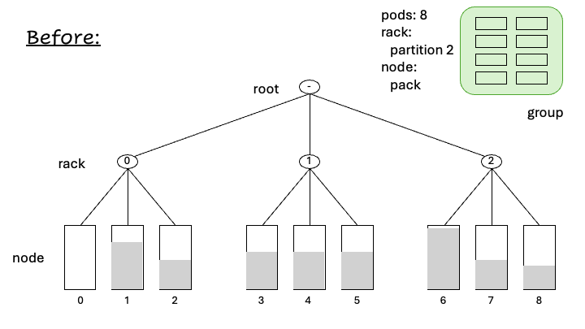

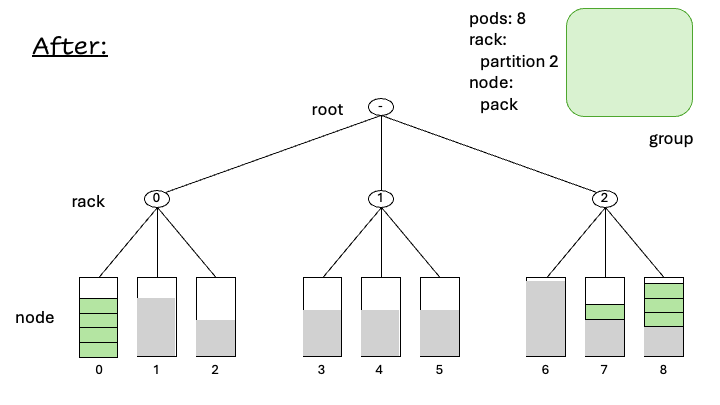

2- **User B:**

Want to place a job with 6 pods packed on same physical server, as much as possible, where pods on the same server are spread across nodes in that server, but in the range [2,4]. Having all pods on the same physical server improves communication among the pods. And, having less than 2 pods in a node spreads the pods too thinly, and having more than 4 may leads to congestion.

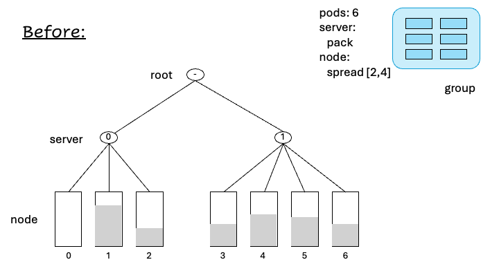

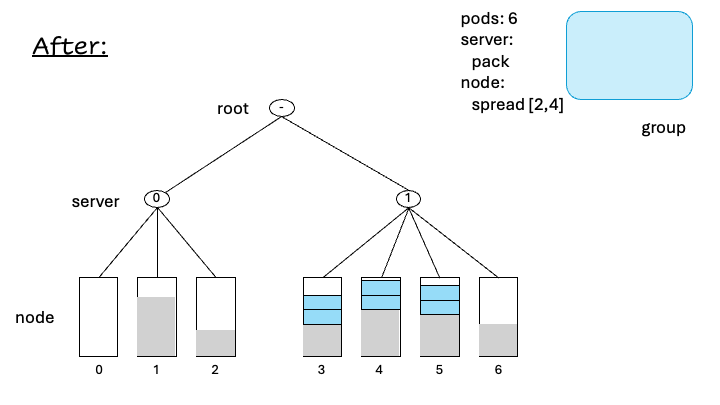

### Examples

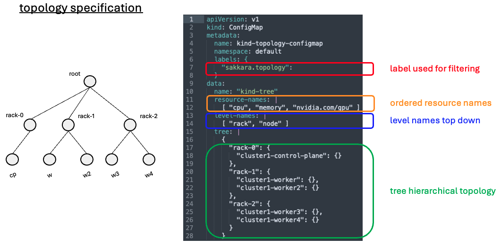

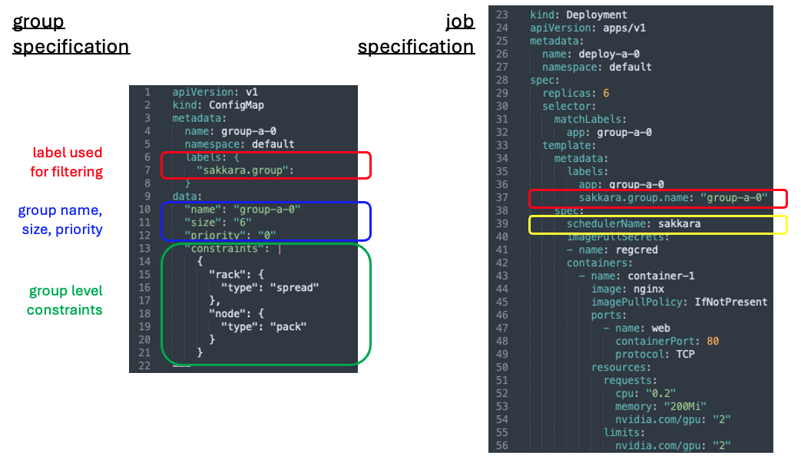

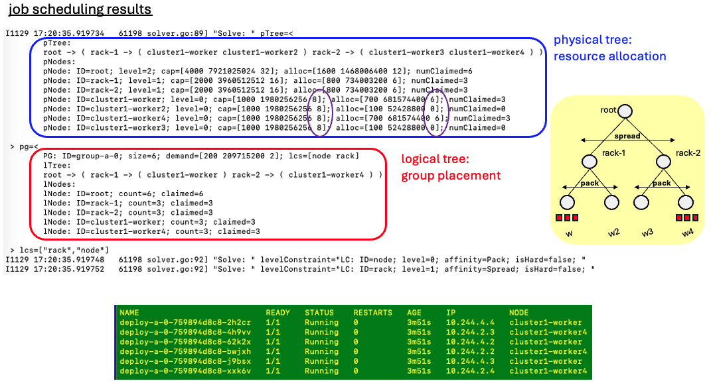

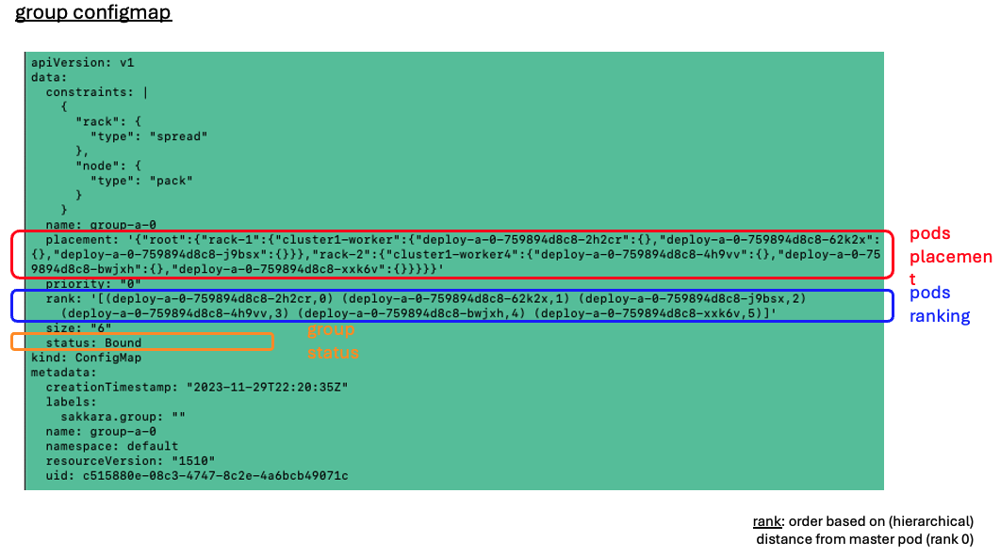

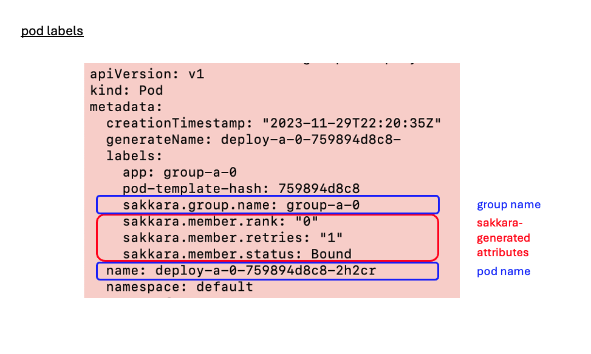

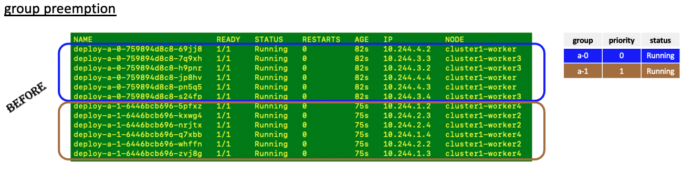

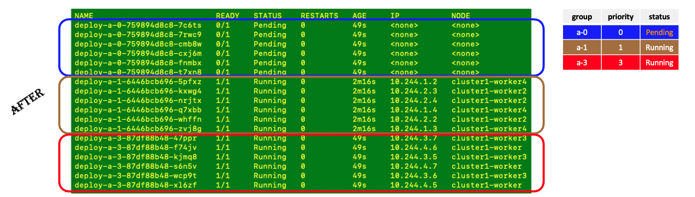

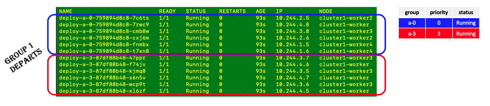

### Notes/Constraints/Caveats

### Risks and Mitigations

## Design Details

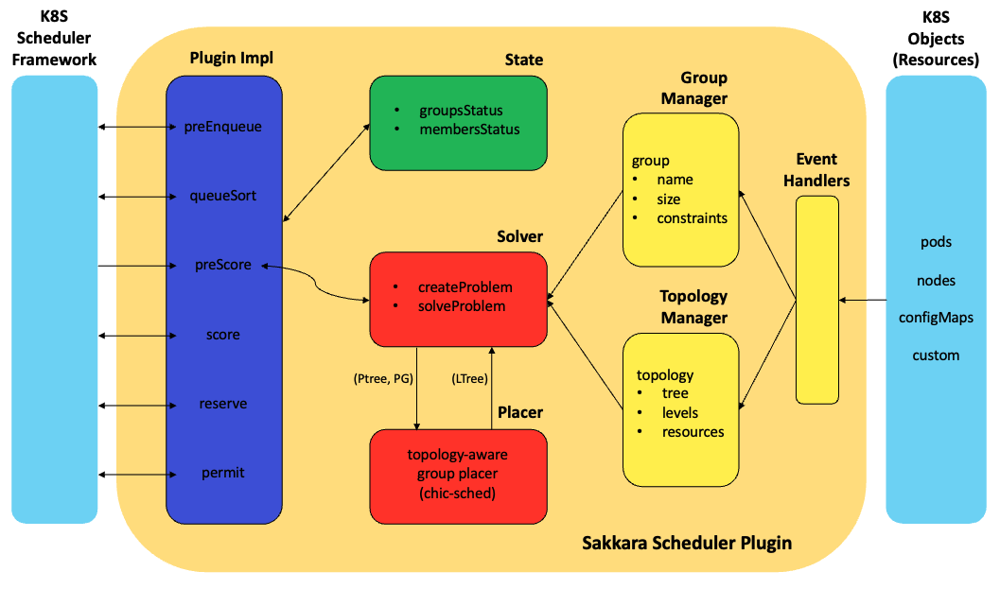

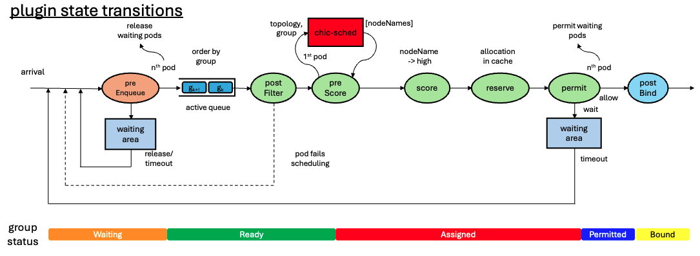

### Cluster topology

The cluster topology is specified as a tree where the leaves are the nodes in the cluster.
There may be one or more levels in the tree, where nodes are at level 0.
For example, level 1 may represent servers, level 2 racks, level 3 rows, and so on.
If no cluster topology is specified, Sakkara assumes a flat topology with only one level, i.e. a tree with a root and all nodes in the cluster as leaves, with two resources: CPU and memory.

The tree is specified in a ConfigMap with a label `"sakkara.topology":`.
It may be updated at any time. Updates take effect during the following group placement cycle.

An example with a two-level tree of racks and nodes follows.

```yaml
apiVersion: v1
kind: ConfigMap
metadata:
  name: cluster-topology-configmap
  namespace: sakkara
  labels: {
    "sakkara.topology": 
  }
data:
  name: "cluster-tree"
  resource-names: |
    [ "cpu", "memory", "nvidia.com/gpu" ]
  level-names: |
    [ "rack", "node" ]
  tree: |
    {
      "rack-0": {
        "node-0": {},
        "node-1": {},
        "node-2": {}
      },
      "rack-1": {
        "node-3": {},
        "node-4": {},
        "node-5": {}
      }
    }
```

- *namespace*: The topology configMap is deployed in a special namespace to avoid modifications by unauthorized users. The name of the namespace is defined using the argument `topologyConfigMapNameSpace` of the Sakkara scheduler plugin in the `KubeSchedulerConfiguration`. If not specified, it defaults to the `default` namespace. Here we use namespace sakkara.
- *resource-names*: Resources to be considered when placing the group.
- *level-names*: Names of the levels as an array of strings ordered top to bottom (excluding the root).
- *tree*: String specification of the tree.

### Group constraints

Group definition and placement topological constraints are provided in a ConfigMap with label `"sakkara.group":`. An example of `group-a' consisting of 8 pods follows.

```yaml
apiVersion: v1
kind: ConfigMap
metadata:
  name: group-a
  namespace: default
  labels: {
    "sakkara.group": 
  }
data:
  "name": "group-a"
  "size": "8"
  "priority": "0"
  "constraints": |
    {
      "rack": {
        "type": "pack"
      },
      "node": {
        "type": "spread"
      }
    }
```

The constraints state that the 8 pods are to be placed in such a way that they are packed on racks, but spread on nodes within the rack. The constraints are soft by default. The resulting placement depends on the current allocation in the cluster. Ideally, the resulting placement would be:

```text
{root:
    {rack-0: 
        {node-0: {pod-0, pod-1, pod-2}},
        {node-1: {pod-3, pod-4, pod-5}},
        {node-2: {pod-6, pod-7}}
    }
}
```

In case rack-1 cannot accommodate the whole group, node-2 does not have enough availability for one pod, node-1 can accommodate up to 3 pods, and node-0 has plenty of space, we get:

```text
{root:
    {rack-0: 
        {node-0: {pod-0, pod-1, pod-2, pod-3, pod-4}},
        {node-1: {pod-5, pod-6, pod-7}}
    }
}
```

Other placements are also possible, where a maximum of 6 pods could be placed on rack-0 and the remaining 2 pods on rack-1:

```text
{root:
    {rack-0: 
        {node-0: {pod-0, pod-1, pod-2}},
        {node-2: {pod-3, pod-4, pod-5}}
    },
    {rack-1: 
        {node-3: {pod-6}},
        {node-5: {pod-7}}
    }
}
```

There are several types of constraints, which may be specified at the various levels of the hierarchy. If none is specified, the default is *pack*.

- *pack*: Pack as many pods as possible on a unit at the level.

```yaml
         "type": "pack"
```

- *spread*: Spread pods as evenly as possible on units at the level.

```yaml
         "type": "spread"
```

- *partition*: Divide the pods into a number of partitions of approximately equal size.

```yaml
         "type": "spread",
         "partitions": 3
```

- *range*: The number of pods placed on a unit at the level is within a range.
  
```yaml
         "min": 2,
         "max": 4
```

- *factor*: The number of pods placed on a unit at the level is a multiple of a given factor.
  
```yaml
         "factor": 4
```

Care has to be taken when specifying constraints, especially at multiple levels, as they may be inconsistent.

### Group pods

The group of pods are specified based on the kind of group. An example of a batch/v1 job group is provided below.

```yaml
apiVersion: batch/v1
kind: Job
metadata:
  namespace: default
  generateName: job-a-
spec:
  parallelism: 8
  template:
    metadata:
      labels:
        sakkara.group.name: "group-a"
    spec:
      schedulerName: sakkara
      containers:
      - name: main
        image: busybox
        imagePullPolicy: IfNotPresent
        command: ["sh", "-c", "sleep 10"]
        resources:
          requests:
            cpu: "100m"
            memory: "128Mi"
            nvidia.com/gpu: "1"
          limits:
            cpu: "200m"
            memory: "128Mi"
            nvidia.com/gpu: "1"
      restartPolicy: OnFailure
```

In this case the pods of the group are specified in the pod template. For Sakkara, the following additions are needed.

- *group name*
  
```yaml
      labels:
        sakkara.group.name: "group-a"
```

- *scheduler name*

```yaml
    spec:
      schedulerName: sakkara
```

The group may be made up of a collection of pods, or a deployment, or multiple deployments, e.g. master and worker pods. The main requirement is that pods are homogeneous, i.e. all pods in the group have the same amount of requested resources.

A group of pods without a corresponding group ConfigMap would remain in the pending state until the group ConfigMap is created.

### Placement results

In addition to the pods of a group being scheduled by Sakkara as a gang and according to topological constraints, some information about the placement result is provided in the group ConfigMap and the pods. This information may be used to configure the application containing the group.

- *group placement*

```yaml
apiVersion: v1
kind: ConfigMap
metadata:
  name: group-a
  namespace: default
  labels: {
    "sakkara.group": 
  }
data:
  "name": "group-a"
  "size": "8"
  "priority": "0"
  "constraints": |
    {
      "rack": {
        "type": "pack"
      },
      "node": {
        "type": "spread"
      }
    }
  "status": Bound
  "placement": |
    {"root":
      {"rack-0": 
        {"node-0": {"pod-0", "pod-4", "pod-6"}},
        {"node-2": {"pod-1", "pod-3", "pod-7"}}
      },
      {"rack-1": 
        {"node-3": {"pod-2"}},
        {"node-3": {"pod-5"}}
      }
    }
  "rank": '[("pod-0",0) ("pod-4",1) ("pod-6",2) ("pod-1",3) ("pod-3",4) ("pod-7",5) ("pod-2",6) ("pod-5",7) ]'
```

Pods in the group are ranked based on their distance from a designated (master) pod. If a pod has the string "master" in its name, it will be considered the master pod, otherwise an arbitrary pod will be selected. Distance is the number of edges between two pods in the topology tree.

- *pod placement*

```yaml
apiVersion: v1
kind: Pod
metadata:
  name: pod-6
  labels:
    sakkara.group.name: group-a
    sakkara.member.rank: "2"
    sakkara.member.retries: "1"
    sakkara.member.status: Bound
```

The rank, status, and number of placement trials for the pod are provided as labels. This way, an (init) container in the pod may read the rank label and configure itself accordingly.

- *timing statistics*

Timing metrics about group scheduling is recorded in the group ConfigMap. This includes timestamps at the begin and end of group scheduling, the total scheduling time (including waiting in the pending state and retrials), and the amount of time taken by the chic-sched solver in Sakkara. An example follows.

```yaml
data:
  name: group-a
  schedBeginTime: "2024-07-02T10:53:58.62352-04:00"
  schedEndTime: "2024-07-02T10:53:58.777733-04:00"
  schedSolverTimeMilli: "0"
  schedTotalTimeMilli: "154"
```

### Plugin Config Args

There is one parameter for the proposed plugin:

- *TopologyConfigMapNameSpace*: The namespace where the cluster topology configmap is deployed.

```go
// ClusterTopologyPlacementGroupArgs holds arguments used to configure ClusterTopologyPlacementGroup plugin.
type ClusterTopologyPlacementGroupArgs struct {
 metav1.TypeMeta

 // Namespace where the cluster topology configmap is deployed
 TopologyConfigMapNameSpace string
}
```

### Plugin Config Map

```yaml
apiVersion: v1
kind: ConfigMap
metadata:
  name: sakkara-scheduler-config
  namespace: sakkara
data:
  config.yaml: |
    apiVersion: kubescheduler.config.k8s.io/v1
    kind: KubeSchedulerConfiguration
    leaderElection:
      leaderElect: false
    profiles:
    - schedulerName: sakkara
      plugins:
        preEnqueue:
          enabled:
          - name: ClusterTopologyPlacementGroup
        queueSort:
          enabled:
          - name: ClusterTopologyPlacementGroup
          disabled:
          - name: "*"
        postFilter:
          enabled:
          - name: ClusterTopologyPlacementGroup
        preScore:
          enabled:
          - name: ClusterTopologyPlacementGroup
        score:
          enabled:
          - name: ClusterTopologyPlacementGroup
            weight: 10
        reserve:
          enabled:
          - name: ClusterTopologyPlacementGroup
        permit:
          enabled:
          - name: ClusterTopologyPlacementGroup
        postBind:
          enabled:
          - name: ClusterTopologyPlacementGroup
      pluginConfig:
      - name: ClusterTopologyPlacementGroup
        args:
          topologyConfigMapNameSpace: sakkara
```

### Plugin Deployment

```yaml
apiVersion: apps/v1
kind: Deployment
metadata:
  name: sakkara
  namespace: sakkara
spec:
  replicas: 1
  selector:
    matchLabels:
      component: scheduler
      tier: control-plane
  template:
    metadata:
      labels:
        component: scheduler
        tier: control-plane
    spec:
      volumes:
        - name: etckubernetes
          configMap:
            name: sakkara-scheduler-config
      containers:
        - name: kube-scheduler
          image: <sakkara-scheduler-image>
          imagePullPolicy: IfNotPresent
          command:
          - /bin/kube-scheduler
          - --config=/etc/kubernetes/config.yaml
          - -v=6
          resources:
            requests:
              cpu: "200m"
              memory: "512Mi"
            limits:
              cpu: "500m"
              memory: "512Mi"
          volumeMounts:
          - name: etckubernetes
            mountPath: /etc/kubernetes
          securityContext:
            privileged: true
      hostNetwork: false
      hostPID: false
```

### Test Plan

Unit tests and Integration tests will be added.

## Production Readiness Review Questionnaire

### Dependencies

- Availability of cluster topology though an administrator, a topology controller, and/or a topology discovery tool.
- Solver such as the open source [chic-sched](https://github.com/ibm/chic-sched).

### Scalability

- Will enabling / using this feature result in any new API calls?

  No.

- Will enabling / using this feature result in introducing new API types?

  No.

- Will enabling / using this feature result in any new calls to the cloud provider?

  No.

- Will enabling / using this feature result in increasing size or count of the existing API objects?

  No.

- Will enabling / using this feature result in increasing time taken by any operations covered by [existing SLIs/SLOs](https://git.k8s.io/community/sig-scalability/slos/slos.md#kubernetes-slisslos)?

  No, to be confirmed with some benchmarking.

- Will enabling / using this feature result in non-negligible increase of resource usage (CPU, RAM, disk, IO, ...) in any components?

  No.

### Troubleshooting

- How does this feature react if the API server and/or etcd is unavailable?

  Running pods are not affected. Any new submissions would be rejected by scheduler.

- What are other known failure modes?

  N/A

- What steps should be taken if SLOs are not being met to determine the problem?

  N/A

## Implementation History

## Drawbacks

## Alternatives
