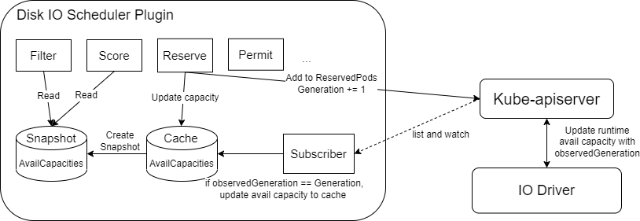

# Disk IO Aware Scheduling

<!-- toc -->
- [Summary](#summary)
- [Motivation](#motivation)
- [Design Consideration](#design-consideration)
  - [Goals](#goals)
  - [Non-Goals](#non-goals)
- [Proposal](#proposal)
- [Design Details](#design-details)
  - [IO Metrics Collector](#io-metrics-collector)
  - [Aggregator](#aggregator)
  - [IO Calculation Model](#io-calculation-model)
  - [Disk IO Scheduler Plugin](#disk-io-scheduler-plugin)
    - [Filter Plugin](#filter-plugin)
    - [Score Plugin](#score-plugin)
    - [Reserve Plugin](#reserve-plugin)
  - [Test Plan](#test-plan)
  - [Graduation Criteria](#graduation-criteria)
    - [Alpha](#alpha)
    - [Beta](#beta)
- [Implementation History](#implementation-history)
<!-- /toc -->


## Summary

This proposal aims at implementing a scheduling plugin which makes the scheduling decision based on node’s available disk IO capacity.

## Motivation

Disk IO resource is an important resource in a Cloud-native environment to guarantee the performance of workloads. Current Kubernetes scheduler does not support disk IO resource aware scheduling. It could happen that the pods scheduled onto a node compete for the disk IO resource, resulting in performance degradation (the noisy neighbor problem).  There is an increasing demand for adding disk IO resource aware scheduling to Kubernetes to avoid or mitigate the noisy neighbor problem.

To support the disk IO resource aware scheduling, we add a scheduler plugin that tracks each pod’s disk IO resource need and does accounting of the available disk IO resource on each node when making the scheduling decision.

## Design Consideration

Unlike CPU and memory, a disk’s available IO bandwidth (BW) cannot be calculated by simply subtracting all the running workloads’ requested IO BW from a disk’s total IO BW capacity. A disk’s total IO BW capacity is not a fixed value and changes dynamically upon the characteristics of the workloads running on it, such as the workload’s disk accessing block size and read/write ratio. At different time points, different combinations of workloads could be scheduled to run on a node in the cloud cluster. Therefore a disk’s total IO BW capacity would change dynamically and a disk’s available IO accounting cannot be done in the same way as the CPU/memory accounting.

Since the remaining IO BW capacity of a disk can change dynamically based on the characteristics of the existing workloads, the characteristics of the workload such as IO block size and read/write ratio must be specified in the pod specification together with the disk IO BW requirement. It could happen that some users do not have knowledge of their workloads’ characteristics. In this case, the scheduler plugin will use default values and later get the workloads’ IO block size and read/write ratio through a real-time metrics collector.

The mathematical relationship between the disk’s IO BW capacity and the running workloads’ characteristics is different for different types of disks manufactured by different vendors. There is no “one size fits all” function to model/normalize it. Therefore, the disk IO scheduler design would provide flexibility for vendors to plug in different calculation/normalization models in the form of an IO Driver.

### Goals

- Implement a disk IO aware scheduler plugin which enables the disk IO aware accounting and scheduling

- Define flexible communication APIs between disk IO aware scheduler plugin and the vendor-specific IO Driver

### Non-Goals

- The implementation of the disk IO Driver due to the distinct characteristics of each disk device.

## Proposal

The disk IO aware scheduler plugin would implement the filter, score and reserve hook points of the scheduler framework. At the filter stage, it would obtain each node’s available disk IO capacity from the IO Driver at run time, update the available disk IO capacity of each node in its local cache, and filter out nodes which do not have enough IO capacity from the node candidate list. At the score stage, it would prioritize the node candidates based on a scoring policy, such as most allocated policy. At the reserve stage it would notify the node IO Driver of the new pod so that the IO Driver can start collecting the disk IO metrics of this new pod.

## Design Details

The design includes the following key components: the disk IO scheduler plugin and its interfaces with the IO Driver.

<p align="center"></p>
The disk IO scheduler plugin communicates with the IO Driver to pass information on IO metrics collection context (e.g., reserved pod list), obtain a normalized IO BW for each new pod’s IO BW request, and retrieve updates on each disk’s normalized available IO capacity for making scheduling decisions.

The IO Driver, which is to be implemented by disk IO vendors, comprises three components.

### IO Metrics Collector

The IO Metrics Collector, which runs on each worker node, acts as an IO metric collector and analyzer. It watches the actual disk IO utilization of each pod, calculates the disk’s available IO capacity based on each workload’s real-time usage and characteristics using the IO Calculation Model and reports the node’s real-time available disk IO capacity to the aggregator when it is smaller than what is saved in the scheduler plugin’s cache. Since different disk vendors could have different ways of collecting metric, this component is outside the scope of the scheduler plugin’s implementation.

### Aggregator

The aggregator consolidates the IO metrics from each worker node, reports a consolidated list of real-time available disk IO capacity to the scheduler plugin. It is also responsible for converting each new pod’s disk IO BW request to a normalized value using the disk’s IO Calculation Model so as to match the disk’s normalized available IO capacity. Since the normalization function is disk type and vendor specific, this component is outside the scope of the scheduler plugin’s implementation.

### IO Calculation Model

The IO Calculation Model is responsible for converting the disk’s available IO capacity and each new pod’s IO request to normalized values. Since the normalization function is disk type and vendor specific, this component is outside the scope of the scheduler plugin’s implementation.

### Disk IO Scheduler Plugin

We leverage the K8s scheduler framework to add the disk IO scheduler plugin.
When the scheduler plugin starts, it subscribes to the IO Driver with a long streaming connection. The IO Driver updates the scheduler plugin about each node disk’s normalized available IO capacity and the scheduler plugin stores the info in the plugin’s local cache. We thought about using CRD mechanism before. But going through the CRD route, it has two drawbacks: 
1. In the pod scheduling flow, the disk IO scheduler plugin needs to pass the disk IO info specified in the annotation of the pod spec to the vendor-specific IO driver and get back a normalized disk IO BW value. Using CRD to support this bi-directional communication would involve creating two CRDs and two watches, which introduces long latency to the pod scheduling flow. 
2. A node's disk IO available capacity would change dynamically upon the workloads' real-time IO access characteristics such as block size and IO read/write ratio. If we choose the CRD route, the real-time disk IO available capacity update will inject too much traffic into the API server and degrade the API server's performance. Using a direct communication channel between the disk IO scheduler plugin and the vendor-specific IO driver greatly helps to mitigate these two issues. 

The disk IO scheduler plugin consists of the following parts.

#### Filter Plugin

During the filter phase, the scheduler plugin sends the PodSpec with a disk IO BW request (as shown below) to the IO Driver and gets back a normalized disk IO BW needed by this POD. It then loops through each node in the candidate node list and checks this needed disk IO request of the POD against each node’s available disk IO capacity saved in the local cache to generate an updated candidate list.

``` yaml
apiVersion: v1
kind: Pod
metadata:
  name: ga_pod
  annotations:
     blockio.kubernetes.io/throughput: |
{"rbps": "20M","wbps": "30M","blocksize": "4k"}
spec:
  containers:
    - name: xxxServer
      image: xxx
       volumeMounts:  
        - name: xxx-storage
          mountPath: /data/xxx
  volumes:
  - name: xxx-storage
     emptyDir: {}
```

#### Score Plugin

During the score phase, the scheduler plugin gives a score to each node in the candidate list based on a scoring policy.
```
T = Node's available disk IO capacity
R = Pod's needed disk IO bandwidth
```
For the Most Allocated policy:

$$ score = { T - R \over T} $$
For the Least Allocated policy:
$$ score = {R \over T} $$

#### Reserve Plugin

During the reserve phase, the scheduler plugin updates the selected node’s available disk IO capacity by deducting the pod’s needed disk IO resource. In addition, it adds the pod to the ReservedPods list, tags the list with a Generation, and then notifies the IO Driver of the new ReservedPods list. The Generation, similar to the Kubernetes’s [ResourceVersion](https://kubernetes.io/docs/reference/using-api/api-concepts/#resource-versions), ensures that only the update on the latest generation ReservedPod list is saved to the scheduler plugin’s cache.

Whenever there is any change to the IO metric collection context, the Generation increases by 1. If the IO Driver reports data based on an older generation than what is saved in the scheduler plugin’s cache, the update will be discarded.
<p align="center"></p>
The API protocol between the disk IO scheduler plugin and the IO Driver is outlined below:

``` go
service IODriver {

    // EstimateRequest returns the normalized IO request using the IO Calculation model
    rpc EstimateRequest (EstimateRequestRequest) returns (EstimateRequestResponse);

    // Subscribe returns the runtime node’s available IO capacity
    rpc Subscribe (Empty) returns (stream NodeIOStatuses);

    // SyncContext synchronizes nodes' IO metrics collection context with the aggregator
    rpc SyncContext (SyncContextRequest) returns (Empty);

}

message Empty {

}

message EstimateRequestRequest {

    // request in json format
    string io_request = 1;

}

message EstimateRequestResponse {

    NodeIOBandwidth io_estimate = 1;

}

message NodeIOStatuses {

    // The key represents the node name
    map<string, NodeIOBandwidth> node_io_bw = 1;

}

message SyncContextRequest {

     // The key represents the node name, while the value represents the IO metrics collection context which is in json format
     map<string, string> context = 1;

}

message NodeIOBandwidth {

     // The key represents the resource name, while the value represents the normalized disk IO request. The format of the value follows the definition of resource.Quantity in Kubernetes
      map<string, string> io_bandwidth = 1;

}
```

### Test Plan

Comprehensive unit tests will be added to ensure that each functionality works as expected. Additionally, detailed integration tests will be implemented to verify that the scheduler plugin and IO Driver interact without any issue.

Finally, a basic e2e test will be included to ensure that all components can work together properly.

### Graduation Criteria

#### Alpha

- Implement the disk IO aware scheduler plugin
- Provide a reference implementation of IO Driver
- Unit tests and integration test from [Test Plan](#test-plan).

#### Beta

- Add E2E tests.
- Provide beta-level documentation.

## Implementation History

- 2023-08-31: KEP created
