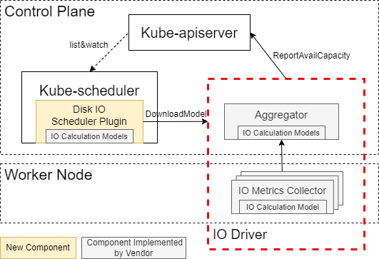

# Disk IO Aware Scheduling

<!-- toc -->
- [Summary](#summary)
- [Motivation](#motivation)
- [Design Consideration](#design-consideration)
  - [Goals](#goals)
  - [Non-Goals](#non-goals)
- [Proposal](#proposal)
- [Design Details](#design-details)
  - [CRD](#crd)
  - [IO Metrics Collector](#io-metrics-collector)
  - [Aggregator](#aggregator)
  - [IO Calculation Model](#io-calculation-model)
  - [Disk IO Scheduler Plugin](#disk-io-scheduler-plugin)
    - [Filter Plugin](#filter-plugin)
    - [Score Plugin](#score-plugin)
    - [Reserve Plugin](#reserve-plugin)
  - [Test Plan](#test-plan)
  - [Graduation Criteria](#graduation-criteria)
    - [Alpha](#alpha)
    - [Beta](#beta)
- [Implementation History](#implementation-history)
<!-- /toc -->


## Summary

This proposal aims at implementing a scheduling plugin which makes the scheduling decision based on node’s available disk IO capacity.

## Motivation

Disk IO resource is an important resource in a Cloud-native environment to guarantee the performance of workloads. Current Kubernetes scheduler does not support disk IO resource aware scheduling. It could happen that the pods scheduled onto a node compete for the disk IO resource, resulting in performance degradation (the noisy neighbor problem).  There is an increasing demand for adding disk IO resource aware scheduling to Kubernetes to avoid or mitigate the noisy neighbor problem.

To support the disk IO resource aware scheduling, we add a scheduler plugin that tracks each pod’s disk IO resource need and does accounting of the available disk IO resource on each node when making the scheduling decision.

## Design Consideration

Unlike CPU and memory, a disk’s available IO bandwidth (BW) cannot be calculated by simply subtracting all the running workloads’ requested IO BW from a disk’s total IO BW capacity. A disk’s total IO BW capacity is not a fixed value and changes dynamically upon the characteristics of the workloads running on it, such as the workload’s disk accessing block size and read/write ratio. At different time points, different combinations of workloads could be scheduled to run on a node in the cloud cluster. Therefore a disk’s total IO BW capacity would change dynamically and a disk’s available IO accounting cannot be done in the same way as the CPU/memory accounting.

Since the remaining IO BW capacity of a disk can change dynamically based on the characteristics of the existing workloads, the characteristics of the workload such as IO block size and read/write ratio must be specified in the pod specification together with the disk IO BW requirement. It could happen that some users do not have knowledge of their workloads’ characteristics. In this case, the scheduler plugin will use default values and later get the workloads’ IO block size and read/write ratio through a real-time metrics collector.

The mathematical relationship between the disk’s IO BW capacity and the running workloads’ characteristics is different for different types of disks manufactured by different vendors. There is no “one size fits all” function to model/normalize it. Therefore, the disk IO scheduler design would provide flexibility for vendors to plug in different calculation/normalization models in the form of an IO Driver.

### Goals

- Implement a disk IO aware scheduler plugin which enables the disk IO aware accounting and scheduling

- Define flexible communication APIs between disk IO aware scheduler plugin and the vendor-specific IO Driver

### Non-Goals

- The implementation of the disk IO Driver due to the distinct characteristics of each disk device.

## Proposal

The disk IO aware scheduler plugin would implement the filter, score and reserve hook points of the scheduler framework. At startup, it obtains each node’s available disk IO capacity from the API server by listing and watching the [NodeDiskIOInfo](#crd) CR when it is created by the IO Driver, and updates the info in its local cache. At the filter stage, it filters out nodes which do not have enough IO capacity from the node candidate list. At the score stage, it would prioritize the node candidates based on a scoring policy, such as most allocated policy. At the reserve stage it will update the API server with a new reserved pod list. Since the node IO Driver is watching update of the reserved pod list, it will be informed of the newly created pod and start collecting the disk IO metrics of this new pod.

## Design Details

The design includes the following key components: the disk IO scheduler plugin and the CRD to interact with the IO Driver.
<p align="center"></p>
The disk IO scheduler plugin communicates with the IO Driver to download normalization functions for normalizing each new pod’s IO BW request, and retrieves updates on each disk’s normalized available IO capacity from the API sever for making scheduling decisions.

The IO Driver, which is to be implemented by disk IO vendors, comprises three components.

### CRD

A new Custom Resource Definition (CRD) will be created. This new CRD has two key fields. One is the `ReservedPods` in its spec and the other is `AllocatableBandwidth` in its status. The `ReservedPods` holds the reserved pod list on one node and the `AllocatableBandwidth` holds the available disk IO capacity on one node. The IO Driver is responsible for updating the available disk IO capacity at runtime and watching the reserved pod list. Concurrently, the scheduler plugin would manage the reserved pod list, keep track of the available disk IO capacity and update it in its local cache. `NodeDiskIOInfo` is namespace scoped. 

``` go
type NodeDiskIOInfo struct {
	metav1.TypeMeta   
	metav1.ObjectMeta 

	Spec   NodeDiskIOInfoSpec   
	Status NodeDiskIOInfoStatus 
}
type NodeDiskIOInfoSpec struct {
	NodeName     string                
	ReservedPods []string // a slice of reserved pod uids
}
// NodeDiskIOStatusInfoStatus defines the observed state of NodeDiskIOStatusInfo
type NodeDiskIOInfoStatus struct {
	ObservedGeneration   int64                                 
	AllocatableBandwidth map[string]DeviceAllocatableBandwidth // the key of the map the device id
}
type DeviceAllocatableBandwidth struct {
	// Device's name
	Name string 
	// Device's IO status
	Status BlockIOStatus
}
type BlockIOStatus struct {
	// Normalized total IO throughput capacity 
	Total float64 
	// Normalized read IO throughput capacity 
	Read float64 
	// Normalized write IO throughput capacity 
	Write float64 
}
```
A sample CR is listed below:
``` yaml
apiVersion: ioi.intel.com/v1
kind: NodeDiskIOInfo
metadata:
  generation: 3
spec: # scheduler updates spec
  nodeName: workerNode
  reservedPods:
  - 7f69dbf7-f6e3-4434-9be8-fca2f8a1543d # pod uid
  - 8f69dbf7-f6e3-4434-9be8-fca2f8a1543d
status: # IO Driver updates status
  observedGeneration: 3
  allocatableBandwidth:
    INT_PHYF922500U3480BGN: # device id
      name: /dev/sda 
      total: 2200 
      read: 1100 
      write: 1100 
    INT_PHYF822500U3480BGN: ...
```

### IO Metrics Collector

The IO Metrics Collector, which runs on each worker node, acts as an IO metric collector and analyzer. It watches the actual disk IO utilization of each pod, calculates the disk’s available IO capacity based on each workload’s real-time usage and characteristics using the IO Calculation Model, and reports the node’s real-time available disk IO capacity to the aggregator when some pods are consuming more IO resource than they initially requested. Since different disk vendors could have different ways of collecting metric, this component is outside the scope of the scheduler plugin’s implementation.

### Aggregator

The aggregator consolidates the IO metrics which includes the real-time available disk IO capacity from multiple worker nodes and reports them to the API server. 

### IO Calculation Model

The IO Calculation Model is responsible for converting the disk’s available IO capacity and each new pod’s IO request to normalized values. Since the normalization function is disk type and vendor specific, this component is outside the scope of the scheduler plugin’s implementation.

### Disk IO Scheduler Plugin

We leverage the K8s scheduler framework to add the disk IO scheduler plugin.
When the scheduler plugin starts, it loads the normalization functions. Different types of disks could have different normalization functions. The normalization functions for various disk models can be configured through a `ConfigMap`. It includes the vendor name, disk model and the url to download the library from the IO Driver. When the normalization functions are downloaded from the IO driver, the scheduler plugin validates their signatures to prevent the library from undetected changes and stores the functions in its local cache.
``` yaml
apiVersion: v1
kind: ConfigMap
metadata:
  name: normalization-func
  namespace: default
data:
  diskVendors:|
  [{"vendorName":"Intel", "model":"P4510", "url": "https://access-to-io-driver"}]
```
The normalization functions must implement the interface below to customize their own normalization methods.
```
type Normalizer interface {
	Name() string
	EstimateRequest(ioRequest string) string
}
```
Here is a sample implementation.  
``` go
type normalizer struct {}
type IORequest struct {
  rbps string
  wbps string
  blockSize string
}

func (n normalizer) Name() string {
	return "Intel P4510 NVMe Disk"
}

// ioRequest example: {"rbps": "30M", "wbps": "20M", "blocksize": "4k"}
func (n normalizer) EstimateRequest(ioRequest) string {
  var req  = &IORequest{}
  _ = json.Unmarshal([]byte(ioRequest), req)
  resp, _ := n.normalize(req)
  normalized, _ := json.Marshal(resp)
  return normalized
}

// customized normalization method
func (n normalizer) normalize(ioRequest *IORequest) (*IORequest, error) {
  return &IORequest{
    rbps: ioRequest.rbps * coefficientA,
    wbps: ioRequest.wbps * coefficientB,
  }, nil
}
```

 The IO Driver updates each node disk’s normalized available IO capacity to the API server and the scheduler plugin watches the info through the `NodeDiskIOInfo` CR and stores it in the plugin’s local cache. 
The disk IO scheduler plugin consists of the following parts.

#### Filter Plugin

During the filter phase, the scheduler plugin passes the PodSpec with a disk IO BW request (as shown below) to the corresponding normalization function and gets back a normalized disk IO BW needed by this POD. It then loops through each node in the candidate node list and checks this needed disk IO request of the POD against each node’s available disk IO capacity saved in the local cache to generate an updated candidate list.

``` yaml
apiVersion: v1
kind: Pod
metadata:
  name: ga_pod
  annotations:
     blockio.kubernetes.io/throughput: |
{"rbps": "20M","wbps": "30M","blocksize": "4k"}
spec:
  containers:
    - name: xxxServer
      image: xxx
       volumeMounts:  
        - name: xxx-storage
          mountPath: /data/xxx
  volumes:
  - name: xxx-storage
     emptyDir: {}
```

#### Score Plugin

During the score phase, the scheduler plugin gives a score to each node in the candidate list based on a scoring policy.
```
T = Node's available disk IO capacity
R = Pod's needed disk IO bandwidth
```
For the Most Allocated policy:

$$ score = { T - R \over T} $$
For the Least Allocated policy:
$$ score = {R \over T} $$

#### Reserve Plugin

During the reserve phase, the scheduler plugin updates the selected node’s available disk IO capacity by deducting the pod’s needed disk IO resource. In addition, it adds the pod to the ReservedPods list, tags the list with a Generation, updates the new ReservedPods list to the CR in the API server and then the IO Driver which is watching the CR would be notified of the change. The Generation, similar to the Kubernetes’s [ResourceVersion](https://kubernetes.io/docs/reference/using-api/api-concepts/#resource-versions), ensures that only the update on the latest generation ReservedPod list is saved to the scheduler plugin’s cache.

Whenever there is any change to the IO metric collection context, the Generation increases by 1. If the IO Driver reports data based on an older generation than what is saved in the scheduler plugin’s cache, the update will be discarded.
<p align="center"></p>

### Test Plan

Comprehensive unit tests will be added to ensure that each functionality works as expected. Additionally, detailed integration tests will be implemented to verify that the scheduler plugin and IO Driver interact without any issue.

Finally, a basic e2e test will be included to ensure that all components can work together properly.

### Graduation Criteria

#### Alpha

- Implement the disk IO aware scheduler plugin
- Provide a reference implementation of IO Driver
- Unit tests and integration test from [Test Plan](#test-plan).

#### Beta

- Add E2E tests.
- Provide beta-level documentation.

## Implementation History

- 2023-08-31: KEP created
