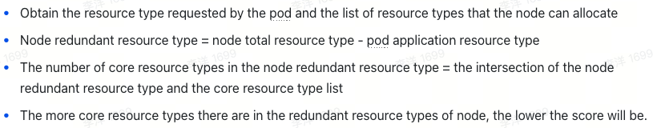

# Node Resource Fit plus Scheduling

<!-- toc -->
- [Summary](#summary)
- [Motivation](#motivation)
- [Design Consideration](#design-consideration)
  - [Goals](#goals)
  - [Non-Goals](#non-goals)
- [Proposal](#proposal)
- [Design Details](#design-details)
  - [NodeResourcesFitPlus](#noderesourcesfitplus)
  - [ScarceResourceAvoidance](#scarceresourceavoidance)
  - [Test Plan](#test-plan)
  - [Graduation Criteria](#graduation-criteria)
    - [Alpha](#alpha)
    - [Beta](#beta)
- [Implementation History](#implementation-history)
<!-- /toc -->


## Summary

The NodeResourcesFit plug-in of native k8s can only adopt a type of strategy for all resources, such as MostRequestedPriority and LeastRequestedPriority. However, in industrial practice, this design does not apply to some scenarios. For example: In AI scenarios, businesses that apply for GPUs prefer to occupy the entire GPU machine first to prevent GPU fragmentation; businesses that apply for CPU & MEM are prioritized and dispersed to non-GPU machines to prevent excessive consumption of CPU & MEM on GPU machines, resulting in real tasks of applying for GPUs. Pending due to insufficient non-GPU resources
. Therefore, two plugins are extended to solve this common problem.

## Motivation
case: 
- GPU tasks take priority over the entire GPU
- CPU&MEM tasks are distributed to the CPU machine first

## Design Consideration

- The solution is more versatile, not limited to AI clusters or CPU clusters, and not limited to common CPU resources or extended GPU resources.

- Different resource policies can be configured for different cluster types and prioritized in the form of weights.

- Easy to expand

### Goals

- Different types of resources can be configured with different strategies to prioritize them in the form of weights

- Prevent pods that have not applied for scarce resources from being scheduled to nodes with scarce resources.

### Non-Goals

- None.

## Proposal

Extend two plug-ins to meet the above needs

- NodeResourcesFitPlus
- ScarceResourceAvoidance

## Design Details

### NodeResourcesFitPlus

config：
```
resources: 
  nvidia.com/gpu:
    type: MostAllocated
    weight: 2
  cpu:
    type: LeastAllocated
    weight: 1
  memory:
    type: LeastAllocated
    weight: 1
```
config description：
<p align="center"></p>

node score:
```
finalScoreNode = [(weight1 * resource1) + (weight2 * resource2) + … + (weightN* resourceN)] /(weight1+weight2+ … +weightN)
```

### ScarceResourceAvoidance
config：
```
resources: 
- nvidia.com/gpu 
```
config description：
<p align="center"></p>

node score:
```
finalScoreNode = (allocatablesResourcesNum - requestsResourcesNum) * framework.MaxNodeScore / allocatablesResourcesNum
```

### Test Plan

Comprehensive unit tests will be added to ensure that each functionality works as expected. Additionally, detailed integration tests will be implemented to verify that the scheduler plugin and IO Driver interact without any issue.

Finally, a basic e2e test will be included to ensure that all components can work together properly.

### Graduation Criteria

#### Alpha

- Implement the NodeResourcesFitPlus and ScarceResourceAvoidance scheduler plugins
- Provide a reference implementation of the NodeResourcesFitPlus and ScarceResourceAvoidance
- Unit tests and integration test from [Test Plan](#test-plan).

#### Beta

- Add E2E tests.
- Provide beta-level documentation.

## Implementation History

- 2024-12-23: KEP created
