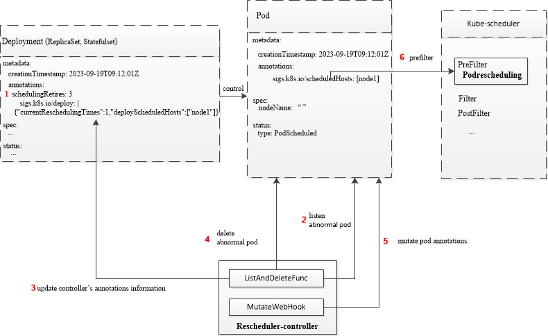

# Error pods rescheduling

## Table of Contents

<!-- toc -->
- [Summary](#summary)
- [Motivation](#motivation)
  - [Goals](#goals)
  - [Non-Goals](#non-goals)
- [Proposal](#proposal)
  - [User Stories](#user-stories)
    - [Story 1](#story-1)
    - [Story 2](#story-2)
- [Design Details](#design-details)
  - [Rescheduler-controller](#rescheduler-controller)
    - [Scheduled nodes list and current rescheduling times definition](#scheduled-nodes-list-and-current-rescheduling-times-definition)
  - [Podrescheduling](#podrescheduling)
  - [A concrete use case](#a-concrete-use-case)
  - [Notes](#notes)
- [Known limitations](#known-limitations)
- [Test Plan](#test-plan)
- [Graduation Criteria](#graduation-criteria)
  - [Alpha](#alpha)
  - [Beta](#beta)
- [Implementation History](#implementation-history)
<!-- /toc -->


## Summary

This proposal outlines a solution for rescheduling pods that have encountered errors, such as pods being OOM-killed or experiencing errors related to NUMA or devices.

## Motivation

The current Kubernetes scheduler performs scheduling for a pod only once. Consequently, if a scheduled pod encounters errors during booting or while running, the scheduler won't intervene to reschedule it to other nodes. 
The in-place restart strategy provided by kubelet only handles local restarts, which often fall short of resolving issues. 
For instance, a running pod might get OOM killed due to insufficient host-node memory, or it could be rejected by kubelet admissions during startup because of mismatches in NUMA or other device requirements. 
In such cases, local restarts are ineffective. Manual intervention becomes necessary, leading to increased operational complexity.
In case of [Descheduler](https://github.com/kubernetes-sigs/descheduler), which pays attention to already running pods, but our proposal focus on pods running normally at first but fails after some time or the pods rejected by kubelet admissions.

This situation contradicts Kubernetes' claim of automatic fault tolerance capabilities, diminishing the reliability and high availability of the service. 
Therefore, we are motivated to develop rescheduling plugins based on the proposed scheduler framework. These plugins can reschedule pods that encounter errors to different nodes, excluding the nodes where they were previously scheduled.

### Goals

* Reschedule already scheduled pods (encounter some errors) to other nodes automatically.
* Implement pod rescheduling plugins in PreFilter extension point to prefilter nodes that the pod has already scheduled.
* Pod rescheduling plugin in this proposal has no conflict with default scheduler's plugins.

### Non-Goals

* Reschedule pods controlled by daemonset or other workload resources which don't exist in default k8s controller.

## Proposal

### User Stories

#### Story 1

A pod submitted to the Kubernetes cluster initially operates smoothly, but over time, as the memory on the node hosting the pod becomes insufficient and the pod's memory requirements grow, it eventually gets CrashLoopBackOff due to out-of-memory (OOM) issues. 
Consequently, we have to manually relocate the pod to other nodes. But this pod may schedule to the same node with the default scheduler.

#### Story 2

After a pod is submitted to the Kubernetes cluster and successfully scheduled, it may encounter startup issues due to mismatches in hardware resources on the node, 
such as NUMA or device-related information. In such cases, we need to manually reschedule the pod to a different node. But this pod may schedule to the same node with the default scheduler.

## Design Details

Our scheme is to design two components as outlined in the diagram and described below: Rescheduler-controller and Podrescheduling. 
Users can configure the `schedulingRetries` (maximum rescheduling retry count) in the metadata annotations of workload resources, such as Deployment and StatefulSet. 
Rescheduler-controller is responsible for monitoring pods with abnormal states in the cluster. For each abnormal pod, 
the rescheduler-controller checks the current scheduling count (defined as `currentReschedulingTimes`) recorded in the metadata annotations of its associated workload resource. 
If the current scheduling count does not exceed the user-configured `schedulingRetries` (maximum rescheduling retry count), 
it increments the current scheduling count by 1 and records the current node where the pod is located in the scheduled nodes list (eg: defined as `deployScheduledHosts`). 
Then, rescheduler-controller deletes the abnormal pod, and this pod's associated workload resource will create a new pod automatically. 
Rescheduler-controller registers a MutateWebHook in the kube-apiserver, this MutateWebHook will patch scheduled nodes list info to this newly created pod's annotations (defined as `sigs.k8s.io/scheduledHosts`) when this newly created pod comes to kube-apiserver admission point.  
Podrescheduling is the scheduler-plugins that implement the PreFilter extension point of kube-scheduler to prefilter out the scheduled nodes list recorded in this pod annotation and schedule this pod to other nodes.



### Rescheduler-controller

The rescheduler-controller is comprised of two components, as illustrated in the above diagram: ListAndDeleteFunc and MutateWebHook.

The ListAndDeleteFunc serves as a periodic monitoring program responsible for listing pods in abnormal states within the cluster. 
It is also in charge of deleting these abnormal pods and updating annotations in the metadata of these pods' workload resources to record the scheduled nodes list. 
The ListAndDeleteFunc triggers pod rescheduling by deleting pods. Additionally, for pods without an owner reference definition, the ListAndDeleteFunc maintains a map (for updating pod's metada annotations) in memory to store scheduled hosts, allowing for direct code-based resubmission of these pods to the cluster.

The MutateWebHook registers with the kube-apiserver and intercepts incoming pods within the cluster. Subsequently, the MutateWebHook patches the list of scheduled nodes for these pods, which is retrieved from the annotations of the pods' associated workload resources, into the metada annotations of the pods themselves.

#### Scheduled nodes list and current rescheduling times definition

for pods' workload resources，like Deployment

```golang
type DeployInfo struct {
	CurrentReschedulingTimes int `json:"currentReschedulingTimes, omitempty"`
	DeployScheduledHosts []string `json:"deployScheduledHosts, omitempty"`
}
```
for pods

```golang
type PodInfo struct {
	CurrentReschedulingTimes int `json:"currentReschedulingTimes, omitempty"`
	PodScheduledHosts []string `json:"podScheduledHosts, omitempty"`
}
```

### Podrescheduling

Podrescheduling implements the PreFilter interface of the scheduler framework. It extracts the list of nodes already scheduled from the "`sigs.k8s.io/scheduledHosts`" field in the pod's metadata annotations. 
Then, it filters out these already scheduled nodes and returns a list of nodes in the cluster where the pod has not yet been run.

### A concrete use case

1. Users can configure the "`schedulingRetries`" field in the metadata.annotations of workload resources.
2. If a workload resource's corresponding pod experiences a failure, it will be detected by the ListAndDeleteFunc component of the rescheduler-controller.
3. Update the values in the metadata.annotations of the controller corresponding to an abnormal pod, specifically in the "`sigs.k8s.io/deploy`" field, including the "`currentReschedulingTimes`" and "`deployScheduledHosts`" values.
4. The ListAndDeleteFunc delete this abnormal pod.
5. The MutateWebHook intercepts newly submitted pods, retrieves the "`deployScheduledHosts`" value from the "`sigs.k8s.io/deploy`" field in the metadata.annotations of the corresponding workload resource, and injects it into the "`sigs.k8s.io/scheduledHosts`" field in the pod's metadata.annotations.
6. Podrescheduling prefilters cluster nodes based on the "`sigs.k8s.io/scheduledHosts`" field in the pod's metadata.annotations.

### Notes

If the "`currentReschedulingTimes`" field is greater than the "`schedulingRetries`" field or if pods scheduling fails due to Podrescheduling scheduler plugins, we will clear the "`sigs.k8s.io/scheduledHosts`" field in the pod's metadata.annotations. 
This is done to prevent interference with the default scheduler by the Podrescheduling scheduler plugin.

## Known limitations

If the pods are controlled by user-defined CRDs, we are unable to obtain the owner reference information of these pods. Consequently, we cannot update the metadata.annotations of the pods' associated workload resources. 
As a result, the Podrescheduling scheduler plugins cannot have any effect during the prefiltering of nodes.

## Test Plan

1. Add detailed unit and integration tests for workloads.
2. Add basic E2E tests, to ensure all components are working together.

## Graduation Criteria

### Alpha

- [ ] Implement the Podrescheduling scheduler plugin.
- [ ] Provide the github address of rescheduler-controller after implementing it.
- [ ] Unit tests and integration tests from Test plans.

### Beta

- [ ] Add basic E2E tests.
- [ ] Provide beta-level documentation.

## Implementation History

* 2023-09-27: KEP created