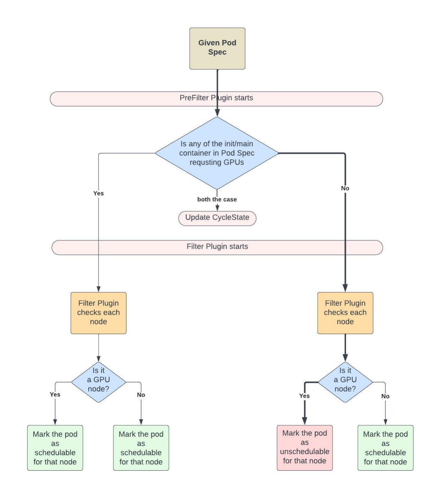
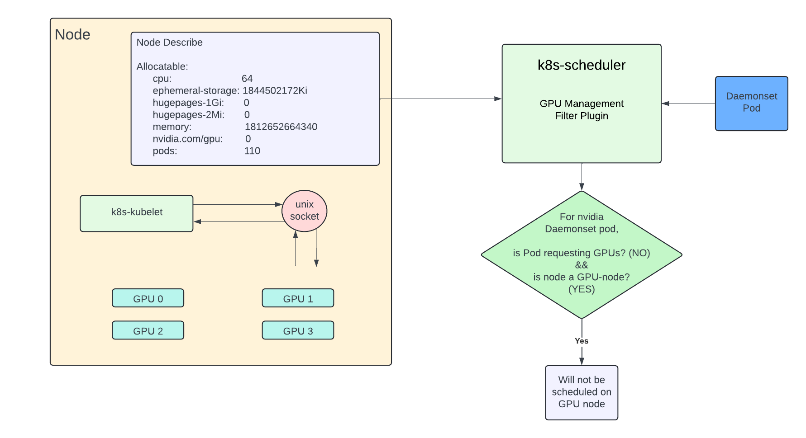

<!--
**Note:** When your KEP is complete, all of these comment blocks should be removed.

To get started with this template:

- [ ] **Pick a hosting SIG.**
  Make sure that the problem space is something the SIG is interested in taking
  up. KEPs should not be checked in without a sponsoring SIG.
- [ ] **Create an issue in kubernetes/enhancements**
  When filing an enhancement tracking issue, please make sure to complete all
  fields in that template. One of the fields asks for a link to the KEP. You
  can leave that blank until this KEP is filed, and then go back to the
  enhancement and add the link.
- [ ] **Make a copy of this template directory.**
  Copy this template into the owning SIG's directory and name it
  `NNNN-short-descriptive-title`, where `NNNN` is the issue number (with no
  leading-zero padding) assigned to your enhancement above.
- [ ] **Fill out as much of the kep.yaml file as you can.**
  At minimum, you should fill in the "Title", "Authors", "Owning-sig",
  "Status", and date-related fields.
- [ ] **Fill out this file as best you can.**
  At minimum, you should fill in the "Summary" and "Motivation" sections.
  These should be easy if you've preflighted the idea of the KEP with the
  appropriate SIG(s).
- [ ] **Create a PR for this KEP.**
  Assign it to people in the SIG who are sponsoring this process.
- [ ] **Merge early and iterate.**
  Avoid getting hung up on specific details and instead aim to get the goals of
  the KEP clarified and merged quickly. The best way to do this is to just
  start with the high-level sections and fill out details incrementally in
  subsequent PRs.

Just because a KEP is merged does not mean it is complete or approved. Any KEP
marked as `provisional` is a working document and subject to change. You can
denote sections that are under active debate as follows:

```
<<[UNRESOLVED optional short context or usernames ]>>
Stuff that is being argued.
<<[/UNRESOLVED]>>
```

When editing KEPS, aim for tightly-scoped, single-topic PRs to keep discussions
focused. If you disagree with what is already in a document, open a new PR
with suggested changes.

One KEP corresponds to one "feature" or "enhancement" for its whole lifecycle.
You do not need a new KEP to move from beta to GA, for example. If
new details emerge that belong in the KEP, edit the KEP. Once a feature has become
"implemented", major changes should get new KEPs.

The canonical place for the latest set of instructions (and the likely source
of this file) is [here](/keps/NNNN-kep-template/README.md).

**Note:** Any PRs to move a KEP to `implementable`, or significant changes once
it is marked `implementable`, must be approved by each of the KEP approvers.
If none of those approvers are still appropriate, then changes to that list
should be approved by the remaining approvers and/or the owning SIG (or
SIG Architecture for cross-cutting KEPs).
-->
# KEP-NNNN: GPU Aware Scheduling

<!--
This is the title of your KEP. Keep it short, simple, and descriptive. A good
title can help communicate what the KEP is and should be considered as part of
any review.
-->

<!--
A table of contents is helpful for quickly jumping to sections of a KEP and for
highlighting any additional information provided beyond the standard KEP
template.

Ensure the TOC is wrapped with
  <code>&lt;!-- toc --&rt;&lt;!-- /toc --&rt;</code>
tags, and then generate with `hack/update-toc.sh`.
-->

<!-- toc -->
- [Release Signoff Checklist](#release-signoff-checklist)
- [Summary](#summary)
- [Motivation](#motivation)
    - [Goals](#goals)
    - [Non-Goals](#non-goals)
- [Proposal](#proposal)
    - [User Stories (Optional)](#user-stories-optional)
        - [Story 1](#story-1)
        - [Story 2](#story-2)
    - [Notes/Constraints/Caveats (Optional)](#notesconstraintscaveats-optional)
    - [Risks and Mitigations](#risks-and-mitigations)
- [Design Details](#design-details)
    - [Test Plan](#test-plan)
        - [Prerequisite testing updates](#prerequisite-testing-updates)
        - [Unit tests](#unit-tests)
        - [Integration tests](#integration-tests)
        - [e2e tests](#e2e-tests)
    - [Graduation Criteria](#graduation-criteria)
    - [Upgrade / Downgrade Strategy](#upgrade--downgrade-strategy)
    - [Version Skew Strategy](#version-skew-strategy)
- [Production Readiness Review Questionnaire](#production-readiness-review-questionnaire)
    - [Feature Enablement and Rollback](#feature-enablement-and-rollback)
    - [Rollout, Upgrade and Rollback Planning](#rollout-upgrade-and-rollback-planning)
    - [Monitoring Requirements](#monitoring-requirements)
    - [Dependencies](#dependencies)
    - [Scalability](#scalability)
    - [Troubleshooting](#troubleshooting)
- [Implementation History](#implementation-history)
- [Drawbacks](#drawbacks)
- [Alternatives](#alternatives)
- [Infrastructure Needed (Optional)](#infrastructure-needed-optional)
<!-- /toc -->

## Release Signoff Checklist

<!--
**ACTION REQUIRED:** In order to merge code into a release, there must be an
issue in [kubernetes/enhancements] referencing this KEP and targeting a release
milestone **before the [Enhancement Freeze](https://git.k8s.io/sig-release/releases)
of the targeted release**.

For enhancements that make changes to code or processes/procedures in core
Kubernetes—i.e., [kubernetes/kubernetes], we require the following Release
Signoff checklist to be completed.

Check these off as they are completed for the Release Team to track. These
checklist items _must_ be updated for the enhancement to be released.
-->

Items marked with (R) are required *prior to targeting to a milestone / release*.

- [ ] (R) Enhancement issue in release milestone, which links to KEP dir in [kubernetes/enhancements] (not the initial KEP PR)
- [ ] (R) KEP approvers have approved the KEP status as `implementable`
- [ ] (R) Design details are appropriately documented
- [ ] (R) Test plan is in place, giving consideration to SIG Architecture and SIG Testing input (including test refactors)
    - [ ] e2e Tests for all Beta API Operations (endpoints)
    - [ ] (R) Ensure GA e2e tests meet requirements for [Conformance Tests](https://github.com/kubernetes/community/blob/master/contributors/devel/sig-architecture/conformance-tests.md)
    - [ ] (R) Minimum Two Week Window for GA e2e tests to prove flake free
- [ ] (R) Graduation criteria is in place
    - [ ] (R) [all GA Endpoints](https://github.com/kubernetes/community/pull/1806) must be hit by [Conformance Tests](https://github.com/kubernetes/community/blob/master/contributors/devel/sig-architecture/conformance-tests.md)
- [ ] (R) Production readiness review completed
- [ ] (R) Production readiness review approved
- [ ] "Implementation History" section is up-to-date for milestone
- [ ] User-facing documentation has been created in [kubernetes/website], for publication to [kubernetes.io]
- [ ] Supporting documentation—e.g., additional design documents, links to mailing list discussions/SIG meetings, relevant PRs/issues, release notes

<!--
**Note:** This checklist is iterative and should be reviewed and updated every time this enhancement is being considered for a milestone.
-->

[kubernetes.io]: https://kubernetes.io/
[kubernetes/enhancements]: https://git.k8s.io/enhancements
[kubernetes/kubernetes]: https://git.k8s.io/kubernetes
[kubernetes/website]: https://git.k8s.io/website

## Summary
A pod not requesting GPUs can run and get scheduled on node advertising GPUs as a GPU node also has CPU, memory and 
disk, and end up keeping node busy. This can lead to inefficient utilization of GPUs in kubernetes cluster. The Filter
plugin will not allow non-GPU pods to run on GPU nodes.

## Motivation
In some of the kubernetes workloads, there can be both CPU requesting pods and CPU+GPU requesting pods, 
and it is a fairly common paradigm. So having hybrid kubernetes clusters (having both GPU and 
non-GPU kubelet nodes) is required. As kubernetes scheduler can schedule non-GPU workloads on GPU nodes, we 
can run into the issue of CPU only workloads occupying GPU nodes. GPU nodes also have CPU and Memory and can 
potentially run CPU only workloads. This can result in GPU workloads unnecessarily waiting as they cannot run 
on non-GPU nodes. This document explains Kubernetes Filter Plugin to be implemented to deal with above mentioned 
shortcomings.

### Goals
- The Filter plugin should not allow non-GPU pods on GPU nodes.
- The Filter plugin should not affect any other scheduling decision made by the kubernetes scheduler.

### Non-Goals
- The added Filter plugin is not responsible for any scheduling decision made to schedule GPU pods on GPU nodes
and non-GPU pods on non-GPU nodes.


## Proposal

<!--
This is where we get down to the specifics of what the proposal actually is.
This should have enough detail that reviewers can understand exactly what
you're proposing, but should not include things like API designs or
implementation. What is the desired outcome and how do we measure success?.
The "Design Details" section below is for the real
nitty-gritty.
-->

#### Story 1

#### Story 2

### Risks and Mitigations

<!--
What are the risks of this proposal, and how do we mitigate? Think broadly.
For example, consider both security and how this will impact the larger
Kubernetes ecosystem.

How will security be reviewed, and by whom?

How will UX be reviewed, and by whom?

Consider including folks who also work outside the SIG or subproject.
-->

## Design Details
To prevent non-GPU pods from getting scheduled on GPU nodes, we plan to add a new filter 
and prefilter plugins at Filter and PreFilter extension points respectively.



#### PreFilter State
Every plugin in kubernetes scheduler keeps a CycleState to store and retrieve arbitrary data. 
CycleState uses a sync.Map to back the storage. It's aimed to optimize for the write once and 
read many times scenarios. It is the recommended pattern used in all in-tree plugins. 
Plugin-specific state is written once in PreFilter/PreScore and afterwards read many times in Filter/Score.

In our case PreFilter will check if a given pod is requesting GPUs or not by checking resource 
limits and will update the PreFilter State accordingly. Pod requesting non-zero GPU
in limits will be considered as GPU requesting pod. Checking pod limit because as per [kuberetes 
documentations](https://kubernetes.io/docs/tasks/manage-gpus/scheduling-gpus/#using-device-plugins),
- You can specify resource limits without specifying requests because Kubernetes will use the limit as the request value by default.
- You can specify the resource in both limits and requests but these two values must be equal.
- You cannot specify resource requests without specifying limits.

#### Filter State
For a given pod resource, Filter plugin will check all the nodes in the cluster. It will check
whether the node is GPU node or not by checking node’s Allocatable field. If a node has an allocatable
GPU resource, it will consider that node as GPU node. 'Allocatable' on a Kubernetes 
node is defined as the amount of compute resources that are available for pods. Note that node 
resources which have been allocated to pods running on that node will not be subtracted from the 
node allocatable resources.

Filter will read the cycle state stored by the PreFilter plugin. If the pod is not requesting 
GPUs and a given node is a GPU node, Filter plugin will mark that pod as unschedulable for that 
node and for all the other cases, Filter plugin will mark pod as schedulable.

##### Case to be handled during device plugin upgrade process
GPUs in kubernetes nodes are advertised using device plugins. And assuming that this device plugin in is running as 
daemonset, GPUs on nodes are advertised using daemonset pods. 

The Filter plugin will also take GPU daemonset pods into consideration. GPU daemonset is responsible for showing 
GPU information on nodes. Without GPU daemonset, node will not show GPU capacity on node describe.
When the GPU plugin daemonset spec is upgraded, daemonset pods are upgraded due to a new rollout of the 
daemonset spec. Old daemonset pod is removed and a new daemonset pod needs to be placed. 

We are assuming that GPU daemonset pods run on nodes with GPU labels (they have a label selector field set). But the 
daemonset pod does not request any GPUs. Because of the filter plugin explained above, daemonset pods can get stuck in 
pending state forever.

So, the scheduler plugin will exclude the pods which contain the GPU device-plugin container image from filtering 
logic.



The overall flow will look something like this. CycleState in the filter plugin will store whether the pod is requesting
GPUs or not. And whether the pod is an GPU daemonset pod or not.

For every pod created, at the PreFilter state,  the plugin will update the CycleState for that pod by looking at 
all the containers of the pod. Container requests to check GPU/non-GPU pods and container images to check GPU 
device plugin pod or not.

At the Filter state, the plugin will read the CycleState stored at the PreFilter state. For a given pod, it will 
check all the nodes. It marks the non GPU device plugin pods not requesting GPUs unschedulable on GPU nodes.


### Test Plan

I/we understand the owners of the involved components may require updates to
existing tests to make this code solid enough prior to committing the changes necessary
to implement this enhancement.

##### Prerequisite testing updates

##### Unit tests
- Add detailed unit tests with 100% coverage.
- `<package>`: `<date>` - `<test coverage>`

##### Integration tests
- TBD
- <test>: <link to test coverage>

##### e2e tests
- TBD
- <test>: <link to test coverage>

## Production Readiness Review Questionnaire

### Feature Enablement and Rollback

###### How can this feature be enabled / disabled in a live cluster?
By enabling the filter and pre-filter plugin in the k8s scheduler config.

###### Does enabling the feature change any default behavior?
No

###### Can the feature be disabled once it has been enabled (i.e. can we roll back the enablement)?
Yes, disable the plugin from scheduler config.

###### What happens if we reenable the feature if it was previously rolled back?

###### Are there any tests for feature enablement/disablement?
N/A

### Rollout, Upgrade and Rollback Planning
N/A

###### How can a rollout or rollback fail? Can it impact already running workloads?
N/A

###### What specific metrics should inform a rollback?
N/A

###### Were upgrade and rollback tested? Was the upgrade->downgrade->upgrade path tested?
N/A

###### Is the rollout accompanied by any deprecations and/or removals of features, APIs, fields of API types, flags, etc.?
No

### Monitoring Requirements

###### How can an operator determine if the feature is in use by workloads?
N/A

###### How can someone using this feature know that it is working for their instance?
By checking non-GPU pods are not getting scheduled on GPU nodes.

###### What are the reasonable SLOs (Service Level Objectives) for the enhancement?
N/A

###### What are the SLIs (Service Level Indicators) an operator can use to determine the health of the service?
N/A

###### Are there any missing metrics that would be useful to have to improve observability of this feature?
No

### Dependencies

###### Does this feature depend on any specific services running in the cluster?
It expects kubernetes scheduler to be running.

### Scalability

###### Will enabling / using this feature result in any new API calls?
No

###### Will enabling / using this feature result in introducing new API types?
No

###### Will enabling / using this feature result in any new calls to the cloud provider?
No

###### Will enabling / using this feature result in increasing size or count of the existing API objects?
No

###### Will enabling / using this feature result in increasing time taken by any operations covered by existing SLIs/SLOs?
No

###### Will enabling / using this feature result in non-negligible increase of resource usage (CPU, RAM, disk, IO, ...) in any components?
No

###### Can enabling / using this feature result in resource exhaustion of some node resources (PIDs, sockets, inodes, etc.)?
No

### Troubleshooting

###### How does this feature react if the API server and/or etcd is unavailable?

###### What are other known failure modes?

###### What steps should be taken if SLOs are not being met to determine the problem?

## Implementation History

## Drawbacks

## Alternatives

Taint all GPU nodes at the beginning with a No Schedule taint, this will ensure no jobs will get scheduled on the nodes
with taint.

```yaml
kubectl taint nodes node1 gpuNodeKey=GPUNodeValue:NoSchedule
```

Write a mutating admission controller, to add a toleration to the pod spec of any workload that requests for GPUs, 
or use the ExtendedResourceToleration Admission controller

```yaml 
tolerations:
- key: "gpuNodeKey"
  operator: "Equal"
  value: "GPUNodeValue"
  effect: "NoSchedule"
``` 

Since the GPU pods would have tolerations they would run on the tainted GPU nodes.
CPU pods on the other hand will not run on GPU nodes as they won’t have any tolerations. 

The drawback in this approach is that, either pod creator(client) needs to add tolerations or it needs to be added by 
kubernetes cluster manager through mutating admission controller without client's knowledge.
Taints are on nodes and tolerations are on pods. Submitter of pods and managers of nodes are two different teams sitting
in different orgs. So one can not manage both the taints and tolerations. And it will increase the chances of errors.


## Infrastructure Needed (Optional)

