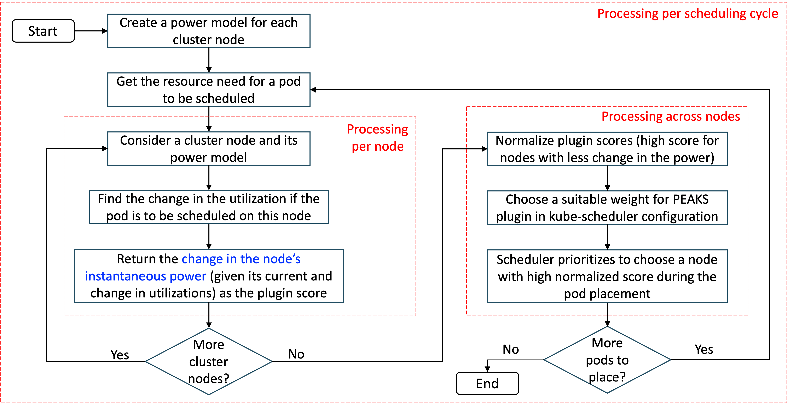
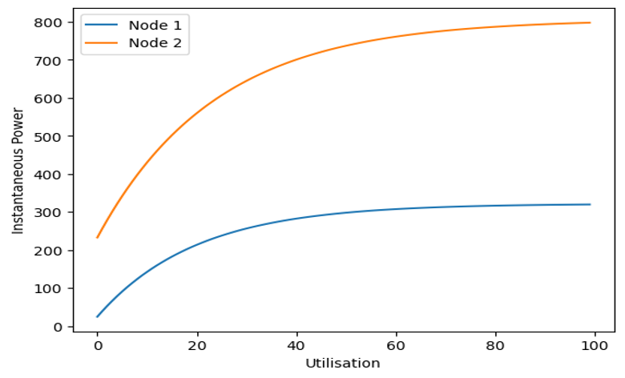
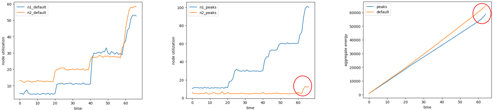
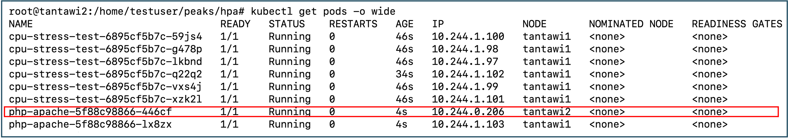
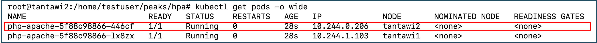
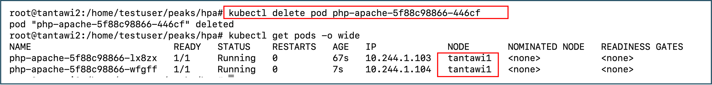
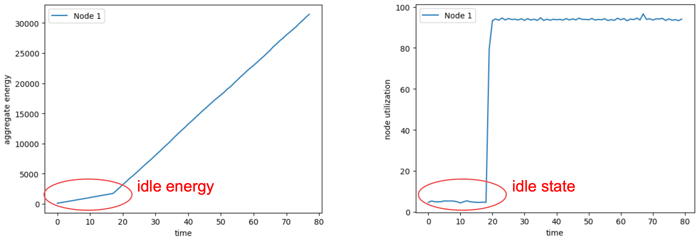

# KEP  PEAKS: Power and Energy Aware Scheduling

## Table of Contents

<!-- toc -->

- [Summary](#summary)
- [Motivation](#motivation)
  - [Goals](#goals)
  - [Non-Goals](#non-goals)
- [Proposal](#proposal)
  - [User Stories](#user-stories)
    - [Story 1](#story-1)
    - [Story 2](#story-2)
  - [Notes/Constraints/Caveats](#notesconstraintscaveats)
  - [Risks and Mitigations](#risks-and-mitigations)
- [Design Details](#design-details)
  
<!-- /toc -->

## Summary

PEAKS (Power Efficiency Aware Kubernetes Scheduler) is a Kubernetes Scheduler plugin that aims to optimize the aggregate power consumption of the entire cluster during scheduling. It uses pre-trained Machine Learning models correlating Node Utilization with Power Consumption to predict the most suitable nodes for scheduling workloads. These predictions are based on the resource needs of incoming workloads and the real-time utilization of nodes within the cluster.

## Motivation

The Kubernetes scheduler framework supports multiple plugins, enabling the scheduling of pods on nodes to optimize various objectives. However, within the ecosystem, there lacks a solution specifically designed to optimize power efficiency while simultaneously fulfilling other scheduling goals.

A new plugin addresses this gap by incorporating power efficiency as a scheduling criterion alongside other objectives, such as optimizing resource allocation or adhering to specific topology requirements.

### Goals

1. Provide a configurable scheduling plugin to minimize the aggregate power consumption of the cluster.
2. Implement the aforementioned features as Score plugins.
3. Avoid altering the behavior of default score plugins unless it's necessary.

### Non Goals

1. De-scheduling resulting from unexpected outcomes (such as hot nodes or fragmentation) due to past scoring by plugins is not addressed in the initial design.
2. Memory, network, and disk utilization are not considered in the initial design.
3. The migration of already scheduled pods running on less power-efficient nodes to more power-efficient nodes is out of scope in the initial design.
4. Shutting down nodes to optimize power by migrating already running pods to other cluster nodes is out of scope in the initial design."

## Proposal

### User Stories

#### Story 1

With 'heterogeneous nodes' (variations in CPU architectures, a mixed cluster consisting of both VM and Bare Metal nodes, and dissimilar allocation of resources across nodes), cluster owners can reap benefits, as the power efficiency of different nodes may vary. This often necessitates the use of customized power models for each node within the cluster.

#### Story 2

Even with 'homogeneous nodes,' if the CPU vs. Power relationship is non-linear (such as piece-wise linear or concave), cluster owners can still benefit. Although the power efficiency might be consistent across all nodes, the varying CPU utilizations among nodes at any given time can significantly impact the aggregate power consumption of the cluster. Placing an incoming pod on one node versus another can influence this consumption.

### Notes/Constraints/Caveats

- The [Min, Max] score range for the plugin is user-configurable, defaulting to [0, 100].
- Additionally, the plugin normalizes the generated scores within the supplied [Min, Max] range.
- There isn't a singular model that comprehensively depicts the correlation between utilization and power consumption for every cluster node.
- At any given time, the current utilization of a node can be identified through metrics data.
- Determining the current power consumption can be achieved either through live metrics or by inference from the model that describes the relationship between node utilization and power consumption.
- Retraining the model representing this relationship may be necessary to better align with the workloads running on the node.

### Risks and Mitigations

- The benchmark test below captures the overhead resulting from model inferencing latency, which appears to be negligible.
- The accuracy of the model that captures the relationship between utilization and power relies heavily on the quality of the metrics used for its training. The current implementation supports integration with various user-selected metrics providers, such as node-metrics and Kepler

## Design Details

### PEAKS workflow

Here is a brief discription of some of the steps in the above workflow:
- Create a power model for each cluster node: If a power model suitable for the workload to be scheduled already exists, then the same can be used to avoid creating a new power model. Thus it is an option step.
  - PEAKS plugin allows the cluster owners to bring their own power models that best represent both the node behavior and the workload characteristics.
  - Training the power model is outside the scope of PEAKS plugin.
  - PEAKS only does power model inferencing.
  - Here is an example that models the "CPU utilization vs. Power" relationship for a two node cluster.
    - This model changes corresponding to a change either in the node configuration or in the workload characteristics.
- Get the resource need for a pod to be scheduled: This step requires estimating the pod resource needs.
  - Consider pod resource requirements (requests/limits) from its specification as an alternative.
  - If there are one or more running pods with the same image (case of auto scaling), consider the average load or resource need across those pods.
- Find the change in the utilization if the pod is to be scheduled on a node: This step requires the current utilization and the updated utilization after the pod placement on a node (so that the instantaneous power at both these utilizations can be found from the power model later)
  - Current node utilization can be queried from Prometheus (with the metric source provider being a service like node-exporter or load-watcher).
  - Add the change in utilization (corresponding to the pod resource requirement) to the current utilization to get the updated utilization
- Return the change in the node's instantaneous power:
  - The power consumption at the current utilization can be either found from the node metrics or by referring to the power model
  - The power consumption at the updated utilization can be found by referring to the power model
- Normalize plugin score: The score range can be provided by the user (otherwise consider the range [0, 100] as the default)
- Choose a suitable weight for PEAKS plugin in kube-scheduler configuration: This is specific to the environment configuration.
  - If the K8s cluster nodes are running using non-renewable energy sources, then a high weightage for PEAKS plugin can result into reduced CO2 emissions

### Pre-requisite modules
- Prometheus
  - For energy metrics collection
- Load-watcher
  - For collecting node usage metrics exported after processing metrics received from source
- Node-exporter
  - Source of node usage metrics
- Kepler
  - Source of energy consumption metrics

### Use-cases (that save energy using PEAKS plugin)
Below use-case scenarios demonstrate energy savings using PEAKS scheduler plugin over default kube-scheduler.
- Scaling of a Pod (via Horizontal Pod Autoscaler):
  - On a K8s cluster with heterogeneous node configurations (resulting in the energy efficiency of the nodes not being the same), a deployment configured with HPA packs the pods on nodes using PEAKS scheduler plugin vs. spreads the pods on nodes using default kube-scheduler.
    - Since energy savings decrease with the increased use of energy ineffecient nodes, PEAKS plugin favours pod placement on energy efficient nodes over pod placement on energy inefficient nodes.
  - Below graph demonstrates energy saving while auto scaling pods with HPA controller 
    - The graph in the left depicts spreading of pods on nodes using default kube-scheduler.
    - The graph in the middle depicts packing of pods on energy efficient nodes before pod placement on energy (relatively) inefficient cluster nodes using PEAKS scheduler plugin.
    - The graph in the right depicts the savings in energy across the cluster nodes over time (i.e., difference in the aggregate cluster energy consumed under PEAKS plugin placement vs. default scheduler placement) as the pods scale up.
    - There is ~10\% of energy savings observed at the end of 15 minutes of workload execution in this experiment.
    - Note that the difference in the aggregate energy consumption of the cluster nodes reduces (highlighted in red circle) as PEAKS plugin places pods on energy inefficient nodes.
- Migration of a Pod (via explicit eviction)
  - An application pods might be placed on the energy ineffecient cluster nodes at the time of scheduling as other applications might be running on the energy effecient nodes. When one or more of those applications complete, resources become available on the energy efficient cluster nodes. Two options are available at this stage:
    - Either the application pods continue to run on the nodes on which they were originally placed.
    - Or, those pods may be migrated to energy efficient nodes to save energy.
  - Periodically check the resource availability on energy efficient nodes via a script. When resources are available, the same script deletes the application pods running on energy inefficient nodes so that the scheduler (configured with PEAKS plugin) places them on the best possible energy efficient nodes.
    - This mimics auto-migration of application pods from energy inefficient nodes to energy efficient nodes to save energy consumption.
    - Identification of the target node for the migration of a pod from an energy inefficient node is carried out by the PEAKS plugin.
    - A pod might need to be deleted more than once before finding the best energy efficient node for its placement by the scheduler.
  - The experiment below demonstrates this use-case.
    - The pods of a deployment "cpu-stress-test" were initially placed on the energy efficient node "tantawi1". As a result, only one of the pod of the deployment "php-apache" could be placed on the node "tantawi1" and its second pod is placed on the energy inefficient node "tantawi2". 
    - Even after the completion of the deployment "cpu-stress-test", a pod of the deployment "php-apache" continues to run on "tantawi2".
    - Deleting the pod from "tantawi2" triggers creation of a new pod by the deployment to meet the desired number of replicas and scheduler places the pod on the energy efficient node "tantawi1" now (In contrast, the default kube-scheduler would place the pod on the same node "tantawi2" as it spreads the pods across cluster nodes). 
- Shutting down of a cluster node (via Cluster Autoscaler)
  - Pod migration to a more energy efficient cluster node (demonstrated in the previous use-case) redcues the active power consumption on the less energy efficient nodes.
  - Migrate each pod (irrespective of the deployment it belongs to) running on a less energy efficient node to (relatively) more energy efficient cluster nodes by repeated execution of individual pod migration (under assumption that there are enough resources on the more energy efficient cluster nodes).
  - After all the pods are migrated, the utilization of the energy inefficient node becomes low which triggers the Cluster Autoscaler to delete that node.
    - Node shutdown results in highest energy savings as it elimiates both the active and idle power consumption of a node.
    - The graph below dipicts that the idle energy consumption of a node is a significant portion of the node's total power consumption.

[WIP]

Benchmarks

1. Peak Scheduler plugin with loadaware + default
    - latency in scheduling (script to get delta (time of request of workload, time of scheduling)
        - read pod events and cature the difference
    - compare peaks resource impact on the cluster
        - Capture cluster total cpu usage + memory : Load watcher + plugin + workload (stuck at lw)

2. Impact of scheduler:
   - measure workload resource cons Peaks vs loadaware, default
        - time of execution
        - resource consumption inc or dec because of cluster packing algo 