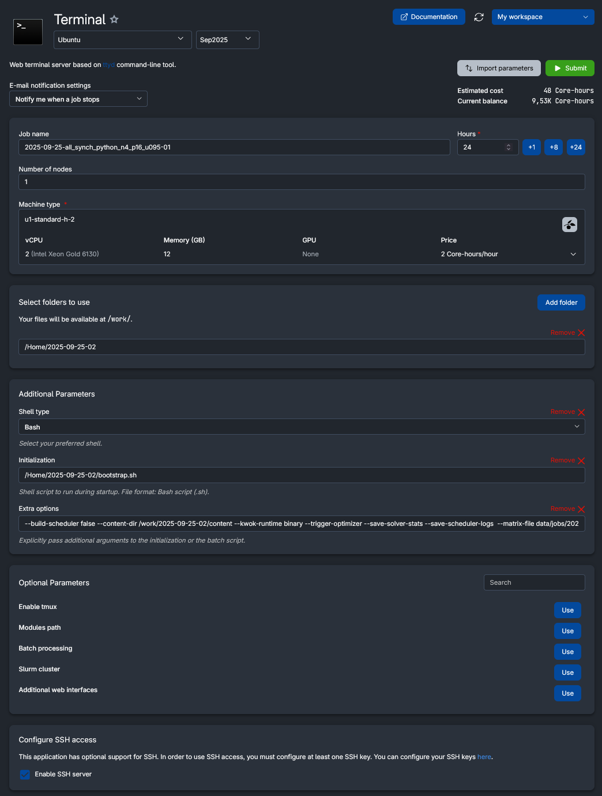

# Cross-Node Preemption Plugin

## Table of Contents

- [Cross-Node Preemption Plugin](#cross-node-preemption-plugin)
  - [Table of Contents](#table-of-contents)
  - [Overview](#overview)
    - [Analogy of the problem to be solved](#analogy-of-the-problem-to-be-solved)
    - [Plugin Description](#plugin-description)
    - [Solvers](#solvers)
  - [Build and Run](#build-and-run)
    - [Prerequisites](#prerequisites)
    - [Build the Python environment (for Python solver)](#build-the-python-environment-for-python-solver)
    - [Copy the Python solver to solver location](#copy-the-python-solver-to-solver-location)
    - [Build the scheduler with the plugin](#build-the-scheduler-with-the-plugin)
      - [Building the binary](#building-the-binary)
      - [Building the docker image (recommended for faster builds)](#building-the-docker-image-recommended-for-faster-builds)
    - [Run the plugin on a KWOK cluster (Automated)](#run-the-plugin-on-a-kwok-cluster-automated)
    - [Run the plugin on a KWOK cluster (Manual)](#run-the-plugin-on-a-kwok-cluster-manual)
    - [Run the plugin in a Kind cluster](#run-the-plugin-in-a-kind-cluster)
  - [Test the plugin](#test-the-plugin)
    - [Test scripts](#test-scripts)
    - [Bootstrap a VM](#bootstrap-a-vm)
    - [Running test jobs on UCloud](#running-test-jobs-on-ucloud)
    - [Useful kubectl/kwokctl commands](#useful-kubectlkwokctl-commands)
  - [TODOs](#todos)
    - [Later TODOs](#later-todos)
  - [Test](#test)
    - [Later Tests](#later-tests)
  - [Questions](#questions)
    - [Open Questions](#open-questions)
    - [Closed Questions](#closed-questions)

## Overview

This project introduces an improved cross-node preemption plugin for Kubernetes that overcomes the limitations of the default scheduler’s preemption mechanism.

Whereas the default scheduler only preempts pods within a single node, this plugin is capable of reasoning across multiple nodes simultaneously. It implements efficient algorithms to decide which pods to move or evict, with the aim of admitting high-priority workloads while minimizing disruption.

### Analogy of the problem to be solved

Let's imagine we have five Lego boxes filled with bricks of different sizes. We've just bought some new bricks that we want to put into the boxes. The problem is that none of the boxes have enough free space, since they are already nearly full. To make room, we can choose to move some of the existing bricks into other boxes that still have a little free space.

But here a cascade effect occurs: when we move one brick from box A to box B, we may need to move another brick from box B into box C – and so on – before we finally free up enough space for the new bricks. This chain reaction can become long and complicated. That’s why the goal is not only to make room for the new bricks, but also to do it with as few moves as possible.

In Kubernetes, this is exactly the situation when high-priority pods need to be scheduled but the cluster is fragmented. The plugin's goal is to resolve this efficiently and fairly across the entire cluster.

### Plugin Description

The Cross-Node Preemption Plugin extends the Kubernetes scheduler with the ability to:

- Perform cluster-wide reasoning: Instead of being limited to a single node, the plugin evaluates all nodes simultaneously when deciding how to schedule a pending pod.
- Optimize across multiple strategies: It supports different solver back-ends (BFS search, local search, or external solvers like OR-Tools) to find feasible placements.
- Reduce disruption: By modeling pod evictions and relocations, it aims to minimize the number of pods that must be preempted or moved.
- Support multiple optimization modes:
  - For every pod – re-optimize whenever a new pod arrives.
  - Batch – group pending pods and solve them together.
  - Continuous – keep optimizing placements as the workload evolves.
- Integrate with scheduling phases: The plugin can be triggered at different points in the scheduling cycle (pre-enqueue or post-filter), making it adaptable to diverse workloads.

In short, this plugin enhances Kubernetes scheduling by making cross-node preemption both possible and practical, while ensuring better resource utilization.

The code of the plugin can be found in `pkg/mycrossnodepreemption/`.

### Solvers

The plugin includes three different solvers to find optimal or near-optimal preemption plans:

1. **Python (CP-SAT) solver**: A solver using Google's CP-SAT solver to find an optimal placement of pods. The code for this solver is located in `bootstrap/content/scripts/python_solver/main.py`.
2. **Swap-based local-search solver**: A fast heuristic solver that iteratively tries to relocate pods to free up space.
3. **Breadth-First Search (BFS) solver**: An exhaustive solver that tries to free a node by exploring pod relocations. Each depth level in the search tree corresponds to one move of a pod.

The last two solvers are implemented in Go, while the first solver is implemented in Python and requires a Python environment as it uses the CP-SAT solver from Google's OR-Tools.

## Build and Run

### Prerequisites

The following tools are required (if Windows host, use WSL2 w/ e.g. Ubuntu) to build and run the scheduler with the plugin:

- git (tested with 2.43.0)
- make (tested with 4.3)
- python3 (tested with 3.10.12)
- pip (tested with 24.0)
- kubectl (tested with client v.1.32.7)
- kwok+kwokctl (tested with v0.7.0)
- Go (tested with 1.24.3)

Currently, it is only tested on amd64 architecture and some code may need to be modified to run on other architectures.

### Build the Python environment (for Python solver)

```bash
sudo install -d -m 0755 /opt/venv/
sudo python3 -m venv /opt/venv/
sudo /opt/venv/bin/python -m pip install --upgrade pip
sudo /opt/venv/bin/pip install --no-cache-dir -r bootstrap/content/scripts/python_solver/requirements.txt
```

### Copy the Python solver to solver location

NOTE: If you modify the Python solver code, you need to copy it again.

```bash
sudo install -d -m 0755 /opt/solver/
sudo cp -a bootstrap/content/scripts/python_solver/main.py /opt/solver/main.py
```

### Build the scheduler with the plugin

The scheduler with the plugin can be built either as a binary or as a docker image.

#### Building the binary

To build the binary, run the following command in the root of the repo:

```bash
make build-scheduler GO_BUILD_ENV='CGO_ENABLED=0 GOOS=linux GOARCH=amd64'
```

#### Building the docker image (recommended for faster builds)

To build the docker image, docker (tested with v28.3.2) and docker-buildx-plugin (tested with v0.25.0) must be installed, then run the following command in the root of the repo:

```bash
docker build -t localhost:5000/scheduler-plugins/kube-scheduler:dev -f build/scheduler/Dockerfile .
```

### Run the plugin on a KWOK cluster (Automated)

To run the scheduler with the plugin on a KWOK cluster, the easiest way is to use the provided test generator script (`bootstrap/content/scripts/kwok/kwok_test_generator.py`). It will create a KWOK cluster, fill it with random pods, and run the scheduler with the plugin. It has a number of parameters, see the help:

```bash
python3 bootstrap/content/scripts/kwok/kwok_test_generator.py --help
```

### Run the plugin on a KWOK cluster (Manual)

If you just want to test it manually on a KWOK cluster, first create a scheduler config (see `manifests/mycrossnodepreemption/scheduler-config.yaml`) and a cluster config file (see `bootstrap/content/data/configs/a/01.yaml`). 

NOTE: Make sure you have the latest binary or docker image of the scheduler with the plugin built (see above). Also make sure the latest Python solver is copied to `/opt/solver/main.py` (see above).

Then create the cluster with kwokctl:

```bash
kwokctl create cluster --name <cluster_name> --runtime <docker/binary> --config <path/to/cluster-config.yaml>
```

To delete the cluster, run:

```bash
kwokctl delete cluster --name <cluster_name>
```

### Run the plugin in a Kind cluster

To run the plugin in a Kind cluster, install docker (tested with v28.3.2) + docker-buildx-plugin (tested with v0.25.0) + Kind (tested with v0.20.0), and run the provided script `kind/kind-create-cluster.sh` to create a Kind cluster with some specified number of nodes:

```bash
./kind-create-cluster.sh <cluster_name> <num_nodes>
```

Then load the scheduler image into the Kind cluster (it will also build the image). The script uses a fixed number of environment variables, see `kind/kind-load-plugins.sh` for details. You can modify the script to change them.

```bash
./kind-load-plugins.sh <cluster_name>
```

## Test the plugin

### Test scripts

Some useful test scripts can be found in `bootstrap/content/scripts/kwok/`:

- `kwok_test_generator.py`: Generates a KWOK cluster with random pods and runs the scheduler with the plugin.
- `kwok_stats.py`: Gathers statistics from the KWOK cluster e.g. number of scheduled pods, current utilization, etc.

### Bootstrap a VM

To bootstrap a VM or a Job runner with all prerequisites installed and running tests with KWOK, use the provided init script `bootstrap/bootstrap.sh` and upload the content of the `bootstrap/content/`. Has been used on UCloud to run tests, see below for more details.

To develop and test the init script it can be beneficial to run it in a VM. To make it easy, a Vagrantfile is provided in the root of the repo. It will create an Ubuntu 22.04 VM with all prerequisites installed and the repo cloned. To use it, install Vagrant and VirtualBox, then run:

```bash
vagrant up
```

This will create a VM named `scheduler-plugins` that you can SSH into using:

```bash
vagrant ssh
```

To delete the VM, run:

```bash
vagrant destroy -f
```

### Running test jobs on UCloud

To run tests on UCloud:

1) Make sure the `bootstrap.sh` under `bootstrap/` is in Unix format (LF). If not, run `dos2unix bootstrap/bootstrap.sh`.
2) Build the scheduler binary using the command mentioned above and copy it from `bin/kube-scheduler` to `bootstrap/content/bin/kube-scheduler`.
3) Copy the content of `bootstrap` folder (including `bootstrap.sh` and `content/` in it) and rename it to whatever you like.
4) Upload it to UCloud under 'Files'.
5) If you want to be able to SSH into the instance, add your public SSH key to 'SSH Keys' under 'Resources'.
6) Create a Terminal instance with Ubuntu 22.04. A illustration is shown below:

   

7) Submit the instance and wait until it is running.
8) To save the results use the App 'Archiver' and select the folder uploaded in step 4 which should now hold the results. Note if you also want to save the stdout from the instance save the file located under Files -> Jobs -> <job_id> -> stdout-0.log.

### Useful kubectl/kwokctl commands

- Get all pods

  ```bash
  kubectl get pods -A
  ```

- Delete namespace

  ```bash
  kubectl delete ns <namespace>
  ```

- Get kube-scheduler logs from KWOK cluster

  ```bash
  kwokctl logs kube-scheduler --name <cluster_name>
  ```

- Getting saved solver plans from kube-scheduler

  ```bash
  kubectl -n kube-system get cm -l plan
  kubectl -n kube-system get cm <CM> -o jsonpath='{.data.plan\.json}' | jq .
  ```

- Get reasons for pod(s) not scheduling

  ```bash
  kubectl --context <ctx> -n <namespace> get events --field-selector involvedObject.kind=Pod -o json | jq '.items[] | {name: .involvedObject.name, reason: .reason, message: .message}'
  ```

## TODOs

- QoS classes are currently ignored: BestEffort, Burstable, Guaranteed. We currently assume all pods are Guaranteed Pods. See also <https://medium.com/@muppedaanvesh/a-hands-on-guide-to-kubernetes-qos-classes-%EF%B8%8F-571b5f8f7e58>
- Quotas and LimitsRanges are currently ignored. See also <https://medium.com/codex/what-you-need-to-know-to-debug-a-preempted-pod-on-kubernetes-1c956eec3f35>
- Remember to add: --trigger-optimizer --save-solver-stats --save-scheduler-logs
- Clean up the code:
  - Reduce code
  - Switch case
  - Early return
  - Default values
  - Remove magic numbers
  - Follow DRY, SOLID principles and Design Patterns where possible.
  - Sort functions based on usage from outside to inside
  - Proper logging
  - Comments
  - Proper variable names
  - Replace not understandable code
  - Use common functions
- Write report
- Remove TODOs.
- Make the test plan.
- Write about that we need both the Blocked and Batched sets otherwise we can
- Write about that we always set a lower bound based on priorities in optimal solver to prevent it providing a worse plan. If no hints provided then set it based on current state.
- Write about that we solve at the end and therefore get the status of the overall model. However, to fail fast we also solve after each stage in the lexicographic order.

### Later TODOs

- Create unit and integration tests.
- Find a better way to set verbose level.
- Consider to add a permit plugin for proper gang-scheduling to prevent not fully implemented plans.
- Somehow ensure that the cluster state is the same throughout execution. If not, consider to evict those non-planned pods during execution. We can use the snapshot to see how many there is of each RS-workloads and standalone pods and compare with the actual state. We should never have more than planned, but we can have less if something got deleted externally or if we move a pod or evict it.
- We will get a plan timeout if a pod is removed during plan execution (if a standalone pod is deleted or a workload is scaled down).
- Fix TODOs

## Test

- Test at which utilization the default scheduler stops to work properly.
- Large scale test on UCloud where i could set up multiple ubuntu servers each making on test.
- Test if python solver timing depends heavily on the node it is executed on (CPU type, etc.)
- Test the plugin works across workload type.
- Test CP-SAT vs. other solvers.

### Later Tests

- Compare with other solvers.
- Compare with other modes.
- Compare with other hook stages.
- Compare with hints.

## Questions

### Open Questions

### Closed Questions

- What to do with evicted and blocked pods - put them to queue or try again immediately?
  - Jacopo: Fine, what i am doing now, by just letting them try again immediately
- What to do with node-selectors, PDBs, and other rules.
  - Jacopo: Fine, to ignore these just write about it. May, the extra constaints actually will make the solver faster (smaller search space).
