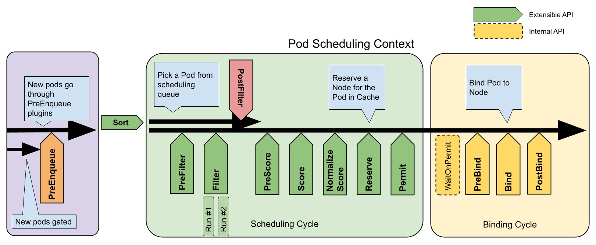
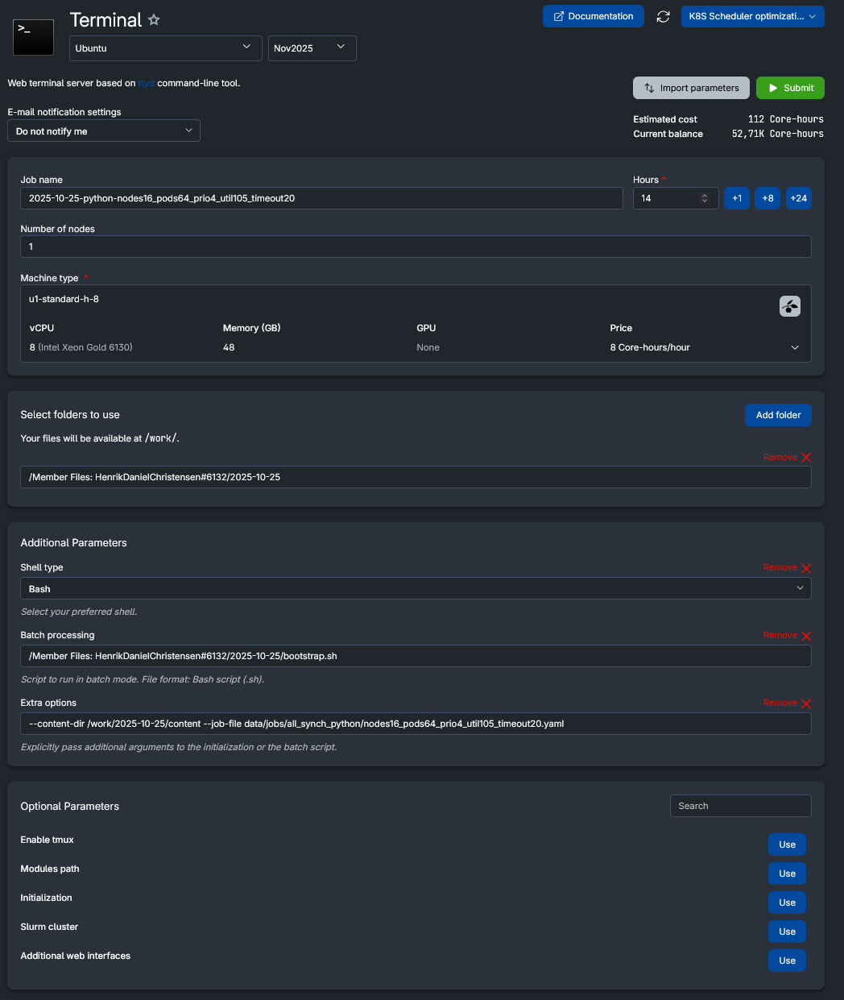

# Priority Optimizer Plugin

- [Priority Optimizer Plugin](#priority-optimizer-plugin)
  - [Overview](#overview)
  - [Code Structure and Extension Points](#code-structure-and-extension-points)
  - [Upstream version](#upstream-version)
  - [Integrating](#integrating)
  - [Building](#building)
    - [Binary (recommended)](#binary-recommended)
    - [Docker image](#docker-image)
  - [Running](#running)
    - [KWOK (recommended)](#kwok-recommended)
    - [Kind](#kind)
  - [Testing](#testing)
    - [Workload Once Generator](#workload-once-generator)
      - [Deterministic scheduling](#deterministic-scheduling)
      - [Workload configuration file](#workload-configuration-file)
      - [Job file](#job-file)
      - [Init script](#init-script)
        - [Using Vagrant for init script development](#using-vagrant-for-init-script-development)
      - [Result replication and running test jobs](#result-replication-and-running-test-jobs)
      - [Expected folder structure after running all jobs](#expected-folder-structure-after-running-all-jobs)
      - [Generating test jobs](#generating-test-jobs)
        - [Deterministic jobs with default scheduler](#deterministic-jobs-with-default-scheduler)
        - [Default scheduler jobs](#default-scheduler-jobs)
        - [Python solver jobs](#python-solver-jobs)
      - [Estimate time to complete all jobs in UCloud](#estimate-time-to-complete-all-jobs-in-ucloud)
    - ['Live' Cluster Simulator](#live-cluster-simulator)
  - [Analysis](#analysis)
  - [Useful kubectl/kwokctl commands](#useful-kubectlkwokctl-commands)
  - [Cluster Simulator](#cluster-simulator)
    - [1. Inputs and stochastic model](#1-inputs-and-stochastic-model)
    - [2. Pod model and trace format](#2-pod-model-and-trace-format)
    - [3. Single fill-once generation method](#3-single-fill-once-generation-method)
    - [4. Utilization model during generation](#4-utilization-model-during-generation)
    - [5. Replaying the trace](#5-replaying-the-trace)
    - [6. Evaluation and scoring](#6-evaluation-and-scoring)
    - [7. Example commands](#7-example-commands)
  - [TODOs](#todos)
    - [TODOs: Next Meeting 8/12](#todos-next-meeting-812)
    - [TODO: 'Live' Cluster Simulator](#todo-live-cluster-simulator)
      - [Now TODOs](#now-todos)
      - [Design](#design)
        - [Other Approaches](#other-approaches)
    - [TODOs: Solver](#todos-solver)
    - [TODOs: Testing](#todos-testing)
    - [TODOs: Plugin](#todos-plugin)
    - [TODOs: Report](#todos-report)
    - [TODOs: General](#todos-general)
    - [TODOs: IJCAI Paper](#todos-ijcai-paper)
    - [TODOs: Later](#todos-later)
  - [Questions](#questions)
    - [Open Questions](#open-questions)
    - [Closed Questions](#closed-questions)

## Overview

This project introduces an **optimized, priority-based** approach for placing pods onto nodes (possibly **optimal**) via the **MyPriorityOptimizer** plugin for the Kubernetes scheduler. The project is a fork of the Kubernetes-sigs project [scheduler-plugins](https://github.com/kubernetes-sigs/scheduler-plugins) and extends it with a new plugin (see also describtion of the [Scheduling Framework](https://kubernetes.io/docs/concepts/scheduling-eviction/scheduling-framework/) for background).

Our goal is to schedule as many *high-priority* pods as possible, especially when the *default scheduler* fails to do so (a possibly side effect of our approach is better resource utilization). The plugin enables integration of an *external* solver—here, a Python solver using [Google's CP-SAT](https://developers.google.com/optimization/cp/cp_solver)—to compute an optimal placement plan that maximizes high-priority pods while *minimizing disruption* by reducing the number of preemptions (*movements* and *evictions*). Given the solver's solution, the plugin applies it by evicting and moving pods, possibly across multiple nodes in the cluster (Note: default scheduler can only preempt pods within a *single* node, which may lead to more preemptions than necessary).

The plugin can be triggered in different **optimization modes**:

- *For every pod* – optimize for every new pod that arrives (not recommended for large clusters).
- *All synch* – optimize all pods (running and pending) at fixed intervals (or on request via HTTP). Scheduling is paused while the optimization runs and the plan is applied.
- *Manual all synch* – same as all synch, but only optimizes when triggered via HTTP. Used for testing and evaluation.
- *All asynch* – same as all synch, but does not wait for optimization to finish. The plan is applied only if the cluster state matches the state used by the solver. Scheduling is still paused while the plan is being applied to avoid conflicts.
- *Free time* – optimize during free time windows (i.e. when no pods are arriving). #TODO: Not yet implemented.

The plugin can be hooked into two **scheduling phases**: either before the pod is enqueued (*PreEnqueue*) or after the default scheduler fails to find a node (*PostFilter*). We recommend the latter, as it avoids optimization when the default scheduler can already place the pod and thus leverages its speed instead of running the solver unnecessarily. Note that the all sync/async modes always trigger at their configured intervals, regardless of which extension point is used.

<center></center>

For a more **detailed description** of the plugin and the optimization approach, read also the **paper** ([Priority Matters: Optimising Kubernetes Clusters Usage with Constraint-Based Pod Packing](https://arxiv.org/abs/2511.08373)) and the **thesis report** ([Optimizing Kubernetes Scheduler [in progress]](TODO:link-to-thesis-report)).

The following sections describe how to **build, run, and test** the scheduler with the plugin.
For [result replication](#result-replication-and-running-test-jobs) from the paper/thesis report, read the provided instructions.

## Code Structure and Extension Points

The code for the **MyPriorityOptimizer** plugin is located under `pkg/mypriorityoptimizer/`. The main files are:

- `mypriorityoptimizer.go`: Main entry point for the plugin that sets up the plugin.
- `args.go`: Contains the configuration arguments for the plugin (e.g. optimization mode, solver timeout, etc.).
- `run_flow.go`: Contains the main logic for running the optimization flow, including triggering the solver, applying the plan, etc.
- `run_solvers.go`: Contains the logic for running solvers (e.g. the Python solver) and selecting the best one to use.
- `solver_python.go`: Contains the logic for interacting with a Python solver, including preparing the input, running the solver, and parsing the output.
- `periodic_loop.go`: Contains the logic for running the optimization flow (`run_flow.go`) in a separate goroutine when not running in mode *for every pod*.
- `hook_preenqueue.go`: Implements the PreEnqueue scheduling extension point. This is mainly used for blocking new pods while an optimization is running or a plan is being applied. If in mode *for every pod*, it is also trigger the optimization for every new pod that arrives.
- `hook_prefilter.go`: Implements the PreFilter scheduling extension point. This is also used for blocking new pods while an optimization is running or a plan is being applied. However, its main purpose is targeting the pod onto the node assigned by the solver in the plan (if any).
- `hook_postfilter.go`: Implements the PostFilter scheduling extension point. This is mainly used to mark a pod as unschedulable as the default scheduler failed to place it. If in mode *for every pod*, it also triggers the optimization for every new pod that arrives.
- `hook_reserve.go`: Implements the Reserve scheduling extension point. This is used to place workloads where we cannot rely on specific pod names (e.g. pods from a ReplicaSets) by matching on workload names instead and how many of each that should be placed on each node.
- `hook_postbind.go`: Implements the PostBind scheduling extension point. This is used for deactivating the paused scheduling and for logging purposes.

If in mode *for every pod*, the optimization flow (`run_flow.go`) is triggered at every new pod arrival using the PreEnqueue and PostFilter extension points.

## Upstream version

Latest upstream version tracked: **v0.32.7** (tagged release) of  
[`kubernetes-sigs/scheduler-plugins`](https://github.com/kubernetes-sigs/scheduler-plugins/releases).

This fork follows **tagged upstream releases only**.  
When updating, **do not** base changes on `*-devel` tags or arbitrary commits from `main`, as they may be incompatible with the KWOK emulation version used here.

After moving to a new upstream tag, always verify **KWOK compatibility**, e.g. by running a small smoke test with the `test_runner.py` harness.

## Integrating

To enable and use plugins in the Kubernetes scheduler, you must apply a **scheduler configuration manifest** that selects the plugins and their settings; the manifest for this plugin is `manifests/plugin-kube-scheduler-config.yaml` (see also [Scheduler Configuration on Kubernetes webpage](https://kubernetes.io/docs/reference/scheduling/config/) for background).

This file enables the **MyPriorityOptimizer** plugin and the used extension points and disables the `DefaultPreemption` plugin to avoid conflicts with our plugin.

The plugin is referenced and registered in `cmd/scheduler/main.go` such that the scheduler will include it at build time.

## Building

The scheduler+plugin can be built either as a **binary** (recommended) or as a **docker image** and can then be run in a cluster (e.g. using KWOK or Kind).

The following tools are required (if Windows host, use WSL2 w/ e.g. Ubuntu) to build the scheduler+plugin:

- `git` (tested with 2.43.0)
- `make` (tested with 4.3)
- `python3` (tested with 3.10.12)
- `pip` (tested with 24.0)
- `Go` (tested with 1.24.3)

When building as a docker image:

- `docker` (tested with v28.3.2)
- `docker-buildx-plugin` (tested with v0.25.0)

Currently, it is only tested on **amd64** architecture and some code may need to be modified to run on other architectures (should not be a problem).

### Binary (recommended)

To build the binary, run the following command in the root of this repo:

```bash
make build-scheduler GO_BUILD_ENV='CGO_ENABLED=0 GOOS=linux GOARCH=amd64'
```

The built binary will be located in `bin/kube-scheduler`.

### Docker image

We have modified the default Dockerfile used to build the scheduler image to include the plugin. To build the docker image, run the following command in the root of this repo:

```bash
docker build -t localhost:5000/scheduler-plugins/kube-scheduler:dev -f build/scheduler/Dockerfile .
```

## Running

To run the scheduler with the plugin, you can e.g. run it in a **KWOK** (recommended) or in a **Kind** cluster.

The following tools are required (tools already mentioned in [Building](#building) are omitted):

- `kubectl` (tested with client v.1.32.7)
- When running in a Kind cluster:
  - `kind` (tested with v0.20.0)
- When running in a KWOK cluster:
  - `kwok`+`kwokctl` (tested with v0.7.0)

### KWOK (recommended)

To set up a KWOK cluster with the scheduler+plugin one needs to provide a configuration file to KWOK. An example of a configuration file is `bootstrap/content/data/configs-kwokctl/all_synch_python.yaml`.

```yaml
kind: KwokctlConfiguration
apiVersion: config.kwok.x-k8s.io/v1alpha1
options:
  kubeSchedulerConfig: manifests/plugin-scheduler-config.yaml
  kubeSchedulerBinary: bin/kube-scheduler
  kubeSchedulerImage: localhost:5000/scheduler-plugins/kube-scheduler:dev
componentsPatches:
  - name: kube-scheduler
    # uncomment for more verbose logging
    # extraArgs:
    #   - key: v
    #     value: "10"
    extraEnvs:
      - name: OPTIMIZE_MODE
        value: "manual_all_synch" # choices: every, all_synch, all_asynch, manual_all_synch
      - name: OPTIMIZE_HOOK_STAGE
        value: "postfilter" # choices: preenqueue, postfilter (not used in all_asynch mode)
      - name: SOLVER_PYTHON_ENABLED
        value: "true"
      - name: SOLVER_PYTHON_TIMEOUT
        value: 10s # e.g. 1s, 10s, 20s
```

As can be seen this file can be used to set environment variables to configure the plugin.

Having set up the KWOK cluster configuration file, ensure you have built the latest scheduler binary or Docker image (see [Building](#building)). Also if using the binary setup, ensure the the latest Python solver is available at `/opt/solver/main.py` and that the Python environment is set up, by following these steps:

- From the root of the repo, run the following commands to set up the Python environment with the required dependencies:

   ```bash
   sudo install -d -m 0755 /opt/venv/
   sudo python3 -m venv /opt/venv/
   sudo /opt/venv/bin/python -m pip install --upgrade pip
   sudo /opt/venv/bin/pip install --no-cache-dir -r scripts/python_solver/requirements.txt
   ```

- Copy the Python solver code to the location expected used by the plugin:

   ```bash
   sudo install -d -m 0755 /opt/solver/
   sudo cp -a scripts/python_solver/main.py /opt/solver/main.py
   ```

   NOTE: If you change the Python solver, you *must* copy it again.

Finally, to create and run the KWOK cluster with the scheduler+pluging, run the following command:

```bash
kwokctl create cluster --name <cluster_name> --runtime <docker/binary> --config <path/to/cluster-config.yaml>
```

If you later want to delete the cluster, run:

```bash
kwokctl delete cluster --name <cluster_name>
```
  
### Kind

We have also made bash scripts for setting up the scheduler with the plugin in a Kind cluster.

To create a Kind cluster with some specified number of nodes, run:

```bash
./kind/kind-create-cluster.sh <cluster_name> <num_nodes>
```

Then load the scheduler docker image into the Kind cluster (it will also build the docker image):

```bash
./kind/kind-load-plugins.sh <cluster_name>
```

## Testing

For testing the pluging, first create a bootstrap folder containing all content needed to run the tests by running the provided script from the root of the repo:

```bash
./make_bootstrap_folder.sh
```

Then, two different approaches for testing have been made:

1) Workload Once Generator: A script that can generate an initial workload on a KWOK cluster running the scheduler with the plugin.
2) Trace Replayer: A script that can simulate a live cluster with fluctuating workloads using the scheduler with the plugin.

The first approach is used for evaluating the optimization capabilities of the plugin under different workloads and cluster sizes, while the second approach is used for testing the plugin under more realistic conditions with fluctuating workloads and the different optimization modes (all synch/asynch).

### Workload Once Generator

For evaluating the plugin, we first run the default scheduler (deterministically) to find 100 seeds where not all pods are running.
Hereafter, we run the default scheduler (as-is) and the scheduler with the MyPriorityOptimizer plugin on these seeds.

The script for generating the initial workload and running the tests is `scripts/kwok_workload_once/test_runner.py`. The script can be setup by reading settings from three types of sources, with later ones overriding earlier ones:

1) a workload configuration file
2) a test job file
3) command-line arguments to the script (highest priority)

After choosing one of more of these source, the script can be run to generate the workload and run the tests. An example of how to run the script from `bootstrap/content/` folder is:

```bash
python -m scripts.kwok_workload_once.test_runner \
--cluster-name my-cluster \
--kwok-runtime binary \
--job-file data/jobs/<job_file>.yaml \
--workload-config-file data/configs-workload/<workload_config_file>.yaml \
--kwokctl-config-file data/configs-kwokctl/<kwokctl_config_file>.yaml
```

Where the idea is that `<job_file>.yaml` contains the specific configuration for a job, `<workload_config_file>.yaml` contains the workload configuration to use, and `<kwokctl_config_file>.yaml` contains the KWOK cluster configuration to use (see above [KWOK (recommended)](#kwok-recommended) for more details on this file). In the following sections the [job file](#job-file) and the [workload configuration file](#workload-configuration-file) are described, however, first we shortly describe the deterministic scheduling setup.

#### Deterministic scheduling

To be able to reproduce seeds where not all pods are running using the default scheduler, another plugin called **MyDeterministicScore** is created, located under `pkg/mydeterministicscore/`. This plugin breaks scoring ties by name, disables `DefaultPreemption` plugin and sets `parallelism=1`, helping making scheduling deterministic.

The scheduler configuration file for using this plugin is `data/configs-kwokctl/deterministic-kube-scheduler-config.yaml`.

#### Workload configuration file

As mentioned, the test script can read a workload configuration file to set up the workload to generate. The file can be used as a template reducing the need to specify all settings in every job file.

The already provided workload configuration files can be found under `data/configs-workload/`. An example of a workload configuration file (`base.yaml`) is:

```yaml
kind: WorkloadConfiguration
namespace: test
cpu_per_pod: ["100m", "1000m"]
mem_per_pod: ["100MB","1000MB"]
num_replicas_per_rs: [1, 4]
wait_pod_mode: running
wait_pod_timeout: 2s
settle_timeout_min: 3s
settle_timeout_max: 10s
```

Here the settings, for example, specify that pods should request between 100m and 1000m CPU and between 100MB and 1000MB memory, that ReplicaSets should have between 1 and 4 replicas, the script should wait for pods to be in running state with a timeout of 2s, and that the script should wait between 3s and 10s for the cluster to settle before checking the scheduling results.

#### Job file

To specify the specific configuration for a test job, a job file can be used. The job file can also specify which workload configuration file to use as a template, which kwokctl configuration file to use, which seed file to use, and other settings specific to the job - actually all settings that is possible in the test script.

That is when running the test script one only needs to provide the job file and the script will read all settings from it (overridable by command-line arguments).

All the test jobs used previously to evaluate the plugin can be found under `data/jobs/`. An example of a job file (`data/jobs/all_synch_python/nodes4_pods16_prio4_util095_timeout10.yaml`) is:

```yaml
workload-config-file: data/configs-workload/base.yaml
kwokctl-config-file: data/configs-kwokctl/all_synch_python.yaml
seed-file: data/seeds/nodes4_pods16_prio4_util095.txt
output-dir: results/all_synch_python/nodes4_pods16_prio4_util095_timeout10
save-scheduler-logs: true
save-solver-stats: true
solver-trigger: true
override-workload-config:
  num_nodes: 4
  num_pods: 16
  num_priorities: 4
  util: 0.95
override-kwokctl-envs:
- name: SOLVER_PYTHON_TIMEOUT
  value: 10s
```

Here the job file specifies which workload configuration file, kwokctl configuration file, and seed file to use. It also specifies the output directory to save the results to, that scheduler logs and solver stats should be saved, and that the solver should be triggered manually over HTTP. Finally, it overrides/adds some settings in the workload configuration file (number of nodes, pods, priorities, and target utilization) and in the kwokctl configuration file (the Python solver timeout).

#### Init script

To run the test jobs faster by parallelizing the evaluation using HPC resources (we used [UCloud](https://docs.cloud.sdu.dk/)), an init script `bootstrap.sh` is provided under `scripts/bootstrap/` that can be used to set up a job runner (HPC or VM) and run the tests. The script will ensure all prerequisites are installed and the tests are run.

The init script accepts all parameters that the test script `test_runner.py` accepts, but the two main parameters to provide are:

- `--content-dir`: Path to the `bootstrap` folder containing the init script and all content needed to run the tests.
- `--job-file`: Path to the job file to run (e.g. see already made jobs under `data/jobs/`).

Note, that if the binary or docker image is not provided this script can also pull the repo and build the latest version before running the tests.

##### Using Vagrant for init script development

To develop and test the init script it can be beneficial to run it in a VM on a local machine. For that reason, a `Vagrantfile` is provided in the root of the repo. Ensure the `bootstrap` folder is created first by running the `make_bootstrap_folder.sh` script.
Using Vagrant, it will create an Ubuntu 22.04 VM with all prerequisites installed and the repo cloned. To use it, install `Vagrant` (tested with v2.4.7) and `VirtualBox` (tested with v7.1.10), then run:

```bash
vagrant up
```

This will create a VM named `scheduler-plugins` that you can SSH into using:

```bash
vagrant ssh
```

To delete the VM, run:

```bash
vagrant destroy -f
```

#### Result replication and running test jobs

After generating the jobs, they’re ready to run.** For faster evaluation, run them in parallel via the init script on HPC or VM resources; we do not recommend manual, single-node runs with the test script.

To run a test jobs, follow these steps:

  1) Run the provided `make_bootstrap_folder.sh` script from the root of the repo to create the `bootstrap` folder containing the init script, the built binary, the Python solver code, and all content needed to run the tests (incl. the job files and configuration files, etc.):
  
      ```bash
      ./make_bootstrap_folder.sh
      ```
  
  2) Upload the `bootstrap` folder to HPC/VM provider where it can be found (can be renamed if needed). This folder contains the init script, the built binary, the Python solver code, and all content needed to run the tests (incl. the job files and configuration files, etc.).
  3) (Optional) Enable SSH access, by adding your public SSH key.
  4) Create an Ubuntu 22.04 instance (no GUI needed) for every job
  5) Once all jobs are done, download the folder containing the results to your local machine.

An example of a instance setup using [UCloud](https://docs.cloud.sdu.dk/) is shown below - any comparable HPC or cloud platform should look/works similarly.

<center></center>

As shown in the illustration, only two parameters are needed to run the init script:

- `--content-dir`: Path to the `bootstrap` folder uploaded in step 1.
- `--job-file`: Path to the job file to run (e.g. see already made jobs under `data/jobs/`).

#### Expected folder structure after running all jobs

Having downloaded the results folder containing results from all jobs - the job files ensures that the results is organized by job type, as follows:

```results/
results/
├── default-deterministic/
│   ├── nodes4_pods16_prio1_util090/
│   │   ├── results.csv
│   │   ├── info.yaml
│   │   ├── seeds-all-running.txt        (if applicable)
│   │   └── seeds-not-all-running.txt    (if applicable)
│   ├── nodes4_pods16_prio1_util095/
│   ├── nodes4_pods16_prio1_util100/
│   ├── nodes4_pods16_prio1_util105/
│   ├── ...
│   └── nodes32_pods256_prio4_util105/
├── default/
│   ├── nodes4_pods16_prio1_util090/
│   │   ├── results.csv
│   │   ├── info.yaml
│   │   ├── seeds-all-running.txt        (if applicable)
│   │   └── seeds-not-all-running.txt    (if applicable)
│   ├── ...
│   └── nodes32_pods256_prio4_util105/
└── all_synch_python/
    ├── nodes4_pods16_prio1_util090_timeout01/
    │   ├── results.csv
    │   ├── info.yaml
    │   ├── seeds-all-running.txt        (if applicable)
    │   ├── seeds-not-all-running.txt    (if applicable)
    │   ├── scheduler-logs/
    │   └── solver-stats/
    ├── nodes4_pods16_prio1_util090_timeout10/
    ├── nodes4_pods16_prio1_util090_timeout20/
    ├── nodes4_pods16_prio1_util095_timeout01/
    ├── nodes4_pods16_prio1_util095_timeout10/
    ├── nodes4_pods16_prio1_util095_timeout20/
    ├── nodes4_pods16_prio1_util100_timeout01/
    ├── nodes4_pods16_prio1_util100_timeout10/
    ├── nodes4_pods16_prio1_util100_timeout20/
    ├── nodes4_pods16_prio1_util105_timeout01/
    ├── nodes4_pods16_prio1_util105_timeout10/
    ├── nodes4_pods16_prio1_util105_timeout20/
    ├── ...
    └── nodes32_pods256_prio4_util105_timeout20/

```

The `results.csv` file contains the scheduling results for the job, while the `info.yaml` file contains the job configuration used. If applicable, the `seeds-all-running.txt` and `seeds-not-all-running.txt` files contain the seeds where all pods were running and where not all pods were running, respectively. For the plugin jobs, the `scheduler-logs/` folder contains the saved kube-scheduler logs for each seed, while the `solver-stats/` folder contains the saved solver statistics for each seed.

#### Generating test jobs

Jobs can be generated using the provided job generator script `scripts/helpers/job_generator.py`.
It generates one job file per combo across `--num-nodes`, `--avg-pods-per-node`, `--num-priorities`, `--utils`, and `--timeouts`.

To regenerate the job sets, follow the steps in the below sections.
Run the [deterministic jobs](#deterministic-jobs-with-default-scheduler) first to discover 'not-all-running' seeds under the default scheduler.
For each combo, take the produced `seeds_not_all_running.txt` and place it in `data/seeds/` as one file per combo (name it `nodes<N>_pods<P>_prio<R>_util<XYZ>.txt`).
Then run both the [default scheduler](#default-scheduler-jobs) and [Python solver jobs](#python-solver-jobs) sets, passing `--seed-file data/seeds/` so they automatically pick the per-combo seed lists.

##### Deterministic jobs with default scheduler

NOTE: This make use of another `--kwokctl-config-file` to make the job generation deterministic.

```bash
python3 job_generator.py \
--out-dir data/jobs/default-deterministic \
--output-dir results/default-deterministic \
--workload-config-file data/configs-workload/base.yaml \
--kwokctl-config-file data/configs-kwokctl/default-deterministic.yaml \
--seed-file data/seeds/seeds_all.txt \
--num-nodes 4 8 16 32 \
--avg-pods-per-node 4 8 \
--num-priorities 1 2 4 \
--utils 0.90 0.95 1.00 1.05 \
--seeds-not-all-running 100 \
--default-scheduler
```

##### Default scheduler jobs

0.90-0.95 utils runs on the seeds found using the deterministic job generation above.

```bash
python3 job_generator.py \
--out-dir data/jobs/default \
--output-dir results/default \
--workload-config-file data/configs-workload/base.yaml \
--kwokctl-config-file data/configs-kwokctl/default.yaml \
--seed-file data/seeds/ \
--num-nodes 4 8 16 32 \
--avg-pods-per-node 4 8 \
--num-priorities 1 2 4 \
--utils 0.90 0.95 \
--default-scheduler
```

1.00-1.05 utils runs on a fixed seed file with 100 seeds.

```bash
python3 job_generator.py \
--out-dir data/jobs/default \
--output-dir results/default \
--workload-config-file data/configs-workload/base.yaml \
--kwokctl-config-file data/configs-kwokctl/default.yaml \
--seed-file data/seeds/seeds_100.txt \
--num-nodes 4 8 16 32 \
--avg-pods-per-node 4 8 \
--num-priorities 1 2 4 \
--utils 1.00 1.05 \
--default-scheduler
```

##### Python solver jobs

0.90-0.95 utils runs on the seeds found using the deterministic job generation above.

```bash
python3 job_generator.py \
--out-dir data/jobs/all_synch_python \
--output-dir results/all_synch_python \
--workload-config-file data/configs-workload/base.yaml \
--kwokctl-config-file data/configs-kwokctl/all_synch_python.yaml \
--seed-file data/seeds/ \
--num-nodes 4 8 16 32 \
--avg-pods-per-node 4 8 \
--num-priorities 1 2 4 \
--utils 0.90 0.95 \
--timeouts 1 10 20 \
--save-scheduler-logs \
--save-solver-stats \
--solver-trigger
```

1.00-1.05 utils runs on a fixed seed file with 100 seeds.

```bash
python3 job_generator.py \
--out-dir data/jobs/all_synch_python \
--output-dir results/all_synch_python \
--workload-config-file data/configs-workload/base.yaml \
--kwokctl-config-file data/configs-kwokctl/all_synch_python.yaml \
--seed-file data/seeds/seeds_100.txt \
--num-nodes 4 8 16 32 \
--avg-pods-per-node 4 8 \
--num-priorities 1 2 4 \
--utils 1.00 1.05 \
--timeouts 1 10 20 \
--save-scheduler-logs \
--save-solver-stats \
--solver-trigger
```

#### Estimate time to complete all jobs in UCloud

Use `scripts/helpers/jobs_eta.py` to list ETAs for running jobs. It recursively scans for `eta_*` files, extracts recorded ETA and seed progress and prints a sorted summary.

```bash
# from bootstrap/content/ or anywhere
python3 eta.py
```

### 'Live' Cluster Simulator

TODO: Implementation not finished yet.

## Analysis

Analyzed results are placed under `analysis/`. They assume the layout shown in [Expected folder structure after running all jobs](#expected-folder-structure-after-running-all-jobs); if yours differs, code changes may be needed.

1. First, merge all job outputs into a single CSV by running `scripts/kwok_workload_once/combine_results.py` (it writes `analysis/per_combo_results.csv`; adjust input/output paths in the script if needed).
2. Then run `scripts/kwok_workload_once/plots_and_tables.py` to produce every figure and table used in the report.
   Outputs are saved under `analysis/figures/` and `analysis/tables/`.

## Useful kubectl/kwokctl commands

- Get pods

  ```bash
  # get all pods
  kubectl get pods -A -n <namespace>
  # get pending pods
  kubectl get pods -A -n <namespace> --field-selector=status.phase=Pending
  # get full description of a pod
  kubectl describe pod <pod_name> -n <namespace>
  ```

- Get nodes

  ```bash
  # get all nodes
  kubectl get nodes
  # get capacity and allocatable for a node
  kubectl get node <node> -o jsonpath='{.status.capacity}{"\n"}{.status.allocatable}{"\n"}'
  ```

- Delete namespace

  ```bash
  kubectl delete ns <namespace>
  ```

- Show recent **cluster events**

  ```bash
  kubectl get events -A --sort-by=.lastTimestamp
  ```

- Get kube-scheduler logs from KWOK cluster

  ```bash
  kwokctl logs kube-scheduler --name <cluster_name>
  ```

- Getting saved solver plans from kube-scheduler

  ```bash
  kubectl -n kube-system get cm -l plan
  kubectl -n kube-system get cm <CM> -o jsonpath='{.data.plan\.json}' | jq .
  ```

- KWOK: list clusters / create / delete

  ```bash
  # get all clusters
  kwokctl get clusters
  # create / delete cluster
  kwokctl create cluster --name <cluster_name>
  kwokctl delete cluster --name <cluster_name>
  ```

- KWOK: Get reasons for pod(s) not scheduling

  ```bash
  kubectl --context <ctx> -n <namespace> get events --field-selector involvedObject.kind=Pod -o json | jq '.items[] | {name: .involvedObject.name, reason: .reason, message: .message}'
  ```

Here’s an updated, single-method description that matches the current code and keeps the replay + evaluation story the same.

You can drop all mentions of “Method 1/2” and the old capacity-from-expectation stuff and replace with something like this:

---

## Cluster Simulator

### 1. Inputs and stochastic model

The simulator generates a synthetic pod trace using Pareto Type I distributions for all key quantities. You choose:

- **Cluster shape**

  - (N_{\text{nodes}}): number of nodes.
  - Each node has normalized capacity `CPU = 1.0`, `MEM = 1.0`.
  - Cluster total capacity is therefore (C_{\text{cpu}} = C_{\text{mem}} = N_{\text{nodes}}).

- **Simulation horizon**

  - (T_{\max}): maximum simulated time; the generator runs from (t = 0) until the next pod would start at (t \ge T_{\max}).

- **Priorities**

  - (N_{\text{priorities}}): number of priority levels.
  - Each pod’s priority is sampled uniformly from ({1, \dots, N_{\text{priorities}}}).

- **Resource request distributions (normalized to a single node)**

  - CPU request:
    [
    X_{\text{cpu}} \sim \text{ParetoI}(\alpha_{\text{cpu}}, x_{\min,\text{cpu}}, x_{\max,\text{cpu}})
    ]
    interpreted as “fraction of a node’s CPU”, i.e. in ((0, 1]).
  - Memory request:
    [
    X_{\text{mem}} \sim \text{ParetoI}(\alpha_{\text{mem}}, x_{\min,\text{mem}}, x_{\max,\text{mem}})
    ]
    interpreted as “fraction of a node’s memory”.

- **Inter-arrival and lifetime distributions (seconds)**

  - Inter-arrival time:
    [
    X_{\text{arrival}} \sim \text{ParetoI}(\alpha_{\text{arrival}}, x_{\min,\text{arrival}}, x_{\max,\text{arrival}})
    ]
  - Lifetime:
    [
    X_{\text{lifetime}} \sim \text{ParetoI}(\alpha_{\text{life}}, x_{\min,\text{life}}, x_{\max,\text{life}})
    ]

Here “ParetoI” means the classic Pareto Type I distribution
[
f(x) = \alpha x_{\min}^{\alpha} x^{-(\alpha+1)},\qquad x \ge x_{\min},
]
with optional upper clamping at (x_{\max}) (to avoid pathological extremes).

---

### 2. Pod model and trace format

Each pod in the trace is a record with:

- `id`: unique integer across all pods.
- `start_time`: pod creation time (seconds since (t=0)).
- `end_time`: pod deletion time; always finite in our generator:
  [
  \text{end_time} = \text{start_time} + X_{\text{lifetime}}.
  ]
- `cpu`: requested CPU, as a fraction ((0,1]) of a single node’s capacity, sampled from (X_{\text{cpu}}).
- `mem`: requested memory, as a fraction ((0,1]) of a single node’s capacity, sampled from (X_{\text{mem}}).
- `priority`: integer priority in ({1, \dots, N_{\text{priorities}}}).
- `replicas`: number of replicas of the record.

Conceptually, the trace file is a JSON list:

```json
[
  {
    "id": 1,
    "start_time": 12.3,
    "end_time": 305.3,
    "cpu": 0.40,
    "mem": 0.70,
    "priority": 3,
    "replicas": 1
  },
  {
    "id": 2,
    "start_time": 15.1,
    "end_time": 420.6,
    "cpu": 0.25,
    "mem": 0.30,
    "priority": 1,
    "replicas": 2
  }
]
```

This is exactly what `trace_generator.py` writes and what `trace_replayer.py` consumes.

---

### 3. Single fill-once generation method

The generator implements a **single, time-driven fill-once method** over the fixed horizon ([0, T_{\max})). There is no separate “fill–drain mode”; all dynamics (pods finishing and freeing capacity) come from the sampled lifetimes.

Algorithm (matching `generate(...)`):

1. Initialize:

   - `current_time = 0`,
   - empty list `pods`,
   - an empty min-heap `end_heap` storing `(end_time, cpu, mem)` of live pods,
   - cluster state with `live_cpu = 0`, `live_mem = 0`,
   - histories `times`, `u_cpu_hist`, `u_mem_hist`, `max_runnable_pods_hist`, all starting at `t = 0` with utilization 0.
2. While `current_time < trace_time`:

   1. **Sample next start time**
      Sample an inter-arrival:
      [
      \Delta t \sim X_{\text{arrival}},
      ]
      set
      [
      \text{start_time} = \text{current_time} + \Delta t.
      ]
      If `start_time >= trace_time`, stop; the trace horizon has been reached.

   2. **Remove completed pods up to start_time**
      Pop from `end_heap` all entries with `end_time <= start_time`, and subtract their `cpu` and `mem` from `live_cpu` and `live_mem`. This mirrors pods finishing before the next arrival.

   3. **Sample pod attributes**

      - Lifetime:
        [
        L \sim X_{\text{lifetime}},\quad \text{end_time} = \text{start_time} + L.
        ]
      - CPU request:
        [
        \text{cpu} \sim X_{\text{cpu}}.
        ]
      - Memory request:
        [
        \text{mem} \sim X_{\text{mem}}.
        ]
      - Priority:
        [
        \text{priority} \sim \text{Uniform}{1, \dots, N_{\text{priorities}}}.
        ]

   4. **Update live set and utilization**
      Add the pod to the live set:
      [
      \text{live_cpu} \leftarrow \text{live_cpu} + \text{cpu}, \quad
      \text{live_mem} \leftarrow \text{live_mem} + \text{mem},
      ]
      push `(end_time, cpu, mem)` into `end_heap`, and record:

      - `times.append(start_time)`
      - CPU utilization:
        [
        U_{\text{cpu}}(t) = \frac{\text{live_cpu}}{N_{\text{nodes}}},
        ]
      - MEM utilization:
        [
        U_{\text{mem}}(t) = \frac{\text{live_mem}}{N_{\text{nodes}}},
        ]
      - and the number of concurrently live pods as `max_runnable_pods_hist.append(len(end_heap))`.
      Set `current_time = start_time` and continue.

3. Return:

   - the list of `pods`,
   - the time series `times`,
   - `u_cpu_hist`, `u_mem_hist`,
   - and `max_runnable_pods_hist`.
This gives a finite trace whose duration is exactly controlled by (T_{\max}), and whose instantaneous pressure is driven purely by the sampled inter-arrivals and lifetimes, not by explicit “fill until threshold, then drain” logic.

---

### 4. Utilization model during generation

During generation we conceptually define, at any simulated time (t),

- the set of live pods:
  [
  \text{live}(t) = { p \mid \text{start_time}_p \le t < \text{end_time}_p },
  ]
- per-resource utilization (with normalized capacities):
  [
  U_{\text{cpu}}(t) = \frac{\sum_{p \in \text{live}(t)} \text{cpu}*p}{N*{\text{nodes}}},
  \quad
  U_{\text{mem}}(t) = \frac{\sum_{p \in \text{live}(t)} \text{mem}*p}{N*{\text{nodes}}}.
  ]
- effective utilization:
  [
  U(t) = \max{U_{\text{cpu}}(t), U_{\text{mem}}(t)}.
  ]

The generator tracks (U_{\text{cpu}}) and (U_{\text{mem}}) at each accepted pod’s start time, which we later visualize (optional utilization plots) to confirm that the trace indeed induces high-utilization, high-churn conditions.

---

### 5. Replaying the trace

The replay phase is decoupled from the generator and does not depend on its internal normalization. The replayer:

1. **Loads the JSON trace** produced by `trace_generator.py` into a list of `TracePod` objects.

2. **Maps normalized fractions to concrete K8s quantities** given:

   - per-node CPU capacity (e.g. `"1000m"`) and
   - per-node memory capacity (e.g. `"1Gi"`).

   For each pod:

   - `cpu_m = round(cpu_frac * node_cpu_m)`,
   - `mem_bytes = round(mem_frac * node_mem_bytes)`,
   - converted to Kubernetes quantities (e.g. `"750m"`, `"512Mi"`).

3. **Builds an event list**:

   For each pod (p) we create two events:

   - Create:
     [
     (\text{sim_time} = \text{start_time}_p,; \text{kind} = \text{"create"})
     ]
   - Delete:
     [
     (\text{sim_time} = \text{end_time}_p,; \text{kind} = \text{"delete"})
     ]

   Events are sorted by `(sim_time, kind)` so that deletes at a given timestamp happen after creates with the same `sim_time`.

4. **Replays events against a KWOK cluster**:

   - A KWOK cluster with the configured number of nodes and capacities is created.
   - Namespace and PriorityClasses are ensured.
   - For each event, we sleep until the wall-clock time corresponding to `sim_time`:
     [
     \text{wall_time}(e) = \text{start_wall} + (\text{sim_time}*e - t*{\min}),
     ]
     then either `kubectl apply` (create) or `kubectl delete` (delete) the corresponding pod.

Using the same trace, we can perform multiple runs:

- **Run A**: Default Scheduler only.
- **Run B**: Default Scheduler + our Scheduling Framework plugin.

All differences in outcomes are therefore due to the scheduler(s), not the trace.

---

### 6. Evaluation and scoring

While the trace is being replayed, a background monitor periodically samples cluster state and writes a time series CSV with:

- `cpu_run_util`, `mem_run_util`: the **actual** CPU and memory utilization of running pods (as seen by the cluster).
- `running_count`: number of pods currently running.
- `unsched_count`: number of unschedulable pods (summed over priorities).
- `prio_k_run_time_s`: cumulative pod-seconds for each priority (k).
For each priority level (k), we accumulate:

[
T_k = \sum_{\text{intervals }i} \left( #\text{running pods with priority } k \text{ during interval } i \right) \cdot \Delta t_i,
]

i.e., the total **runtime mass** allocated to that priority during the replay.

Given the same trace and cluster configuration, we compare:

- (T_k^{\text{DS}}) vs. (T_k^{\text{plugin}}) per priority (k),
- time series of `cpu_run_util` / `mem_run_util`,
- and the evolution of `unsched_count`.
This lets us answer questions such as:

> For identical workloads and capacities, does the solver-based scheduler increase the cumulative runtime of high-priority pods compared to the Default Scheduler, and what is the impact on overall utilization and unschedulable backlog?

The evaluation pipeline is thus unchanged; only the **trace generator** has been simplified to a single fill-once method over a fixed time horizon.

### 7. Example commands

```bash
python -m scripts.kwok_trace_replayer.trace_generator \
  --output-dir trace \
  --num-nodes 16 \
  --mean-cpu 0.134 --xmin-cpu 0.05 --xmax-cpu 0.4 \
  --mean-mem 0.134 --xmin-mem 0.05 --xmax-mem 0.4 \
  --mean-arrival 10.0 --xmin-arrival 0.001 --xmax-arrival 60.0 \
  --mean-life 500.0 --xmin-life 10.0 --xmax-life 1800.0 \
  --priority-min 1 --priority-max 4 --priority-ratio 0.8 \
  --replicas-min 1 --replicas-max 3 --replicas-ratio 1.2 \
  --seed 2 \
  --log-level INFO \
  --trace-time 6h
```

```bash
python -m scripts.kwok_trace_replayer.trace_replayer \
  --trace-dir trace \
  --cluster-name kwok1 \
  --kwok-runtime binary \
  --kwokctl-config-file data/configs-kwokctl/default.yaml \
  --namespace trace \
  --node-cpu 1000m \
  --node-mem 1Gi \
  --monitor-interval 1.0 \
  --log-level INFO
```

## TODOs

### TODOs: Next Meeting 8/12

- Read the DCM paper from SoA to understand their workload generation using Azure traces and check how workloads/jobs arrives in average using paper "Large-scale cluster management at Google with Borg"
- Make the Live Cluster Simulator
- Write the "Implementation" section of the report.
- Add a new mode that uses the freetime while no pods are arriving to optimize the cluster in the background (same as all_asynch mode however, with unlimited time until new pod arrives).
- PhD is possibly first in the end of 2026, however another PhD is at June it sounds.

### TODO: 'Live' Cluster Simulator

#### Now TODOs

- Finish the implementation of the live cluster simulator by line-by-line study of the code.
- Run 3 different traces with different utilizations (e.g., 0.9, 0.95, 1.0) and see how our scheduler performs compared to default scheduler.
- Update Vagrant so it works after having moved files around.
- Find en smartere måde at referere til plot funktionen fra `plots.py` vi benytter i `trace_generator.py`.

#### Design

- We want a continous distribution, not a discrete one, as we want to sample real values.
- Dont keep utilization in check.
- Make a traces that can be replayed to make it deterministic.
|-----o---o-o-o---o---o---o---o---o---o---o---o---o---o---o---o---o---o----|
     t0   t1t2t3  t4  t5  t6  t7  t8  t9  t10 t11 t12 t13 t14 t15 t16 t17
at each tick $t_i$:
- Run trace and read which pods to add at $t_i$.
- Evaluation: For each $pod_i$, let $t_i$ be the uptime.
  - Let $T_p = \sum_{i: pod_i = priority p} t_i$.
  - Result is $(T_1, T_2, ..., T_n)$ for $n$ priorities.
  - One result is better than the other by lexicographic order, i.e., first compare $T_n$, then $T_{n-1}$, ..., then $T_1$.
  - Competitive analysis:
    - Let $P$ be the number of pods and $N$ be the number of nodes.
    - Competitive ratio, $c$: $c \le N/(P-N) = O(1/P)$ if $N$ is assumed constant $(O(1))$.
  - Vi tænker at hvis man har prioriter på x aksen startende fra højeste prioritet og y aksen er total runtime for pods med den prioritet, så vil vores scheduler starte dårlige, men vinder ved lavere prioriteter, da den får disse også skeduleret.
- Vi tror udmiddelbart at vores approach er langsommere med at skedulere højere prioritets pods end default, da den blot kaster lavere væk med det samme.

##### Other Approaches

- Sample direct from public traces and scale to wanted expectations.
- Use Prometheus to monitor the cluster for evaluation.

### TODOs: Solver

- Right now in the python solver, the disruption metric is defined as:
    +1 if the pod stays in the original position
    -2 if the pod is evicted
    -1 if the pod is moved (-2 + 1)
  Jacopo: Thinks my idea reduces the search space, however, he is also fine with a simpler metric, where we just sum the x_{i,p_i.orig} to treat every pod that is not in the same place as 1.
- Also, warm-start the python solver before the loop.
- Test the PolySCIP solver (<https://polyscip.zib.de/>). Seems to support multiple objectives (<https://www.scipopt.org/doc-3.2.0/applications/MultiObjective/>).

### TODOs: Testing

- Test if python solver timing depends heavily on the node it is executed on (CPU type, etc.)

### TODOs: Plugin

- New mode: Kør solver sålænge der ikke kommer nye pods (dvs. i fritiden).
- Make recreation of standalone pods optional and consider to remove it completely.
- Look throw forks and their stars on github on scheduler-plugins repo
- Use pluginConfig with args instead of hardcoding values. See [scheduler-config.yaml](https://github.com/AlleNeri/scheduler-plugins/blob/dev-optimizedpreemption/manifests/optimizedpreemption/scheduler-config.yaml)
- QoS classes are currently ignored: BestEffort, Burstable, Guaranteed. We currently assume all pods are Guaranteed Pods. See also <https://medium.com/@muppedaanvesh/a-hands-on-guide-to-kubernetes-qos-classes-%EF%B8%8F-571b5f8f7e58>
- Quotas and LimitsRanges are currently ignored. See also <https://medium.com/codex/what-you-need-to-know-to-debug-a-preempted-pod-on-kubernetes-1c956eec3f35>
- Find a better way to set verbose level.
- Somehow ensure that the cluster state is the same throughout execution. If not, consider to evict those non-planned pods during execution. We can use the snapshot to see how many there is of each RS-workloads and standalone pods and compare with the actual state. We should never have more than planned, but we can have less if something got deleted externally or if we move a pod or evict it.
- We will get a plan timeout if a pod is removed during plan execution (if a standalone pod is deleted or a workload is scaled down).
- Add metrics using Prometheus and Grafana.

### TODOs: Report

- Write about the default preemption and the test script made showing the limitations of it.
- The replayer uses a thread pool to issue kubectl apply and kubectl delete commands asynchronously, hiding their latency. Each trace event is submitted exactly once as an async job. Events are scheduled in deterministic order by simulated time, but the actual completion order of kubectl commands is not enforced. We only wait for all outstanding jobs once the replay loop has processed all event times.
- We should not re-run tests with new found distributions: This is the first branch of results. You can present them like this and then add the second bench of results that test different things. The first one is to see how much we can improve in a simple static scenario. The second in a more dynamic one.
- Make it clear that many factors influence their concrete distribution so we would rather make it configurable to later use case and for ease of experimentation.
- Argue why we choose Pareto using the grid-plot and the paper "Reiss et al., EuroSys 2012" which argues that Borg arrivals follow a power-law distribution.
- Nævn at vi altid bruger en MC sample til at estimere forventet værdi, da vi upper-bounder distributionerne.
- Nævn at vi har overvejet Lomax for at tillade 0s inter-arrival times, men valgte Pareto da det er mere simpelt og blot sætte xmin til en lille værdi (f.eks. 0.0001s). Brugen af den er fx nem ved CPU og Mem da den allerede sikrer mod lave værdier via xmin.
- Gør det klart at vores udviklet plugin faktisk ender med at være et Adapter design pattern, da den kan benyttes i flere forskellige hooks, alt efter behov.
- Gør det klart at via KSF, benytter vi os af Inversion of Control, da vi implementere interfaces som K8s scheduler benytter sig af.
- Vi tænker måske at fordi der er prioriter så har default scheduler nemmere ved at være optimal, da den tillader preemption, det gør den ikke hvis der blot er en enkelt prioritet (altså ingen prioritering). Vi kan lave en uendelig svær case hvor hvis vi først har submittet en høj prioritet pod der fylder det hele, så kan vi ikke skedulere andre høj prioritet pods, da den ikke preemptor. Her er vores anderledes, da vi blot optimere antallet af pods for hver prioritet, hvilket betyder at vi tillader at flytte rundt på pods.
- Vi tillader os at skalere distributionerne fra public traces, da vi antager fx at Borg kunne bruge flere cells (clusters) til at håndtere de samme workloads, hvilket betyder at i stedet for at have 8 cells med i alt 10000 noder, så kunne de have brugt 1000 cells hvor hver cell har 10 noder. Dette betyder at distributionen af pod arrivals som er lavet over alle cells i borg kan skaleres med 1000, hvilket nu viser hvor ofte pods ankommer til et enkelt kubernetes cluster med 10 noder.
- The reason why we think that higher number of priorities helps is that we solve subproblems first.
- If you dont know the wheighting, the only reasonable thing to do is to start with 1st priority then 2nd and so on. However, if you did have a wheighting, you could have done something smarter. But since we in real life do not know the wheighting, it makes sense to just start with 1st priority and then 2nd.
- We can use all from the paper but to avoid any problem with the plagiarism check you can also add a sentence that these results/text is also presented in the arxiv paper that you submitted to IJCAI.
- Make it clear that we could have removed the PostFilter hook if every@PostFilter wasnt a mode
- Why we include concrete implementation details: "One exception is if you require a certain technology for your approach, e.g., you investigate gcc and your approach does not extend to other compilers." see "Writing a Computer Science Thesis"
- We could also make it possible to run until optimal for each priority and return the priorities levels we reached to get. Since at the end of the day we only care about high priorities.
- Gør det klart at preenque kun blokerer mod at en pod går i activeQ
- Write about the non-determism when we activate blocked pods. The order in which they are activated matters. We can consider to sort them based on priority and creation time.
- Write about that gang-scheduling (all-or-nothing strategy) doesn't really make sense in our case as we also preempt pods meaning we therefore cannot revert to the old state. However, we can consider to add a permit plugin to make all planned pods schedule together (but still due it does not implement an all-or-nothing strategy, as we have preemptions).
- Write about why we have the Blocked pods sets: we ensure the pods are activated right away after plan completion.

### TODOs: General

- Create unit and integration tests.
- Clean up the code:
  - Reduce code
  - Switch case
  - Early return
  - Default values
  - Remove magic numbers
  - Follow DRY, SOLID principles and Design Patterns where possible.
  - Sort functions based on usage from outside to inside
  - Proper logging
  - Comments
  - Proper variable names
  - Replace not understandable code
  - Use common functions
- Fix TODOs.

### TODOs: IJCAI Paper

- If the paper is rejected at IJCAI and reviewers complaint about the random pod request used for evaluation, we may consider the possibility to use more realistic distributions. But for the time being, I will leave things as is.

### TODOs: Later

- Try updating to latest upstream version.
  - Check for compatibility issues.
  - Check if kubectl, kwokctl, etc. versions need to be updated as well to make it work.

## Questions

### Open Questions

### Closed Questions

- Add gang scheduling using Permit?
  - Jacopo: Nope
- What to do with evicted and blocked pods - put them to queue or try again immediately?
  - Jacopo: Fine, what i am doing now, by just letting them try again immediately
- What to do with node-selectors, PDBs, and other rules.
  - Jacopo: Fine, to ignore these just write about it. May, the extra constaints actually will make the solver faster (smaller search space).
