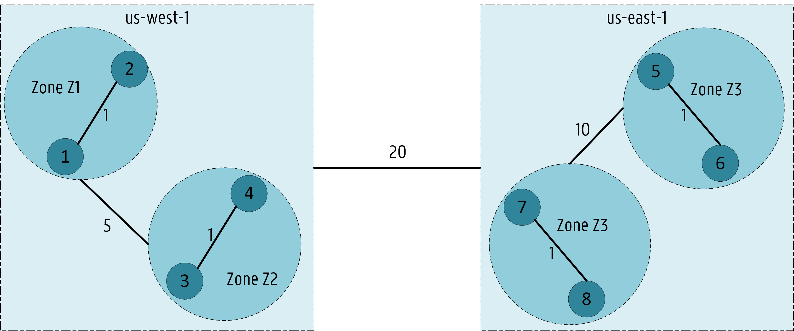

## NetworkOverhead Plugin

#### Extension point: Filter 

Workload dependencies established in the AppGroup CR must be respected.

This plugin focuses on `maxNetworkCost` requirements. 

Nodes providing higher network costs than the `maxNetworkCost` requirement must be filtered out. 

Several dependencies may exist since multiple pods can be already deployed on the network. 

As an initial design, we plan to filter out nodes that unmet a higher number of dependencies to reduce the number of nodes being scored. 

Also, `minBandwidth` requirements will be considered at a later stage. 
based on the bandwidth capacity / allocatable available in each region / zone. 
The bandwidth allocatable in each region or zone will be handled by the Network Topology controller previously mentioned.  

```go
// Filter : evaluate if node can respect maxNetworkCost requirements
func (pl *NetworkOverhead) Filter(ctx context.Context, cycleState *framework.CycleState, pod *v1.Pod, nodeInfo *framework.NodeInfo) *framework.Status {
    // 1) Check if Pod belongs to an AppGroup
    (...)
    // 2) Check if pods already available (AppGroup lister), otherwise return
    (...)
    // 3) Check Dependencies of the given pod 
    (...)
    // 4) Retrieve network costs from the NetworkTopology CRD based on the region and zone of the node being filtered    
    (...)
    // 5) Save them in a map to search for costs faster
    (...)
    // 6) Main Procedure: check if the node is able to meet maxNetworkCost requirements
        // For Loop: check all workloads allocated in the cluster and see if dependencies are met if pod is allocated on the node
        (...) // If the node being filtered and the pod's hostname is the same node -> numOK = numOK + 1 (dependency respected)
        (...) // If Nodes belong to the same zone -> numOK = numOK + 1 (dependency respected)
        (...) // Otherwise, retrieve the cost from the map:  
        (...) // If the cost (retrieved from map) <= dependency MaxNetworkCost -> numOK = numOK + 1 (dependency respected)             
        (...) // Otherwise: (cost > dependency MaxNetworkCost) -> numNotOK = numNotOK + 1 (dependency not respected)

    // 7) If the number of unmet dependencies is higher than the number of respected dependencies: return framework.Unschedulable
    if numNotOK > numOK{
        return framework.NewStatus(framework.Unschedulable, fmt.Sprintf("Node %v does not meet several 
            network requirements from Pod dependencies: OK: %v NotOK: %v", nodeInfo.Node().Name, numOK, numNotOK))
    // 8) Otherwise, node can schedule the pod: return nil 
    return nil
}
```

#### `NetworkOverhead` Filter Example

Let's consider the following AppGroup CRD for the appGroup `A1` containing three workloads representing pods `P1 - P3`:

```yaml
# Example App Group CRD spec
apiVersion: diktyo.k8s.io/v1alpha1
kind: AppGroup
metadata:
  name: a1
spec:
  numMembers: 3
  topologySortingAlgorithm: KahnSort
  workloads: 
    - workload:
        kind: Deployment
        apiVersion: apps/v1
        namespace: default
        name: P1
      dependencies:
        - workload: 
            kind: Deployment
            apiVersion: apps/v1
            namespace: default
            name: P2
          minBandwidth: "100Mi"
          maxNetworkCost: 30
    - workload: 
        kind: Deployment
        apiVersion: apps/v1
        namespace: default
        name: P2
      dependencies:
        - workload:
            kind: Deployment
            apiVersion: apps/v1
            namespace: default
            name: P3
          minBandwidth: "250Mi"
          maxNetworkCost: 20
    - workload:
        kind: Deployment
        apiVersion: apps/v1
        namespace: default
        name: P3
```

Then, workloads already allocated in the cluster are retrieved via an AppGroup lister. Two pods have already been allocated: one instance of `P2` in node `N1` and one instance of `P3` in node `N4`. 

Also, the kubernetes cluster has two regions `us-west-1` and `us-east-1`, four zones `Z1 - Z4` and eight nodes `N1 - N8`. 

The NetworkTopology CRD is the following:

```yaml
# Example Network CRD 
apiVersion: diktyo.k8s.io/v1alpha1
kind: NetworkTopology
metadata:
  name: net-topology-test
  namespace: default
spec:
  configMapName: "netperfMetrics"
  weights:
    # Region label: "topology.kubernetes.io/region"
    # Zone Label:   "topology.kubernetes.io/zone"
    # 2 Regions:  us-west-1
    #             us-east-1
    # 4 Zones:    us-west-1: z1, z2
    #             us-east-1: z3, z4
    - name: "UserDefined"
      costList: # Define weights between regions or between zones 
        - topologyKey: "topology.kubernetes.io/region" # region costs
          originCosts:
            - origin: "us-west-1"
              costs:
                - destination: "us-east-1"
                  bandwidthCapacity: "10Gi"
                  networkCost: 20
            - origin: "us-east-1"
              costs:
                - destination: "us-west-1"
                  bandwidthCapacity: "10Gi"
                  networkCost: 20
        - topologyKey: "topology.kubernetes.io/zone" # zone costs
          originCosts:
            - origin: "z1"
              costs:
                - destination: "z2"
                  bandwidthCapacity: "1Gi"
                  networkCost: 5
            - origin: "z2"
              costs:
                - destination: "z1"
                  bandwidthCapacity: "1Gi"
                  networkCost: 5
            - origin: "z3"
              costs:
                - destination: "z4"
                  bandwidthCapacity: "1Gi"
                  networkCost: 10
            - origin: "z4"
              costs:
                - destination: "z3"
                  bandwidthCapacity: "1Gi"
                  networkCost: 10
```

Thus, the cluster topology corresponds to the following network graph:
 
<p align="center"></p>

Now, let's consider that we need to schedule one pod corresponding to the workload `P1`. 
`P2` is an established dependency of `P1`. 

So, nodes that do not respect its network cost requirement (i.e., `maxNetworkCost: 15`) will be filtered out:

<p align="center"></p>

#### Extension point: Score

We propose a scoring function to favor nodes with the lowest combined network cost based on the pod's AppGroup.

Workload allocations are retrieved via an AppGroup lister. 

Network weights among regions and zones in the cluster are available in the NetworkTopology CR. 
 
First, we check if pods are already running for the Pod's AppGroup. Otherwise, we score all candidate nodes equally.

Second, we retrieve network costs related to the node being scored. 

Finally, we score the node based on the accumulated network cost related to the workload's dependencies defined in the AppGroup CR. 
The accumulated cost is returned as the score:

```go
// Score : evaluate score for a node
func (pl *NetworkOverhead) Score(ctx context.Context, cycleState *framework.CycleState, pod *v1.Pod, nodeName string) (int64, *framework.Status) 
    // 1) Check if pod belongs to an AppGroup -> return: score all nodes equally
    (...)
    // 2) Check if workloads are already allocated (Appgroup lister), otherwise score all nodes equally 
    (...)
    // 3) Check Dependencies of the given pod 
    (...)
    // 4) Retrieve network costs from the NetworkTopology CR based on the region and zone of the node being scored
    (...)
    // 5) Save them in a map to search for costs faster
    (...)
    // 6) Main Procedure: score the node based on workload allocations and network costs among regions and zones (accumulated cost path)
        // For Loop: check all workloads allocated in the cluster and score nodes based on the pod's dependencies already allocated
        (...) // If the node being scored and the pod's hostname is the same node -> sum = sum + 0
        (...) // If Nodes belong to the same zone -> sum = sum + 1
        (...) // Otherwise, retrieve the cost from the map and add to sum -> sum = sum + cost

    // 7) Return: Accumulated cost as score
    score = sum
    return score, framework.NewStatus(framework.Success, "Accumulated cost added as score, normalization ensures lower costs are favored")
}
```

Then, we get the maximum and minimum costs for all candidate nodes to normalize the values between 0 and 100. 
After normalization, **nodes with lower costs are favored** since it also corresponds to lower latency:

```go
// NormalizeScore : normalize scores
func (pl *NetworkOverhead) NormalizeScore(ctx context.Context, state *framework.CycleState, pod *v1.Pod, scores framework.NodeScoreList) *framework.Status {
	// Lower scores correspond to lower latency
	// 1) Get Min and Max Scores to normalize between framework.MaxNodeScore and framework.MinNodeScore
	(...)
	// 2) If all nodes were given the minimum score, return
    (...)
    // 3) Loop: for all scores 
        (...) // If max != min
            (...) // node_normalized_cost = MAX_SCORE * ( ( nodeScore - minCost) / (maxCost - minCost)
            (...) // nodeScore = MAX_SCORE - node_normalized_cost
        (...) // Else: If maxCost = minCost, avoid division by 0
            (...) // node_normalized_cost = MAX_SCORE * - minCost
            (...) // nodeScore = MAX_SCORE - node_normalized_cost

    // 4) Return after the loop finishes 
    return nil
}
```

We plan to combine our scoring plugin with other scoring plugins (e.g., `BalancedAllocation`, `LeastRequestedPriority`, etc). 
We will attribute a higher weight to our plugin to prefer decisions focused on low latency. 
For instance, consider the following scheduler config as an example to enable the `NetworkOverhead` plugin:

```yaml
apiVersion: kubescheduler.config.k8s.io/v1beta2
kind: KubeSchedulerConfiguration
leaderElection:
  leaderElect: false
clientConnection:
  kubeconfig: "REPLACE_ME_WITH_KUBE_CONFIG_PATH"
profiles:
- schedulerName: network-aware-scheduler
  plugins:
    filter:
      enabled:
      - name: NetworkOverhead
    score:
      disabled: # Preferably avoid the combination of NodeResourcesFit with NetworkOverhead
      - name: NodeResourcesFit
      enabled: # A higher weight is given to NetworkOverhead to favor allocation schemes with lower latency.
      - name: NetworkOverhead
        weight: 5
      - name: BalancedAllocation
        weight: 1
  pluginConfig:
  - name: NetworkOverhead
    args:
      namespaces:
      - "default"
      weightsName: "UserDefined" # weights applied by the plugin
      networkTopologyName: "net-topology-test" # networkTopology CR used by the plugin
```

#### `NetworkOverhead` Score Example

Let's consider the AppGroup CR and NetworkTopology CR shown for the Filter example [here](#networkoverhead-filter-example).

After filtering nodes with the `NetworkOverhead` plugin, four nodes remain as candidate nodes for the pod corresponding to the workload `P1`. 

Nodes with the lowest combined network costs will be scored higher: 

<p align="center"></p>