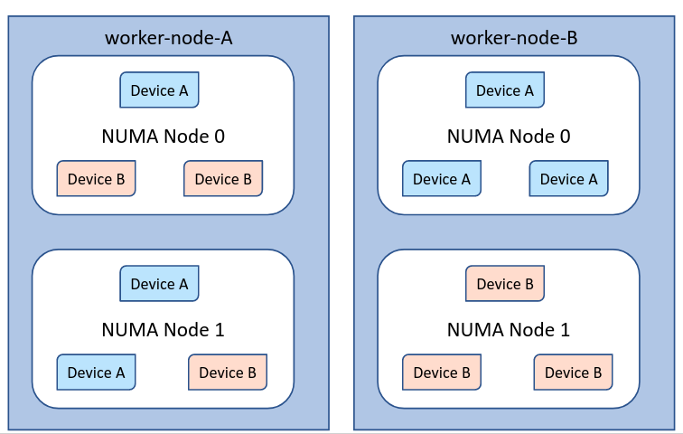

# Overview

This folder holds the Topology-aware scheduler plugin implementations based on [Topology aware scheduler plugin based on NodeResourceTopology CRD](https://github.com/kubernetes-sigs/scheduler-plugins/tree/master/kep/119-node-resource-topology-aware-scheduling/README.md). This plugin enables scheduling decisions based on worker node hardware topology overcoming the issue described [here](https://github.com/kubernetes/kubernetes/issues/84869).

Document capturing the NodeResourceTopology API Custom Resource Definition Standard can be found [here](https://docs.google.com/document/d/12kj3fK8boNuPNqob6F_pPU9ZTaNEnPGaXEooW1Cilwg/edit).

## Maturity Level

<!-- Check one of the values: Sample, Alpha, Beta, GA -->

- [ ] 💡 Sample (for demonstrating and inspiring purpose)
- [x] 👶 Alpha (used in companies for pilot projects)
- [ ] 👦 Beta (used in companies and developed actively)
- [ ] 👨 Stable (used in companies for production workloads)

## Tutorial

### Expectation

In case the cumulative count of node resource allocatable appear to be the same for both the nodes in the cluster, topology aware scheduler plugin uses the CRD instance corresponding to the nodes to obtain the resource topology information to make a topology-aware scheduling decision.

### Config

Enable the "NodeResourceTopologyMatch" Filter and Score plugins via SchedulerConfigConfiguration.
NOTE: Update the config below to specify the namespace(s) in which NodeResourceTopology CR instances are present.

```yaml
apiVersion: kubescheduler.config.k8s.io/v1beta1
kind: KubeSchedulerConfiguration
leaderElection:
  leaderElect: false
clientConnection:
  kubeconfig: "/etc/kubernetes/scheduler.conf"
profiles:
- schedulerName: topo-aware-scheduler
  plugins:
    filter:
      enabled:
      - name: NodeResourceTopologyMatch
    score:
      enabled:
      - name: NodeResourceTopologyMatch
# optional plugin configs
  pluginConfig:
  - name: NodeResourceTopologyMatch
    args:
      kubeconfigpath: "/etc/kubernetes/scheduler.conf"
      namespaces:
        - default
        - production
        - test-namespace
      # other strategies are MostAllocatable and BalancedAllocation
      scoringStrategy:
        type: "LeastAllocatable"
```

### Demo

Let us assume we have two nodes in a cluster deployed with sample-device-plugin with the hardware topology described by the diagram below:



The hardware topology corresponding to both the nodes is represented by the below CRD instances. These CRD instances are supposed to be created by Node Agents like [Resource Topology Exporter](https://github.com/k8stopologyawareschedwg/resource-topology-exporter) (RTE) or Node feature Discovery (NFD). Please refer to issue [Exposing Hardware Topology through CRDs in NFD](https://github.com/kubernetes-sigs/node-feature-discovery/issues/333) and [Design document](https://docs.google.com/document/d/1Q-4wSu1tzmbOXyGk_2r5_mK6JdXXJA-bOd3cAtBFnwo/edit?ts=5f24171f#) which captures details of enhancing NFD to expose node resource topology through CRDs.
Noderesourcetopology plugin works with namespaces, in this case each CRD could be namespace specific. The default namespace is used if it was omitted in the plugin's configuration.

```yaml
# Worker Node A CRD spec
apiVersion: topology.node.k8s.io/v1alpha1
kind: NodeResourceTopology
metadata:
  name: worker-node-A
  namespace: default
topologyPolicies: ["SingleNUMANodeContainerLevel"]
zones:
  - name: numa-node-0
    type: Node
    resources:
      - name: cpu
        capacity: 4
        allocatable: 3
      - name: example.com/deviceA
        capacity: 1
        allocatable: 1
      - name: example.com/deviceB
        capacity: 2
        allocatable: 2
  - name: numa-node-1
    type: Node
    resources:
      - name: cpu
        capacity: 4
        allocatable: 3
      - name: example.com/deviceA
        capacity: 2
        allocatable: 2
      - name: example.com/deviceB
        capacity: 1
        allocatable: 1
```

```yaml
# Worker Node B CRD spec
apiVersion: topology.node.k8s.io/v1alpha1
kind: NodeResourceTopology
metadata:
  name: worker-node-B
  namespace: default
topologyPolicies: ["SingleNUMANodeContainerLevel"]
zones:
  - name: numa-node-0
    type: Node
    resources:
      - name: cpu
        capacity: 4
        allocatable: 3
      - name: example.com/deviceA
        capacity: 3
        allocatable: 3
  - name: numa-node-1
    type: Node
    resources:
      - name: cpu
        capacity: 4
        allocatable: 3
      - name: example.com/deviceB
        capacity: 3
        allocatable: 3
```

- Verify if the CRD has been created by running
    1. In case NFD/RTE is deployed in the cluster ensure that the CRD and CRD instances are created by running

       ```bash
         $ kubectl get noderesourcetopologies.topology.node.k8s.io
       ```

    1. Alternatively, in case you are just interested in simply testing the scheduler plugin, use the manifest in the manifest directory to deploy the CRD and CRs as follows:

         1. Deploy the Custom Resource Definition manifest

            ```bash
            $ kubectl create -f crd.yaml
            ```

         1. Check if the noderesourcetopologies.topology.node.k8s.io CRD is created

            ```bash
             $ kubectl get crd
             $ kubectl get noderesourcetopologies.topology.node.k8s.io
            ```

         1. Deploy the CRs representative of the hardware topology of the worker-node-A and worker-node-B:

            ```bash
             $ kubectl create -f worker-node-A.yaml
             $ kubectl create -f worker-node-B.yaml
            ```
            NOTE: In case you are testing this demo by creating CRs manually, ensure that the names of the nodes in the cluster match the CR names.

- Copy cluster kubeconfig file to /etc/kubernetes/scheduler.conf

- Build the image locally

    ```bash
    $  make local-image
    ```

- Push the built image to the image registry:

    ```bash
    $ docker push <IMAGE_REGISTRY>/scheduler-plugins/kube-scheduler:latest
    ```

- Deploy the topology-aware scheduler plugin config

    ```bash
    $ kubectl  create -f scheduler-configmap.yaml
    ```

- Deploy the Scheduler plugin

    ```bash
    $ kubectl  create  -f cluster-role.yaml
    serviceaccount/topo-aware-scheduler created
    clusterrole.rbac.authorization.k8s.io/noderesourcetoplogy-handler created
    clusterrolebinding.rbac.authorization.k8s.io/topo-aware-scheduler-as-kube-scheduler created
    clusterrolebinding.rbac.authorization.k8s.io/my-scheduler-as-volume-scheduler created
    rolebinding.rbac.authorization.k8s.io/topo-aware-scheduler-as-kube-scheduler created
    clusterrolebinding.rbac.authorization.k8s.io/noderesourcetoplogy created

    $ kubectl create -f deploy.yaml
    deployment.apps/topo-aware-scheduler created
    ```

- Check if the scheduler plugin is deployed correctly by running the following

  ```script
  $ kubectl get pods -n kube-system -o wide
  NAME                                         READY   STATUS    RESTARTS   AGE   IP            NODE                 NOMINATED NODE   READINES
  topo-aware-scheduler-764c475854-vpmcw        1/1     Running   0          2s    10.244.0.14   kind-control-plane   <none>           <none>
  ```

- Deploy the pod to be scheduled with topology-aware scheduler plugin by populating the schedulerName: topo-aware-scheduler

```yaml
apiVersion: apps/v1
kind: Deployment
metadata:
  name: test-deployment
spec:
  selector:
      matchLabels:
        name: test
  template:
    metadata:
      labels:
        name: test
    spec:
      schedulerName: topo-aware-scheduler
      containers:
      - name: test-deployment-1-container-1
        image: nginx:1.7.9
        imagePullPolicy: IfNotPresent
        resources:
          limits:
            cpu: 1
            memory: 100Mi
            example.com/deviceA: 1
            example.com/deviceB: 1
          requests:
            cpu: 1
            memory: 100Mi
            example.com/deviceA: 1
            example.com/deviceB: 1
```

  ```bash
  $ kubectl create -f test-deployment.yaml
  deployment.apps/test-deployment created
  ```

- The test-deployment pod should be scheduled on the worker-node-A node

  ```script
  $ kubectl get pods -o wide
  NAME                               READY   STATUS    RESTARTS   AGE     IP           NODE                 NOMINATED NODE   READINESS GATES
  device-plugin-a-ds-9bpsj           1/1     Running   0          3h13m   172.17.0.3   worker-node-B          <none>           <none>
  device-plugin-a-ds-dv55t           1/1     Running   0          3h13m   172.17.0.2   worker-node-A          <none>           <none>
  device-plugin-b-ds-8t7lh           1/1     Running   0          3h13m   172.17.0.2   worker-node-A          <none>           <none>
  device-plugin-b-ds-lt4pr           1/1     Running   0          3h13m   172.17.0.3   worker-node-B          <none>           <none>
  test-deployment-6dccf65ddb-pkg9j   1/1     Running   0          18s     172.17.0.2   worker-node-A          <none>           <none>
  ```
