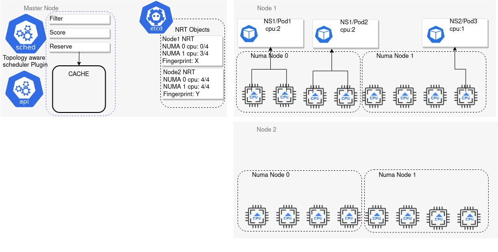
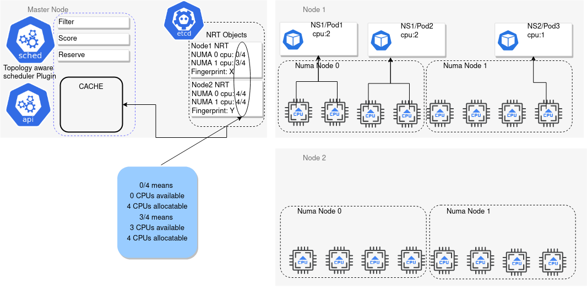
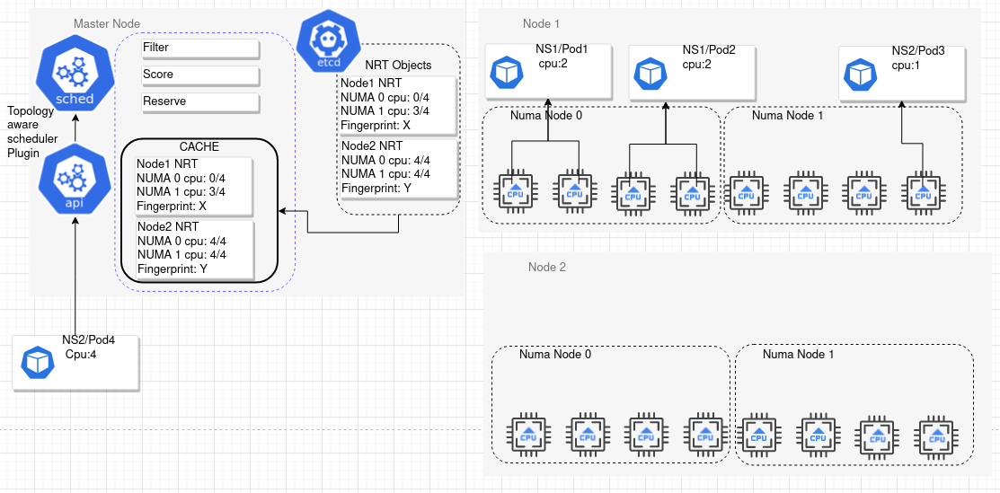
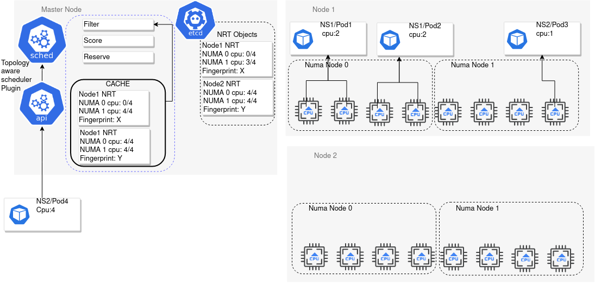
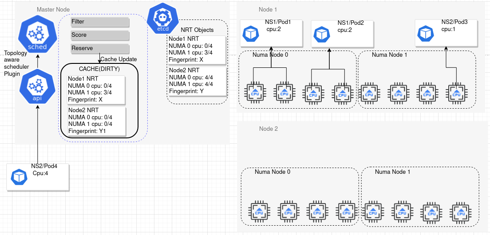
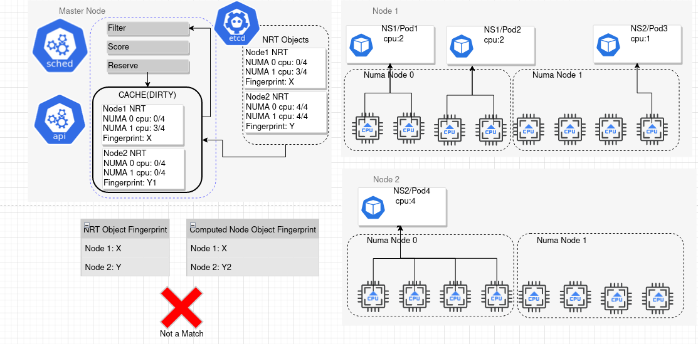
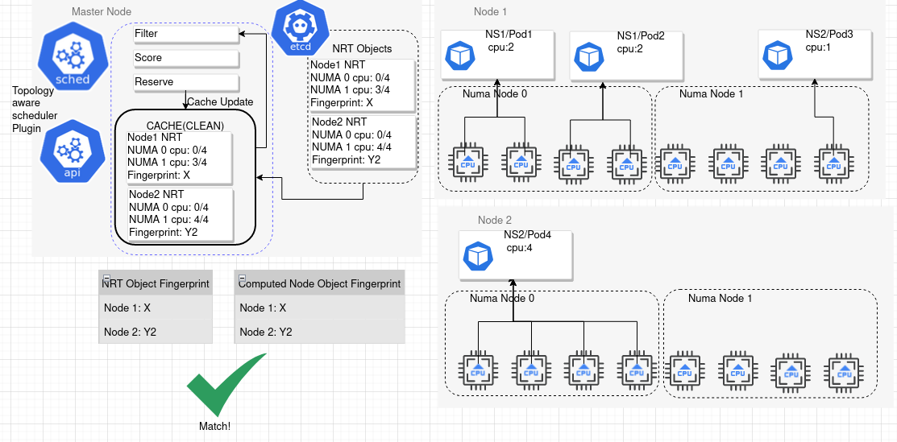

# NUMA-aware scheduler side caching using a reserve plugin

Version 6 - 20220615

Francesco Romani \<[*fromani\@redhat.com*](mailto:fromani@redhat.com)\>
With review and contributions from
Swati Sehgal \<[*swsehgal\@redhat.com*](mailto:swsehgal@redhat.com)\>

## Introduction

The cornerstone of the NUMA-aware scheduler are the
[*noderesourcetopology*](https://github.com/k8stopologyawareschedwg/noderesourcetopology-api/blob/master/manifests/crd.yaml)
objects (NRT), and the filter and score plugins which operate on them to
make the NUMA-aware filtering decisions.

The NRT objects report kubernetes resource capacity and availability
with NUMA-zone granularity. This is different from what we have with the
node object, which reports the capacity and the allocatable amount of
kubernetes resource at node (machine) level granularity.

At node (machine) level, the Topology Manager kubelet component is the
final arbiter of the resource allocation. Depending on the node state,
it can place the workload - thus allocating the resources requested by
that - on any NUMA zone suitable.

The Topology Manager supports different allocation policies. The most
interesting, because it provides NUMA alignment guarantees, is
"single-numa-node". Using this policy, should the Topology Manager not
be able to allocate resources with NUMA-level alignment, the pod will
fail the admissions with TopologyAffinityError.

The scheduler cannot and should not control the Topology Manager
allocation decisions, and neither can predict it. Even if the scheduler
would run the very same code the kubelet runs (as in, for example, go
importing it), the kubelet and the scheduler form a distributed system,
which voids the assumption the scheduler can predict the kubelet
behavior 100% of the time.

This key difference makes it hard for the NUMA aware scheduler plugins
to track the resource allocation with NUMA zone granularity. This is
very different from the case of the core scheduler, which does not need
to handle this uncertainty factor - the Topology Manager is irrelevant
in that case. For node (machine) resources, the scheduler **can** make
reliable assumptions about the node resource availability.

## Goals of NUMA-aware scheduling

Because the Topology Manager is a key component of the current
architecture, the goal of the NUMA-aware scheduler plugin is to
integrate nicely (not replace or override), and this means to
**minimize, or if possible eliminate, the occurrence of
TopologyAffinityError.**

A TopologyAffinityError happens when the kubelet cannot allocate the
resources requested by the workload with NUMA zone alignment. The only
way for the scheduler to prevent this is to filter out nodes which are
unlikely to fulfill this allocation.

**The system behavior should prefer longer scheduling time over
TopologyAffinityError occurrence.** In other words, it is preferable to
filter out nodes too aggressively and let pods stay longer in the
scheduling queue ("Pending" state) if this reduces the chances of
TopologyAffinityError.

In the current implementation, the NUMA aware scheduler plugins do not
do any resource accounting, and completely depend on the freshness of
the NRT data to report the current resource availability and to make
good scheduling decisions.

## Description and drawbacks of the current solution

At node level, the kubelet is the ultimate source of truth.
The software components called "\[node\] topology updater \[agents\]"
are in charge of the following:
- query the resource allocation state from the kubelet
- reorganize this data with per-NUMA node granularity
- fills and update NRT objects.

Updates are performed periodically, or each time pods are added to or
deleted from nodes (using triggers like OCI hooks to signal runtime
changes), or with a mixed approach.

Before each scheduling decision, the NUMA-aware scheduler plugins list
the possible NRT objects and perform their decisions based on the
data extracted from the available objects.

At cluster level, daemonsets must update the NRT objects as fast as
possible, to prevent the scheduler plugins from processing stale data,
which will lead to bad scheduling decisions.

Thus, the current design has a hidden requirement at the node level to
detect and propagate resource allocation changes, tied to pod
creation/deletion events, as fast as possible.

While this is manageable at node level, it creates significant traffic
to the apiserver, which is a major performance and scalability concern.

## NUMA-aware scheduler-side cache: the reserve plugin

We propose to extend the NRT plugins with a scheduler-side cache. We aim
to implement this cache leveraging the [*reserve extension
point*](https://kubernetes.io/docs/concepts/scheduling-eviction/scheduling-framework/#reserve).
Hence, from hereafter we will conflate the concepts under the umbrella
name "the reserve plugin".

This cache will do the accounting of the resource requests with
NUMA-zone granularity. This would be the NRT equivalent of what the core
scheduler framework does for node resources.

The cache is optional, simple as possible, requires minimal changes in
the filter and score plugin, tolerates restarts well, and is backward
compatible, meaning that score and filter should see **no changes** in
their behavior with the reserve plugin -thus the cache- disabled.

**Benefits:**

1.  we have now the option to greatly reduce the pressure on the
    topology updater, because good scheduling decision is less dependent
    on timely update of NRT objects (reserve of course reconciles its
    own state with fresh NRT state once available)
2.  we add a knob to cluster administrators to prefer to keep pods in
    waiting state, requiring less frequent topology updates.

### Implementation of the reserve plugin

Implementing the reserve plugin means designing a solution to the
initial issue that prevented the filter and score NUMA-aware plugins to
do their own accounting.

**Prerequisites:**

1.  Topology updater agents like [RTE](https://github.com/k8stopologyawareschedwg/resource-topology-exporter)
    or [NFD](https://github.com/kubernetes-sigs/node-feature-discovery/tree/master/cmd/nfd-topology-updater)
    or any other compatible implementation are still deployed on all the
    worker nodes (targetable by the NUMA-aware plugins), and they report
    NRT updates with a predictable and regular cadence - typically
    ranging between 10 and 60 seconds.

**Algorithm:**

1: \[startup step\] When the reserve plugin starts up, it gets the
resource availability listing the NRT objects on the cluster and
populates its own cache using this data.

2: \[watch step\] The reserve plugin starts watching for NRT updates
cluster wide. Updates of NRT objects are **not** automatically
translated to cache updates. The cache update is always an explicit
operation (see below).

3: \[filter stage\] At filter stage, the resource availability is taken
from the cache. NRT objects are no longer considered to compute the free
resources (see below).

4: \[allocation stage\] If a pod passed the filtering stage and invokes
the reserve plugin, the latter updates the cache to account the
resources requested by the pod. If only a NUMA zone on a node can
accommodate the workload, we account the resources against it and we
update the cache accordingly. If more than a NUMA zone on a node can
accommodate the workload, we account the resources **against them all
(pessimistic overallocation)**

5: \[invalidation step\] when the invalidation condition triggers, the
plugin checks if the latest received NRT data is fresher than the cached
data. If so, it flushes its local cache for that node, and replaces the
content with the data from the NRT object.

All the steps above are straightforward except for the invalidation
step, which needs clarification to properly define the "cache
invalidation condition".

**To be scalability-friendly, we will work under the assumption that
computing the cache invalidation condition is not so cheap that we can
just do this check each time a NRT update is received.**

## The reconciliation condition: a "node state" definition

After each pod successfully passes the "reserve" stage, the cache
represents a pessimistic view of the node\'s expected state. NRT object
updates on the other hand represent the real view of the node state.

Because of the pessimistic allocation, the reserve cache will consider
nodes fully allocated way before they are actually fully allocated - the
pessimistic allocation is roughly N times the real allocation (N being
the number of the NUMA zones on the node).

A node can be thus incorrectly filtered out because of the pessimistic
allocation.

To avoid this, we can leverage the periodic updates of NRT that are
pushed (see prerequisites).

**Cache invalidation condition: we need to flush the scheduler-side
cache when the plugin receives a NRT object which represents the same
node state which the cache computed.**

We define "node state" as the expected set of pods running on a node at
any given time. Pods are identified by the namespace + name pair.

At steady state, all node states as seen from the scheduler and from the
kubelet(s) must coincide:

1.  When a node is running the expected set of pods perhaps with some
    free resources, but the desired workload is running
2.  When a node is **correctly (as reflected by NRT object data)** fully
    allocated
3.  When a node is **pessimistically (as computed by the reserve
    cache)** fully allocated

Because of the pessimistic allocation, the scheduler will mark a node as
fully allocated before it is actually the case.

From the scheduler perspective, the node will reach a steady state, and
in due time the kubelet will reach the same state. At this point, the
NRT objects will be stable, and they will report the same state.

The node state can be encoded:

1.  As a plain string of unordered namespace/name pairs. This is the
    simplest representation, but it's likely to be unwieldy

2.  As a fingerprint. This representation is much more compact, but
    needs to be computed as cheaply as possible and using the same steps
    on both sides (node and scheduler)

    a.  We don't cover how to compute the fingerprint, intentionally.
        This task will be deferred by a third-party package. The
        fingerprint needs to be stable and computable on both sides
        independently. The hashing does need to be cryptographically
        secure, and collisions will only cause increased load without
        other negative effects.

To help the scheduler, all NRT objects shall have a node state
fingerprint to record the node state they represent.

The fingerprint will be initially set in an annotation. Once this
approach is fully validated and mature enough, we will propose a new
field in the NodeResourceTopology object.

## Cache invalidation algorithm

1.  Watch for NRT updates. **Do not automatically reflect these updates
    into the scheduler-side cache**. This update step must be explicit
    and happen on well-defined conditions.

2.  At reserve stage, account for the pod resources on all the node NUMA
    zones. This usually means overallocation. If the node cache was
    clean, mark it as dirty; if it was already dirty, it is still dirty.

3.  Check the **cache invalidation condition: **when the cache is dirty
    and a node is filtered out at least N times in a row, compute its
    node state fingerprint

    a.  It's easy to track how many consecutive times a node is filtered
        out, and we use this value to approximate "node fully
        allocated". Actually checking a node is "fully allocated"
        would require setting detailed load thresholds which are
        impractical or too complex.

4.  Compare the computed node start fingerprint with the node state
    fingerprint of the last NRT object received

    a.  If they don't match, exit this flow

    b.  If they match, overwrite the node cache with the content of the
        > NRT object. The node cache is now clean again

## Performance and scalability considerations

We estimate the time/space overhead of the proposed changes as follows:

-   NRT objects: the node state fingerprint is a constant-size string.
    Expected impact is negligible.

-   At node level:

    -   Update agents which publish NRT objects can consume node-local APIs
        ([podresources](https://kubernetes.io/docs/concepts/extend-kubernetes/compute-storage-net/device-plugins/#grpc-endpoint-list),
        or [kubelet local](https://www.deepnetwork.com/blog/2020/01/13/kubelet-api.html#pods))
        to learn about the resource allocation. They need to process
        all the running pods anyway. Thus, the impact is expected to
        be minimal. No calls to the APIserver are expected.

-   At scheduler level:

    -   Computing a node state fingerprint **will** require extra work
        to list all the pods on a node (albeit from an already
        existing cache). We aim to minimize this overhead by doing
        this work only when needed - so when a node cache is dirty and
        the node is considered full.

    -   When we have high pod churn this extra load can have an impact
        on the scheduler plugin resource consumption. We will need to
        monitor and tune the system.

## Future enhancements and open issues

### Node level

1.  The podresources List API is such a way that returns information
    about all the pods running on the node, which turns out to be very
    handy for the purposes of the work described here. But this is not
    part of the API contract.

    a.  The API is Stable anyway and unlikely to change, we can just
        make this (sensible) behavior part of the API contract

    b.  NRT update agent can use both podresources API and kubelet local APIs

### General

[The current pod fingerprinting implementation](https://github.com/k8stopologyawareschedwg/podfingerprint)
uses the \`namespace+name\` pair to identify a pod. In case of high pod
churn when burstable or guaranteed pods get deleted and recreated with non-identical pod specs
(e.g. changing pod resources requests/limits), the fingerprint will clash. So, two different set of
pods will yield the same fingerprint.

However kubernetes best practices [suggest to always use controllers, not \"naked\" pods](https://kubernetes.io/docs/concepts/configuration/overview/#naked-pods-vs-replicasets-deployments-and-jobs).
[Kubernetes controllers will generate create unique names for pods](https://github.com/kubernetes/kubernetes/blob/v1.24.1/pkg/controller/controller_utils.go#L553),
hence in this scenario the name clash described above should occur very rarely.
[Please refer to the pod fingerprinting implementation for more details](https://github.com/k8stopologyawareschedwg/podfingerprint#fingerprint-v1-pod-aliasing-issue).

## Version history

Major milestones only

-   20220615 acknowledged and documented the possible pod fingerprint aliasing
-   20220607 document finalized
