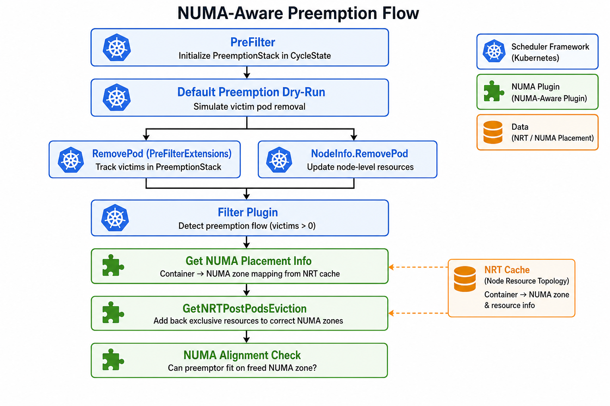

# NUMA-aware scheduler preemption

Version 1 — 20260630

## Table of Contents

- [Summary](#summary)
- [Introduction](#introduction)
- [Motivation](#motivation)
  - [Goals](#goals)
  - [Non-Goals](#non-goals)
- [The preemption problem with NUMA-aware scheduling](#the-preemption-problem-with-numa-aware-scheduling)
- [Why container NUMA localities are required](#why-container-numa-localities-are-required)
- [Design: NUMA-aware preemption simulation](#design-numa-aware-preemption-simulation)
  - [PreFilter and PreFilterExtensions](#prefilter-and-prefilterextensions)
  - [Post-eviction NRT reconstruction](#post-eviction-nrt-reconstruction)
  - [Filter integration](#filter-integration)
- [Preemption flow](#preemption-flow)
- [Prerequisites and limitations](#prerequisites-and-limitations)
- [Performance and reliability considerations](#performance-and-reliability-considerations)
- [Future enhancements and open issues](#future-enhancements-and-open-issues)
- [Version history](#version-history)

## Summary

The NUMA-aware scheduler filter plugin operates on per-NUMA resource availability  
reported by *[NodeResourceTopology](https://github.com/k8stopologyawareschedwg/noderesourcetopology-api)* (NRT) objects. The default Kubernetes preemption  
logic, however, only simulates pod removal at **node level**. Without additional logic, the  
NUMA filter continues to see victim resources as consumed on their NUMA zones and  
incorrectly rejects nodes that would become schedulable after eviction.

This document describes how the NUMA-aware scheduler plugin integrates with the  
scheduler preemption dry-run by:

1. tracking victim pods through the **PreFilter** extension point and its
  **PreFilterExtensions** (`RemovePod` / `AddPod`) callbacks;
2. decoding **container NUMA localities** from NRT data (via the
  *[numaplacement](https://github.com/k8stopologyawareschedwg/numaplacement)* encoding); and
3. reconstructing a **post-eviction NRT view** inside the filter stage before
  running the usual NUMA alignment checks.

## Introduction

The cornerstone of the NUMA-aware scheduler are the NRT objects and the filter  
and score plugins which operate on them to make NUMA-aware filtering decisions.  
See also the companion design document on scheduler-side caching:  
[NUMA-aware scheduler side caching using a reserve plugin](../../cache/docs/NUMA-aware-scheduler-side-reserve-plugin.md).

NRT objects report Kubernetes resource capacity and availability with  
NUMA-zone granularity. The kubelet Topology Manager, configured with the  
`single-numa-node` policy, is the final arbiter of resource placement on the  
node. The scheduler must filter out nodes that cannot satisfy NUMA alignment,  
because a pod admitted without sufficient NUMA-local resources will fail at  
kubelet admission with a `TopologyAffinityError`.

[Priority and preemption](https://kubernetes.io/docs/concepts/scheduling-eviction/pod-priority-preemption/)  
allow higher-priority pods to evict lower-priority pods when no node can fit them  
otherwise. During preemption, the scheduler performs a **dry-run**: it simulates  
removing candidate victim pods from a node and re-runs filter plugins to check  
whether the preemptor would fit.

For node-level resources (CPU, memory totals), the default preemption simulation  
works out of the box: removing a pod from `NodeInfo` frees the corresponding  
node-level allocatable resources, and filter plugins see the updated state.

For NUMA-local exclusive resources (integral CPUs, memory, hugepages, device  
plugin resources), this is **not sufficient**. The NUMA filter reads NRT zone  
data, not the node-level summary in `NodeInfo`. NRT still reflects victim  
resources as consumed on the NUMA zone where the kubelet placed them. Without  
knowing *which* NUMA zone each victim occupies, the scheduler cannot determine  
whether evicting those victims would free enough resources for the preemptor.

## Motivation

NUMA-aware clusters routinely run latency-sensitive or hardware-accelerated  
workloads that request exclusive, NUMA-aligned resources. These workloads often  
use priority classes so that critical jobs can preempt best-effort or lower-priority  
tenants. If preemption dry-run ignores NUMA topology, the scheduler will:

- reject valid preemption candidates, leaving high-priority pods stuck in  
`Pending`; or
- in edge cases, accept preemption candidates that still cannot be placed with  
NUMA alignment after eviction.

Both outcomes violate the core goal of NUMA-aware scheduling: **minimize**  
**TopologyAffinityError while integrating with, not replacing, the kubelet**  
**Topology Manager.**

### Goals

1. Make NUMA-aware preemption dry-run as accurate as possible for nodes running
  the `single-numa-node` Topology Manager policy.
2. Reuse existing NRT data and the `numaplacement` encoding — no new API
  objects or kubelet changes required on the scheduler side.
3. Keep the change localized: PreFilter state tracking plus filter-stage NRT
  adjustment; score and reserve behavior remain unchanged.
4. Only account for **exclusive** resources when simulating post-eviction
  availability, matching what the NUMA filter actually enforces.

### Non-Goals

- Cross-node preemption (preemption is still scoped to a single node per the  
default scheduler).
- Preemption for Topology Manager policies other than `single-numa-node`.
- Simulating post-eviction state when container NUMA placement data is missing  
or stale (in that case the filter falls back to the unmodified NRT view) -> no preemption.
- Replacing or extending the default preemption victim selection algorithm.

## The preemption problem with NUMA-aware scheduling

Consider a two-NUMA node where NRT reports:


| NUMA zone | Available CPU | Available memory |
| --------- | ------------- | ---------------- |
| node-0    | 0             | 0                |
| node-1    | 3             | 8 Gi             |


A low-priority pod `victim` consumes 4 CPU and 8 Gi on **node-0**. A  
high-priority pod `preemptor` requests the same resources and must align to a  
single NUMA zone.

At node level, removing `victim` from `node-0` makes 4 CPU and 8 Gi available  
on the node. The default `NodeResourcesFit` filter would pass.

The NUMA filter, however, still reads NRT:

- node-0: 0 CPU, 0 memory (victim still accounted)
- node-1: 3 CPU, 8 Gi

The preemptor needs 4 CPU on **one** NUMA zone. Neither zone alone satisfies the  
request. The NUMA filter returns `Unschedulable` — **even though evicting**  
`victim` **would free node-0 and make the preemptor schedulable.**

The root cause is a **semantic gap** between two views of node state during  
preemption dry-run:


| View                      | What preemption updates | What NUMA filter reads |
| ------------------------- | ----------------------- | ---------------------- |
| NodeInfo                  | Yes — victims removed   | No                     |
| NRT per-NUMA availability | No                      | Yes                    |


Closing this gap requires knowing where each victim's exclusive resources live  
and adding them back to the correct NUMA zone before running the alignment check.

## Why container NUMA localities are required

NRT objects expose **aggregate** per-NUMA availability. They do not, by  
themselves, answer the question: *"which running container occupies NUMA zone*  
*N?"*

That mapping is essential for preemption simulation because:

1. **Exclusive resources are NUMA-local.** When the kubelet evicts a pod, only
  the NUMA zone where its containers were placed becomes free — not every zone  
   on the node.
2. **The reserve cache uses pessimistic overallocation.** When the scheduler-side
  cache is enabled, assumed pods decrement resources from *all* NUMA zones. NRT  
   reconciliation restores the real view, but during preemption we still need  
   per-container placement to undo victim consumption precisely.
3. **Not all container resources matter.** Only *exclusive* resources participate
  in NUMA alignment for `single-numa-node`:
  - guaranteed QoS: integral CPU, memory, hugepages
  - device plugin resources
  - extended resources always exclusive until clarified otherwise
  - burstable/best-effort pods with non-native (device) resources

Shared or non-exclusive requests must not be added back during simulation.

The *[numaplacement](https://github.com/k8stopologyawareschedwg/numaplacement)* project defines a compact encoding of container→NUMA mappings.   
Topology updater agents (RTE, NFD topology updater, or compatible implementations) is expected  
to embed this encoding in NRT object attributes:

- **Metadata attribute** on the NRT object: container count and decoding parameters
- **Vector attribute** on each NUMA zone: bit-packed placement data for containers  
hosted on that zone

The scheduler-side NRT cache decodes this data whenever an NRT update arrives,  
producing an `EncodedInfo` structure keyed by  
`(namespace, pod, container)` → NUMA ID. See  
`[getNUMAPlacementInfo](../../cache/store.go)` in the cache store.

Without this data, the filter cannot reconstruct post-eviction NRT and preemption  
dry-run remains broken for NUMA-local exclusive resources.

## Design: NUMA-aware preemption simulation

The solution has two cooperating parts: **victim tracking** (PreFilter) and  
**NRT adjustment** (Filter + preemption helper).

### PreFilter and PreFilterExtensions

The Kubernetes scheduling framework exposes  
`[PreFilterExtensions](https://kubernetes.io/docs/concepts/scheduling-eviction/scheduling-framework/#prefilterextensions)`  
with two callbacks invoked during preemption dry-run:


| Callback    | When called                                      | Purpose in default scheduler |
| ----------- | ------------------------------------------------ | ---------------------------- |
| `RemovePod` | A victim pod is simulated as removed from a node | Update plugin-local state    |
| `AddPod`    | A previously removed victim is reprieved         | Undo the removal             |


The NUMA-aware plugin implements `PreFilterPlugin` and `PreFilterExtensions`:

```go
// PreFilter initializes an empty victim stack for this scheduling cycle.
func (tm *TopologyMatch) PreFilter(...) {
    cycleState.Write(stateVictimPodsKey, &PreemptionStack{
        PodsToRemove: make(PodsInfo),
    })
}

// RemovePod records a victim pod in the stack.
func (tm *TopologyMatch) RemovePod(...) {
    ps.PodsToRemove[pod.Namespace+"/"+pod.Name] = pod
}

// AddPod removes a reprieved victim from the stack.
func (tm *TopologyMatch) AddPod(...) {
    delete(ps.PodsToRemove, pod.Namespace+"/"+pod.Name)
}
```

**Why PreFilter is needed:** the filter plugin runs later and has no direct  
visibility into which pods the preemption dry-run removed from `NodeInfo`. The  
PreFilter extension callbacks are the framework's sanctioned hook for plugins to  
track simulated pod additions and removals. By maintaining a `PreemptionStack`  
in `CycleState`, the filter can later ask: *"which victims is this dry-run*  
*evaluating?"*

The PreFilter method itself does no narrowing of the node space — it only  
allocates state. This is intentional: preemption victim selection remains the  
responsibility of the default preemption plugin.

### Post-eviction NRT reconstruction

Given victim pods and their NUMA placements, the  
`[preemption](../../preemption/preemption.go)` package builds a simulated  
post-eviction NRT:

1. For each victim pod, iterate its containers.
2. Skip pods that are neither guaranteed QoS nor carrying non-native resources.
3. Look up each container's NUMA affinity via `numaPlacementInfo.NUMAAffinity()`.
4. For each exclusive resource in the container's requests, accumulate the
  quantity to add back on that NUMA zone.
5. Deep-copy the NRT and increment `Available` on matching zone resources.
6. If any increment would exceed `Allocatable`, abort and return the original
  NRT unchanged (safety guard against inconsistent data).

This logic mirrors what will happen on the node after the kubelet evicts the  
victims and the topology updater publishes a fresh NRT — but it happens  
**synchronously inside the filter**, so preemption dry-run can make a correct  
decision now.

### Filter integration

In `[Filter](../../filter.go)`, after loading cached NRT data:

```go
victims, _ := getVictimPods(cycleState)
if len(victims) > 0 {
    numaPlacementInfo := tm.nrtCache.GetNUMAPlacementInfo(nodeName)
    if numaPlacementInfo != nil && numaPlacementInfo.Containers() > 0 {
        nodeTopology = preemption.GetNRTPostPodsEviction(
            lh, nodeTopology, victims, numaPlacementInfo)
    }
}
// ... proceed with normal NUMA alignment handler
```

Key behaviors:

- Preemption is detected purely by a non-empty victim stack — no special pod  
annotations or scheduler profile flags.
- Over-reserve accounting (`NodeMaybeOverReserved`) is **skipped** during  
preemption flow, because the filter is evaluating a hypothetical state, not  
committing a scheduling decision.
- If NUMA placement info is missing, the filter uses the unmodified NRT. This  
preserves existing behavior (conservative rejection) rather than guessing  
placement.

## Preemption flow



**Step-by-step:**

1. **[PreFilter]** At the start of a scheduling cycle, initialize an empty
  `PreemptionStack` in `CycleState`.
2. **[Initial filter pass]** The preemptor pod fails filtering on all nodes.
  The default preemption plugin (`PostFilter`) takes over.
3. **[Preemption dry-run]** For each candidate node, the framework simulates
  removing lower-priority victim pods:
  - `NodeInfo.RemovePod(victim)` — node-level accounting
  - `PreFilterExtensions.RemovePod(victim)` — NUMA plugin records victim in stack
4. **[Filter re-evaluation]** With victims in the stack, the NUMA filter:
  - loads cached NRT for the node
  - retrieves decoded `numaplacement.EncodedInfo`
  - calls `GetNRTPostPodsEviction` to simulate freed NUMA-local resources
  - runs the standard `single-numa-node` alignment check on the adjusted NRT
5. **[Reprieve handling]** If the framework puts a victim back
  (`AddPod`), the victim is removed from the stack. Subsequent filter calls  
   reflect the reduced eviction set.
6. **[Candidate selection]** If the adjusted NRT satisfies alignment, the node
  becomes a valid preemption candidate. The default preemption plugin selects  
   the best candidate and nominates the node.
7. **[Real eviction]** After binding, the kubelet evicts victims, the topology
  updater publishes fresh NRT (with updated placement encoding), and the  
   scheduler cache reconciles on the next NRT watch event.

## Prerequisites and limitations

**Prerequisites:**

1. Nodes must run Topology Manager with policy `single-numa-node` (pod or
  container scope).
2. A compatible topology updater must publish NRT objects with valid
  `numaplacement` metadata and per-zone vector attributes.
3. The scheduler profile must enable the NUMA-aware plugin on both
  `PreFilter` and `Filter` extension points (PreFilter is required for  
   PreFilterExtensions to be invoked).
4. Scheduler-side NRT caching (`OverReserve` or equivalent) must decode and
  store NUMA placement info on NRT updates. The passthrough cache mode does  
   not provide placement data.

**Limitations:**


| Condition                                          | Behavior                                                    |
| -------------------------------------------------- | ----------------------------------------------------------- |
| Missing or empty NUMA placement info               | Filter uses unmodified NRT; no eviction                     |
| Inconsistent container count in placement metadata | Placement decoding fails; same as above                     |
| Non-`single-numa-node` policy                      | NUMA filter handler is nil; plugin is a no-op for topology  |
| Best-effort pods without device resources          | Skipped by both filter and preemption simulation            |
| Burstable pods                                     | Only non-native (device) resources are considered exclusive |


## Performance and reliability considerations

- **CycleState cloning:** `PreemptionStack` implements `Clone()` so parallel  
filter workers receive an independent copy. Victim maps are deep-copied per  
pod.
- **NRT deep copy:** Post-eviction simulation always works on a copy of the  
cached NRT. The cache itself is never mutated during filtering.
- **Safety abort:** If adding back resources would exceed a zone's  
`Allocatable`, the entire NRT update is discarded and the original NRT is  
returned. This prevents overly optimistic preemption decisions when NRT data  
and placement encoding are inconsistent.
- **No extra API calls:** NUMA placement info is decoded once per NRT update and  
cached alongside the NRT snapshot. Preemption dry-run adds only in-memory  
arithmetic during filter.

## Future enhancements and open issues

1. **Score plugin awareness.** The current implementation adjusts NRT only in
  the filter stage. If preemption dry-run ever invokes the score plugin with  
   victim simulation, similar post-eviction adjustment may be needed there.
2. **Placement staleness.** NUMA placement is decoded from the last NRT update.
  If a pod was recently scheduled but NRT has not yet been reconciled, placement  
   data may not include it. This is the same class of staleness problem addressed  
   by the reserve cache; preemption benefits from timely NRT updates, which one    
  of the driving is synchronizing podfingerprint (PFP). 
3. **Multi-NUMA policies.** NRT scheduler plugin is designed to support only   
`single-numa-node`, hence supporting `best-effort` or `restricted` Topology
  Manager policies would require a different post-eviction simulation model.

## Version history

Major milestones only

- 20260630 initial document: preemption status, container NUMA localities,  
PreFilter integration, and post-eviction NRT simulation

