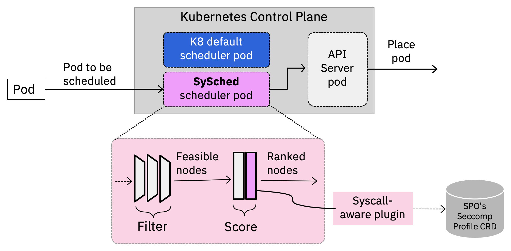
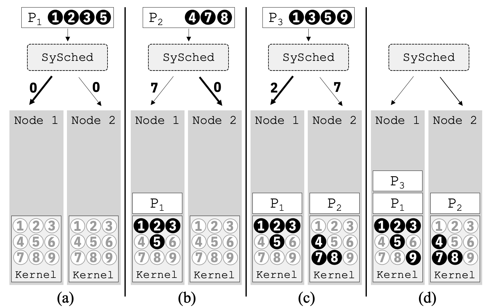

---
title: SySched - System call-based scheduling
---

# KEP: SySched  - System call-based scheduling

## Table of Contents

<!-- toc -->
- [Summary](#summary)
- [Motivation](#motivation)
  - [Goals](#goals)
  - [Non-goals](#non-goals)
- [Proposal](#proposal)
- [User Stories](#user-stories)
  - [Notes/Constraints/Caveats](#notesconstraintscaveats)
    - [Seccomp](#seccomp)
  - [Risks and Mitigations](#risks-and-mitigations)
- [Design Details: Overall architecture](#design-details-overall-architecture)
  - [Scheduling Metrics - Extraneous System Call (ExS)](#scheduling-metrics---extraneous-system-call-exs)
  - [Scheduling Illustrative Example](#scheduling-illustrative-example)
  - [Scheduling Plugin](#scheduling-plugin)
    - [<strong>How the Scheduler gets access to pods' system call profiles</strong>](#how-the-scheduler-gets-access-to-pods-system-call-profiles)
  - [Known limitations](#known-limitations)
  - [Test plans](#test-plans)
- [Production Readiness Review Questionnaire](#production-readiness-review-questionnaire)
  - [Scalability](#scalability)
  - [Troubleshooting](#troubleshooting)
  - [Graduation criteria](#graduation-criteria)
- [Implementation history](#implementation-history)
<!-- /toc -->

## Summary

We propose the use of pod placement as a way to improve the security of nodes in a cluster. Specifically, we propose a new scheduler scoring plugin (SySched) that enables the ranking of feasible nodes based on the relative risks of pods' system call usage. Key to this risk calculation is the Extraneous System Call (ExS) metric, a metric defined at [IBM Research](https://research.ibm.com/topics/security-research), which measures the amount of excess system call a pod is exposed to on a given node. The benefits of this approach are the following:

1. reduce the number of victim pods that can be impacted by a "bad" pod, where a "bad" pod uses one or more system calls that are vulnerable and potentially exploitable to compromise the host kernel
2. reduce the number of nodes in a cluster that can be impacted by a "bad" pod
3. minimizes the "excess" system calls a pod may experience during its lifecycle, hence reduces needed system calls on a node, which in turns reduces the attack surface areas of a node


## Motivation

Securing Kubernetes workloads despite the inevitability of vulnerabilities is a critical task. Particularly devastating are vulnerabilities in the host kernel that are exploitable via system calls to escalate privileges and break out of containment, as demonstrated by the infamous [Dirty COW](https://dirtycow.ninja/) or the recent [Dirty Pipe](https://dirtypipe.cm4all.com/) vulnerability. As a result, a pod's security depends on its neighboring pods and their system call usage since pods share a highly-privileged kernel on a host. Yet cloud providers strive to increase pod density to improve host utilization by multiplexing workloads from different users and tenants on the same set of physical nodes, providing ample opportunities for distrusting containers to become "bad neighbors."

While pod-centric security schemes such as seccomp are necessary, they alone are insufficient. We introduce a practical way to curtail the impact of these types of threats by leveraging a new security-aware pod scheduling scheme that we've developed for Kubernetes to co-locate pods based on their system call usage. So even if such attacks were successful, we show that it would impact fewer victim pods (up to 40% less) on fewer nodes (up to 1/3 less) in the cluster than the existing scheduler.

### Goals

1. Develop a score plugin to favor nodes, for a given incoming pod, that have low ExS scores, i.e., nodes with pods that have similar system call profiles.
2. Define ExS metric used by the logic in the score plugin

### Non-goals

1.  Use other pod security attributes as part of scheduling metric (only considering system call in initial version)
2.  Use existing Taint mechanism to implement above
3.  Descheduling or rescheduling a pod after placement if the system call condition on the node changes during a pod's lifetime.
4.  Automatically generating a system call profile of a pod

## Proposal

## User Stories

1. As a user of the cloud, I would like to be scheduled with neighbors who do not have, or less likely to have, the abilities to compromise my security via the shared kernel on the host.
2. As a developer, I would like the users of my applications to be rewarded for my conscientious and judicious use of system calls by being scheduled on a node with neighboring applications who are similarly limited in their system call usage, hence reducing the user's chance to being compromised by those neighbors via system call-based host exploits.
3. As a cloud provider, we want to enable multitenancy but minimize the impact of a compromised or malicious pod on our users. Hence, we want to minimize the number of victim pods and victim nodes in a cluster from some pods exploiting system call-based host exploits.

### Notes/Constraints/Caveats

#### Seccomp

* We assume the pod's configuration contains seccomp security context provided by the user or automatically configured using the Security Profile Operator (more on this below). We make use of the seccomp profile to retrieve what system calls are used by the pods. seccomp is also used to filter the system calls for each pod to enforce system call restriction.

* Creating a seccomp profile that is inaccurate can result in pod execution failure. Creating an accurate seccomp filter can be challenging but this is an existing difficulty of using seccomp. The Security Profile Operator can be used to ease and automate this process.

* We currently only support seccomp profiles with an allowed set of system calls, i.e., SCMP_ACT_ALLOW, and with the `defaultAction` of SCMP_ACT_ERRNO or SCMP_ACT_LOG. Supporting a deny list will require keeping an up-to-date list of available system calls in the cluster. This can be done in future iteration depending on need.

* We do not support system call filtering based on arguments.

* We also assume each node in the cluster runs a similar Linux kernel version and the resulting seccomp profiles generated either with SPO or other approaches will be for the corresponding host kernel version. The `architecture` field of the pod's seccomp profiles will have to match the corresponding hosts. This is to ensure that the pods' seccomp profiles will be correct and applicable across all the nodes.

Weights can be used to denote the "riskiness" of certain system calls or groups of system calls. We can define riskiness in a few ways but one way is to base on historical CVE data associated with system calls or how system calls are used in known exploits. We discuss how weights can be incorporated in the formulation of ExS below. While weights can be specified through the plugin's configuration or by extending the SPO CRD to encode it, chosing what weight values to use is not straightforward. Hence, implementing weights will depend on the interest/demand from the community.

### Risks and Mitigations

Pods with the same workload (same syscall profiles) might get scheduled on the same set of nodes, potentially impacting performance. This would be a concern if the plugin is used as the sole decider of placement. However, we do not anticipate it being used as such since if there are performance critical workloads or other scheduling metric that is more important, one would want to make use of existing tagging/anti-affinity mechanisms or other scheduling plugins in conjunction with our security plugin and provide the appropriate weights to ensure some form of QoS is maintained. The workloads without specific restrictions can then benefit from our approach.

## Design Details: Overall architecture

SySched utilizes system call profiles of pods obtained through their security contexts in the form of seccomp profiles. It computes a score for each feasible node by comparing the system call profile of the pod with the system call profiles of the existing pods in the node. Our plugin keeps track of the placements of pods and their system call profiles using a lightweight in-memory cache to reduce the cost of querying the API server. To compute the scores, the plugin uses the ExS metric. We define the ExS metric to capture the system calls that a pod does not need, but are present in the node. Our plugin then returns the computed normalized ExS scores to be combined with other scores in Kubernetes for ranking candidate nodes. Figure 1 shows the integration of our plugin with the Kubernetes scheduler.

<p align="center">

</p>

<p align="center">
<b>Figure 1: Overall architecture</b>
</p>

### Scheduling Metrics - Extraneous System Call (ExS)

At the heart of SySched is a single-valued score used to quantify the extraneous system call exposure of a pod on a node. Informally, ExS captures the additional system calls accessible on a node that the pod itself does not use. This score reflects the potential “danger” a pod must face when running on the target node as vulnerabilities in these extraneous system calls from neighboring pods can jeopardize its own security.

For illustrative purpose, we consider a hypothetical node capable of executing nine system calls numbered from 1 to 9 in Figure 2. If we have three pods $P_1$, $P_2$, and $P_3$ in the node with their system call profiles $S_1 = \{1, 2, 3, 5\}$, $S_2 = \{4, 7, 8\}$, and $S_3 = \{1, 3, 5, 9\}$ respectively, we can obtain the ExS for pod $P_1$, $P_2$, and $P_3$ as follows.

> ExS for $P_1 = (S_1 \cup S_2 \cup S_3) - S_1 = \{1, 2, 3, 4, 5, 7, 8, 9\} - \{1, 2, 3, 5\} = \{4, 7, 8, 9\}$

> ExS for $P_2 = (S_1 \cup S_2 \cup S_3) - S_2 = \{1, 2, 3, 4, 5, 7, 8, 9\} - \{4, 7, 8\} = \{1, 2, 3, 5, 9\}$

> ExS for $P_3 = (S_1 \cup S_2 \cup S_3) - S_3 = \{1, 2, 3, 4, 5, 7, 8, 9\} - \{1, 3, 5, 9\} = \{2, 4, 7\}$


<p align="center">

</p>

<p align="center">
<b>Figure 2: Example ExS score calculation</b>
</p>

To express the computation of the ExS score as mathematical equations, let's assume that all system calls in a node are numbered as $1, ..., M$. Let $S_i^n$ represent the binary vector of enabled system calls for pod $i$ on node $n$: $S_i^n = [s_1, s_2, ..., s_M]$, where $s_k = 1$ when the $k$-th system call is enabled, and $s_k = 0$ otherwise. Practically, $S_i^n$ mirrors a typical **seccomp** policy for the corresponding pod.

To find the systems calls that are enabled a given node $n$, we perform a logical $or$ (union) of the enabled system calls across all pods within that node:  $$S^n = \bigcup_i S_i^n$$

We can now compute the vector, $E_i^n = [e_1^n, e_2^n, ..., e_M^n]$, which represents the extraneous systems calls for pod $i$ on node $n$: $$E_i^n = S_i^n \oplus S^n$$

Let $W = [w_1, w_2, ..., w_M]$ be the set of "riskiness" weights associated with each system call. If all system calls are treated equally, then $W = [1, 1, ... , 1]$. $ExS$ reflects the extraneous system call exposure and is computed as follows: for pod $i$ on node $n$, this score can then be computed as the dot product between $E_i^n$ and $W$: $$ExS_i^n = E_i^n \cdot W = e_1^n \times w_1 + e_2^n \times w_2 + ... + e_M^n \times w_M$$

The $ExS_i^n$ score provides an answer to a key question during scheduling: how does the placement of a new pod on a host impact that pod's $ExS_i^n$ score as well as the scores of all current running pods on that node? This node-wide $ExS^n$ score can be calculated by first assuming the new incoming pod is placed on the target node and then calculating the $ExS^n$ score for each pod on that node and adding those scores together:

$$ ExS^n = \sum_i ExS_{i}^{n}$$

It is useful to also calculate the $ExS$ score for an entire cluster as a way to evaluate how well syscall-aware scheduling can reduce the extraneous system call exposure of all the nodes in that cluster. The cluster-wide $ExS$ score for a cluster with $N$ nodes is the summation of the $ExS^n$ score across all nodes:

$$ ExS = \sum_n ExS^n $$

### Scheduling Illustrative Example

Figure 3 illustrates how our scoring impacts placement decisions. To make the illustration simple, we consider two feasible nodes (Node 1 and Node 2) and the node-wide ExS score $(ExS^n)$ as the sole factor for ranking the feasible nodes. However, in reality, our normalized $ExS^n$ scores <!--(i.e., reversed scores by subtracting them from maxPriority) --> are combined with other plugin scores to rank feasible nodes. The figure shows the placement of three pods $(P_1$, $P_2$, and $P_3)$ in Node 1 and Node 2. The numbers inside a pod indicate the system call profile of the pod, i.e., the profile for $P_1$ is $\{1, 2, 3, 5\}$, $P_2$ is $\{4, 7, 8\}$, and $P_3$ is $\{1, 3, 5, 9\}$.

Initially, to schedule pod $P_1$, the node-wide ExS  scores for both Node 1 and Node 2 are the same (i.e., 0), since there are no pods running on the nodes (Figure 3(a)). Thus, the scheduler randomly picks one of the two nodes, Node 1 in this case, and update Node 1's system call usage list using $P_1$'s system call profile (Figure 3(b)). When pod $P_2$ arrives to be scheduled (Figure 3(b)), our plugin computes the node-wide ExS scores for Node 1 and Node 2 by first assuming $P_2$ is assigned to each node, respectively. Hence, $$ExS^1 = ExS_1^1 + ExS_2^1 = 3 + 4 = 7$$ and $$ExS^2 = ExS_1^2 = 0$$ In this case, the plugin ranks Node 2 over Node 1 since Node 2 would have a lower node-wide ExS  score if $P_2$ were to be placed there (i.e., higher normalized score). Figure 3(c) shows the updated system call lists for Node 2. This process repeats for all incoming pods. After all pods are placed, the cluster-wide ExS score in this example is 2: $$ExS = ExS^1 + ExS^2 = ExS_1^1 + ExS_2^1 + ExS_1^2 = 1 + 1 + 0 = 2 $$ Note only $P_3$ on Node 2, hence, no extraneous syscalls.

<p align="center">

</p>

<p align = "center">
<b>Figure 3. Scheduling algorithm and pod placement example</b>
</p>

Figure 3 also highlights the opportunities not only for reducing the exposure to extraneous system calls (i.e., ExS score) but also the node’s attack surface. If $P_3$ had been scheduled on Node 2 instead of Node 1, then Node 2 would have a total of 7 system calls "open" $(1,3,4,5,7,8,9)$, instead of only 3 system calls under the SySched approach.

### Scheduling Plugin

There are two main components of our plugin: 1) a lightweight in-memory cache that is kept synchronize with pod events in order to keep an up-to-date node to pod mapping in the cluster, and 2) mechanisms for retrieving the system call sets used by pods for computing the ExS scores. The in-memory cache reduces the cost of querying the API server for each pod scheduling event. We obtain the system call profiles for pods from their seccomp profiles. Our plugin leverages the Kubernetes sigs community-developed [Security Profiles Operator](https://github.com/kubernetes-sigs/security-profiles-operator) (SPO) that creates Custom Resource Definitions (CRDs) for seccomp profiles. If a pod has no seccomp profile associated with it, i.e., `unconfined`, it will have access to all system calls on a host (denoting highest risk), hence, our plugin will associate all system calls available on a particular host to the pod when calculating ExS.

#### **How the Scheduler gets access to pods' system call profiles**

We assume that the system call profiles of pods have explicitly been made available to the scheduler via the SPO. We rely on the SPO to generate and bind seccomp profile CRDs to the pods. The scheduler uses the API server to access a pod's seccomp profile CRD and parses the seccomp profile CRD to obtain the list of system calls for a pod.

An example of an SPO's seccomp profile CRD:

``` yaml
---
apiVersion: security-profiles-operator.x-k8s.io/v1beta1
kind: SeccompProfile
metadata:
  name: nginx-seccomp
  namespace: scheduler-plugins
spec:
  defaultAction: SCMP_ACT_LOG
  architectures:
  - SCMP_ARCH_X86_64
  syscalls:
  - action: SCMP_ACT_ALLOW
    names:
    - recvmsg
    - fchdir
    - sendfile
    - getdents64
    - setsockopt
    - recvfrom
    - sigaltstack
    - fstatfs
    - umask
    - getegid
    - read
    ...
```

An example of pod's security context specifying the associated seccomp profile:

``` yaml
...
    spec:
      securityContext:
        seccompProfile:
          type: Localhost
          localhostProfile: operator/scheduler-plugins/nginx-seccomp.json
...
```

To further elaborate, when our plugin receives an incoming pod to score, the plugin first obtains the namespace and the SPO seccomp profile CRD name(s) for each container in the pod. The seccomp profile CRD name is gotten either from the Annotations field or the security context field of a pod's metadata. The example below shows a pod in the *default* namespace with two containers with seccomp profile CRDs as *localhost/operator/default/nginx-seccomp.json* and *localhost/operator/default/proftpd-seccomp.json*. The plugin then reads all the seccomp profile CRDs via the API server and combines all the system calls into the system call set for the pod.

If a pod does not have a security context field or SPO annotations, then our plugin simply returns zero (0) as the ExS score for the target node.

```
Name:         multi-container-pod-bdc58d9fb-l686s
Namespace:    default
Priority:     0
Node:         mynode-2/192.168.60.12
Start Time:   Tue, 16 Aug 2022 23:14:52 -0500
Labels:       app=multi-container-pod
              pod-template-hash=bdc58d9fb
Annotations:  cni.projectcalico.org/containerID: 7d20550c2130035c2e5e67f1abd0ea9d7a370ca9bdb265880651a2295e6ccd4c
              cni.projectcalico.org/podIP: 20.96.25.165/32
              cni.projectcalico.org/podIPs: 20.96.25.165/32
              container.seccomp.security.alpha.kubernetes.io/nginx: localhost/operator/default/nginx-seccomp.json
              container.seccomp.security.alpha.kubernetes.io/proftpd: localhost/operator/default/proftpd-seccomp.json
Status:       Running
IP:           20.96.25.165
IPs:
  IP:           20.96.25.165
Controlled By:  ReplicaSet/multi-container-pod-bdc58d9fb
...
```

### Known limitations

-   System call profile associated with a pod must be accessible to the scheduler via the SPO's CRD
-   If there are not enough nodes or the variance in system call usage of the workload is small, the security benefit will be small, if any.
-   Generating a tight and complete system call profile for a pod is not trivial.

### Test plans

## Production Readiness Review Questionnaire

### Scalability

-   Will enabling / using this feature result in any new API calls?No.
-   Will enabling / using this feature result in introducing new API types?No.
-   Will enabling / using this feature result in any new calls to the cloud provider?No.
-   Will enabling / using this feature result in increasing size or count of the existing API objects?No.
-   Will enabling / using this feature result in increasing time taken by any operations covered by [existing SLIs/SLOs](https://git.k8s.io/community/sig-scalability/slos/slos.md#kubernetes-slisslos)?  Experiments are planned to evaluate the overhead.  However, it should be a negligible.
-   Will enabling / using this feature result in non-negligible increase of resource usage (CPU, RAM, disk, IO, ...) in any components?  No. A small amount of memory is used to hold pod topology and grows linearly with number of pods. The scoring algorithm is also linear when the total system call usage set for a node is cached.

### Troubleshooting

-   How does this feature react if the API server and/or etcd is unavailable?  Running pods are not affected. Any new submissions would be rejected by scheduler.
-   What are other known failure modes?  N/A
-   What steps should be taken if SLOs are not being met to determine the problem? Disable the scoring plugin

### Graduation criteria

-   Alpha
	-   Pods are placed based on their system call profiles provided via seccomp files in the SPO CRD
	-   Pods without seccomp profiles (or `unconfined`) will be treated as no-op (return score of 0)
-   Beta
	-   Provide list of available system calls in a cluster via the plugin's configuration
	-   Weights for system calls (potentially)

## Implementation history

-   We have implemented this System Call-aware Scheduler (SySched) plugin for Kubernetes v1.23 and have evaluated the security benefits and performance impact to the cluster.
-   We have presented to the Scheduling-SIG on April 7th, 2022
-   Used the Security Profiles Operator to generate system call profiles for pods and bind them to the pods as seccomp filters
-   We have wrote client code in the plugin to access the SPO seccomp profile CRDs
