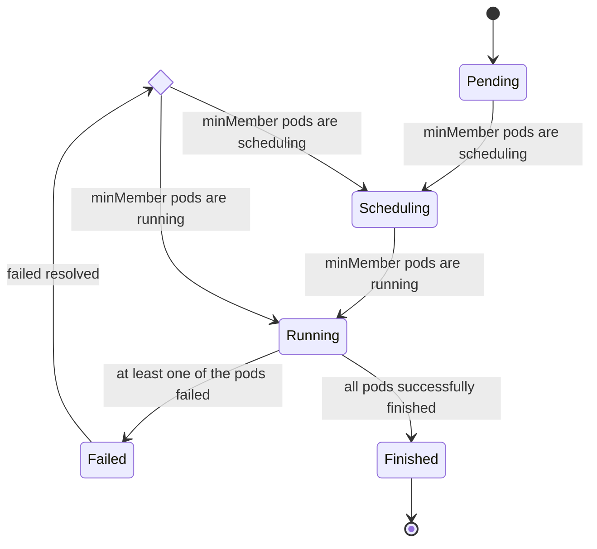

# Coscheduling based on PodGroup CRD

## Table of Contents

<!-- toc -->
- [Motivation](#motivation)
- [Goals](#goals)
- [Non-Goals](#non-goals)
- [Use Cases](#use-cases)
- [Design Details](#design-details)
  - [PodGroup](#podgroup)
    - [PodGroupPhase](#podgroupphase)
  - [Controller](#controller)
  - [Extension points](#extension-points)
    - [QueueSort](#queuesort)
    - [PreFilter](#prefilter)
    - [PostFilter](#postfilter)
    - [Permit](#permit)
  - [Known Limitations](#known-limitations)
<!-- /toc -->

## Motivation
Currently, through the default scheduler of Kubernetes, we cannot ensure a group of pods can be scheduled altogether. Under some scenes, it would waste resources since the whole application cannot work with only partial Pods' running, like Spark jobs, TensorFlow jobs, and so on. This proposal is aimed at solving the issue, by introducing a PodGroup CRD to do the heavy lifting on wiring a group of Pods.
## Goals
1. Base on the scheduling framework, implement the co-scheduling feature.
2. Define a CRD name PodGroup to help pod scheduling.

## Non-Goals
Sort the job when we submit jobs to a cluster. Currently, we can only do this base on pods.

## Use Cases
Batch workloads such as Spark jobs, TensorFlow jobs that have to run altogether.

## Design Details

### PodGroup

We define a CRD name PodGroup to help schedule, its definition is as follows:
```go
// PodGroupSpec represents the template of a pod group.
type PodGroupSpec struct {
	// MinMember defines the minimal number of members/tasks to run the pod group;
	// if there's not enough resources to start all tasks, the scheduler
	// will not start anyone.
	MinMember uint32 `json:"minMember"`

	// MinResources defines the minimal resource of members/tasks to run the pod group;
	// if there's not enough resources to start all tasks, the scheduler
	// will not start anyone.
	MinResources *v1.ResourceList `json:"minResources,omitempty"`

	// ScheduleTimeoutSeconds defines the maximal time of members/tasks to wait before run the pod group;
	ScheduleTimeoutSeconds *int32 `json:"scheduleTimeoutSeconds,omitempty"`
}

// PodGroupStatus represents the current state of a pod group.
type PodGroupStatus struct {
	// Current phase of PodGroup.
	Phase PodGroupPhase `json:"phase"`

	// OccupiedBy marks the workload (e.g., deployment, statefulset) UID that occupy the podgroup.
	// It is empty if not initialized.
	OccupiedBy string `json:"occupiedBy,omitempty"`

	// The number of actively running pods.
	// +optional
	Running uint32 `json:"running"`

	// The number of pods which reached phase Succeeded.
	// +optional
	Succeeded uint32 `json:"succeeded"`

	// The number of pods which reached phase Failed.
	// +optional
	Failed uint32 `json:"failed"`

	// ScheduleStartTime of the group
	ScheduleStartTime metav1.Time `json:"scheduleStartTime"`
}
```

#### PodGroupPhase
`PodGroup` has the following states called `PodGroupStatus`.

```go
// These are the valid phase of podGroups.
const (
	// PodGroupPending means the pod group has been accepted by the system, but scheduler can not allocate
	// enough resources to it.
	PodGroupPending PodGroupPhase = "Pending"

	// PodGroupRunning means the `spec.minMember` pods of the pod group are in running phase.
	PodGroupRunning PodGroupPhase = "Running"

	// PodGroupScheduling means the number of pods scheduled is bigger than `spec.minMember`
	// but the number of running pods has not reached the `spec.minMember` pods of PodGroups.
	PodGroupScheduling PodGroupPhase = "Scheduling"

	// PodGroupUnknown means a part of `spec.minMember` pods of the pod group have been scheduled but the others can not
	// be scheduled due to, e.g. not enough resource; scheduler will wait for related controllers to recover them.
	PodGroupUnknown PodGroupPhase = "Unknown"

	// PodGroupFinished means the `spec.minMember` pods of the pod group are successfully finished.
	PodGroupFinished PodGroupPhase = "Finished"

	// PodGroupFailed means at least one of `spec.minMember` pods have failed.
	PodGroupFailed PodGroupPhase = "Failed"

	// PodGroupLabel is the default label of coscheduling
	PodGroupLabel = scheduling.GroupName + "/pod-group"
)
```




### Controller

We define a controller to reconcile PodGroup status, and we can query the job status through describing the PodGroup. Once a pod in a group failed, the Group Status is marked Failed. Controller would also help recover from abnormal cases, e.g. batch scheduling is interrupted due to
cluster upgrade.

### Extension points

#### QueueSort

To make sure a group of pods can be scheduled as soon as possible. We implemented this `extension point`. The main progress is as follows:

1. Sort based on Pod Priority
2. Pod does not belong to any group
3. PodGroup creation time
4. Pod creation time

#### PreFilter

This extension pre-filters pods to save scheduling cycles. This is especially helpful when there are not enough resources in a cluster. The overall flow works as below:

1. If the pod doesn't belong to a pod group, allow it; otherwise, go to the following steps.
2. If there are no other pending pod groups - say all other pod groups have already been scheduled, we allow the pod when its resource requirement is satisfied.
3. If there are other pod groups not fully scheduled, we check if the pod group current pod belongs to is the closest to its completion - i.e., we check its completion progress by `len(waiting pods of a pod group) / pod group's minMember`.
    - if it is, this pod is allowed.
    - if it's not, we check if allowing it would still make the top-progressed pod group (or you want to say all progressed pod grouped?) scheduled:
        - if so, this pod is allowed;
        - if not, we check if the current pod has higher priority than the top-progressed pod group (I guess for convenience, you would still need the `PriorityClass` defined in PodGroup?). If it does, this pod is allowed and the top-progressed pod group gets rejected.

For any pod that gets rejected, their pod group would be added to a backoff list and get retried until a TTL is met.

#### PostFilter

If the gap to reach the quorum of a PodGroup is greater than 10%, we reject the whole PodGroup. Note that this plugin should be configured as the last one among PostFilter plugins.

#### Permit

1. When the number of waiting pods in a PodGroup is less than `minMember` (defined in the PodGroup), the status `Wait` is returned. They will be added to cache with TLL (equal to ScheduleTimeoutSeconds).
2. When the number is equal or greater than `minMember`, send a signal to permit the waiting pods.

We can define `MaxScheduleTime` for a PodGroup. If any pod times out, the whole group would be rejected.

### Known Limitations

1. We cannot support group preemption very well now. Though we have tried to implement the extensions, it still cannot meet production requirements.
