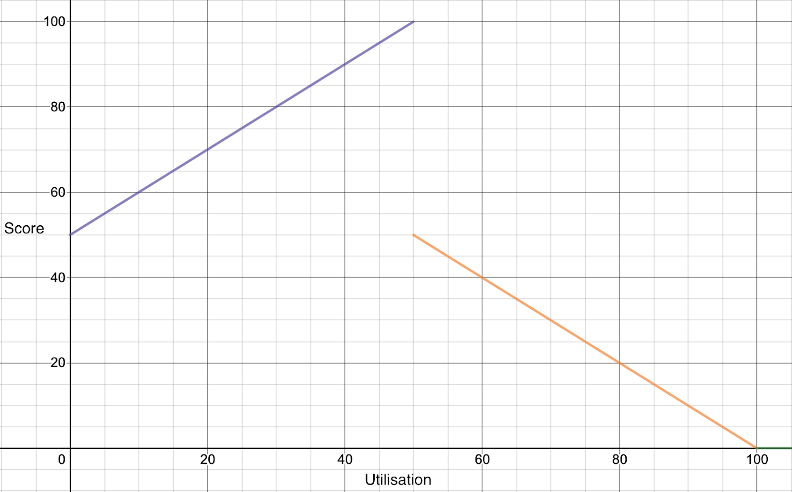
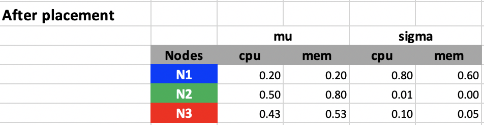
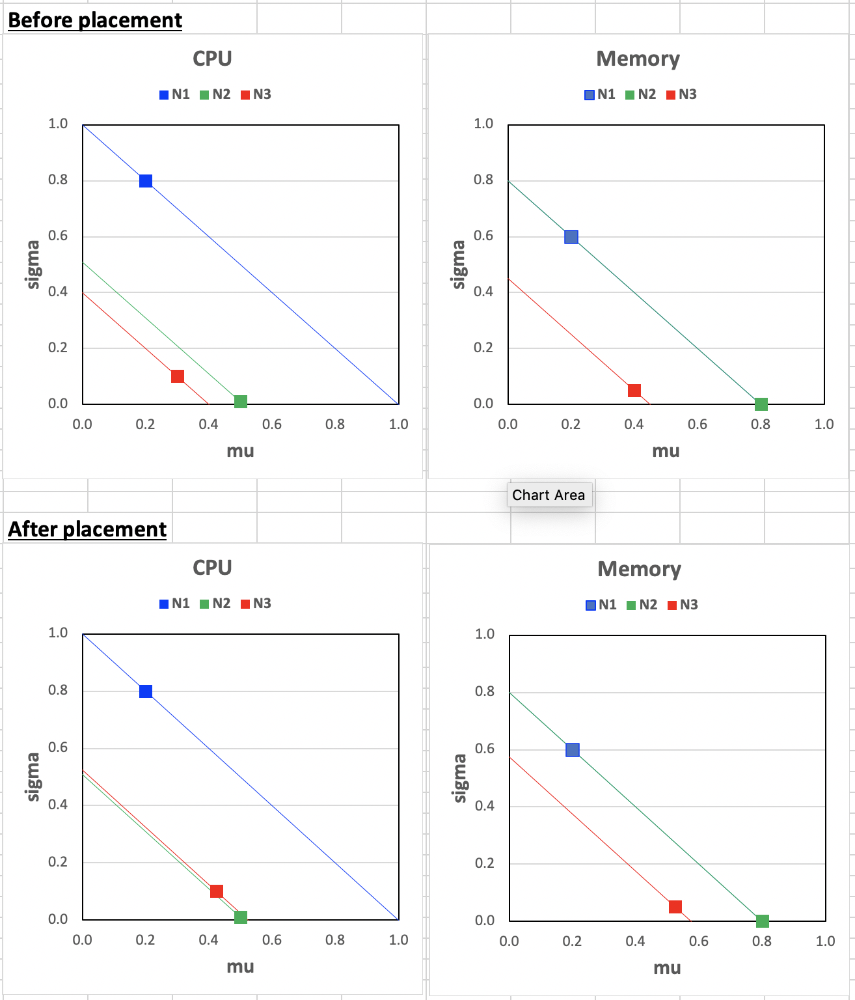

# KEP - Trimaran: Real Load Aware Scheduling

## Table of Contents

<!-- toc -->
- [Summary](#summary)
- [Motivation](#motivation)
  - [Goals](#goals)
  - [Non-Goals](#non-goals)
- [Proposal](#proposal)
  - [User Stories](#user-stories)
    - [Story 1](#story-1)
    - [Story 2](#story-2)
  - [Notes/Constraints/Caveats](#notesconstraintscaveats)
  - [Risks and Mitigations](#risks-and-mitigations)
- [Design Details](#design-details)
  - [Metrics Provider](#metrics-provider)
  - [Load Watcher/Load Analyser](#load-watcherload-analyser)
  - [DB](#db)
  - [Scheduler Plugins](#scheduler-plugins)
  - [TargetLoadPacking Plugin](#targetloadpacking-plugin)
    - [Score plugin](#score-plugin)
  - [LoadVariationRiskBalancing Plugin](#loadvariationriskbalancing-plugin)
    - [Score plugin](#score-plugin-1)
  - [<strong>Bad Metrics</strong>](#bad-metrics)
  - [<strong>Load Watcher API</strong>](#load-watcher-api)
  - [<strong>Scheduled Pods State</strong>](#scheduled-pods-state)
  - [<strong>Test Plan</strong>](#test-plan)
- [<strong>Production Readiness Review Questionnaire</strong>](#production-readiness-review-questionnaire)
  - [<strong>Scalability</strong>](#scalability)
  - [<strong>Troubleshooting</strong>](#troubleshooting)
- [<strong>Implementation History</strong>](#implementation-history)
- [<strong>Appendix</strong>](#appendix)
      - [Load Watcher JSON schema](#load-watcher-json-schema)
<!-- /toc -->

## Summary

Minimizing machine costs by utilizing all nodes is the main objective for efficient cluster management. To achieve this goal, we can make the Kubernetes scheduler aware of the gap between resource allocation and actual resource utilization. Taking advantage of the gap may help pack pods more efficiently, while the default scheduler that only considers pod requests and allocable resources on nodes cannot.

## Motivation

Kubernetes provides a declarative resource model that core components (scheduler and kubelet) honor to behave consistently and satisfy QoS guarantees.
However, using this model can lead to low-utilization of the cluster for the following reasons:

1. It is hard for users to estimate accurate resource usage for applications. Also, users may not understand the resource model and not set it at all.
2. The default in-tree scheduling plugins (Score) that Kubernetes provides don't consider live node utilization values.

This proposal utilizes real time resource usage to schedule pods with proposed plugins. The eventual goal is to increase cluster utilization and decrease costs of cluster management without breaking the contract of Kubernetes Resource Model.

### Goals

1. Provide configurable scheduling plugins to increase cluster utilization.
2. Expected CPU Utilisation per node should not go beyond X% (constraint).
3. To not affect the behavior of default score plugins unless necessary.
4. Implement the above features as Score plugins

### Non-Goals

1. Implement the above constraint 2 as Filter plugins.
2. Descheduling due to unexpected outcome (hot nodes, fragmentation etc.) of past scoring by plugins is not addressed in the initial design.
3. Memory, Network, and Disk utilization are not considered in the initial design.

## Proposal


### User Stories


#### Story 1


As a company relying on the public cloud, we would like to minimize machine costs by efficiently utilizing the nodes leased.


As a company-owned data center, we would like to minimize the hardware and maintenance associated with clusters by getting the maximum possible juice out of existing machines.


#### Story 2

Increasing resource utilization as much as possible may not be the right solution for all clusters. As it always takes some time to scale up a cluster to handle the sudden spikes of load, cluster admins would like to leave adequate room for the bursty load, so there is enough time to add more nodes to the cluster.


### Notes/Constraints/Caveats

Enabling our plugin(s) will cause conflict with 2 default scoring plugins: "NodeResourcesLeastAllocated" and "NodeResourcesBalancedAllocation" plugins. So it is strongly advised to disable them when enabling plugin(s) mentioned in this proposal.
If you choose to enable "NodeResourcesMostAllocated" in tree plugin which is not enabled by default, then it would conflict with our scoring too.


### Risks and Mitigations

If utilization metrics are not available for a long time, we will fall back to the best fit bin pack based on allocations. There is no user action needed for this.
To achieve X% utilization, it is recommended to set the value as X - 10 in practice. Refer to TargetLoadPacking Score Plugin below for more details.
For more details on risks and mitigations associated with live metrics, refer to "Bad Metrics".


## Design Details

Our design consists of the following components as outlined in the diagram and described below. We propose two plugins namely "TargetLoadPacking" and "LoadVariationRiskBalancing". Both of them use metrics from load watcher for scoring nodes with different algorithms.


### Metrics Provider

This service provides metrics backed by a time-series database — for example, Prometheus, InfluxDB, [Kubernetes Metrics Server](https://github.com/kubernetes-sigs/metrics-server) etc.


### Load Watcher/Load Analyser

The load watcher and analyzer both run in a single process. The watcher is responsible for retrieving cluster-wide resource usage metrics like CPU, memory, network, and IO stats over windows of a specified duration from metrics providers above. It stores these in its local cache and persists several aggregations in the host local DB for fault tolerance. The analyzer is responsible for the detection of bad metrics and any remediation. Bad metrics could be due to missing metrics or metrics with considerable errors, making them anomalies. It can also be extended in the future to use ML models for analyzing metrics.

Load watcher would cache metrics in the last 15-minute, 10-minute, and 5-minute windows, which can be queried via REST API exposed. A generic interface will be provided that can support fetching metrics from any metrics provider. Example is provided under Load Watcher API.


### DB

This is a localhost database stored as a file. This DB aims to populate the load watcher's cache quickly if it is lost due to a crash and perform scheduling decisions without any impact on latency.
The file will be stored in host file system, so it will be persisted across pod failures on the same node. For HA setups, each load watcher process will maintain its corresponding file locally.


### Scheduler Plugins

This uses the scheduler framework of K8s to incorporate our customized real load aware scheduler plugins without modifying the core scheduler code. The plugins we proposed mainly include the following two.

- TargetLoadPacking Plugin: It is best fit variant of bin pack algorithm that scores nodes by their actual resource utilization in a way that all utilized nodes have around x% of utilization. Once all nodes reach x% utilization it moves to least fit variant.
- LoadVariationRiskBalancing Plugin: It is a node sorting plugin that sorts nodes base on both the mean and the standard deviation of node resource utilization. It aims to balance not only the average load but also the risk caused by load variations.


### TargetLoadPacking Plugin


#### Score plugin

This plugin would extend the Score extension point. K8s scheduler framework calls the Score function for each node separately when scheduling a pod.

Following is the algorithm:

**Algorithm**

1. Get the utilization of the current node to be scored. Call it A.
2. Calculate the current pod's total CPU requests and overhead. Call it B.
3. Calculate the expected utilization if the pod is scheduled under this node by adding i.e. U = A + B.
4. If U &lt;= X%, return (100 - X)U/X + X as the score
5. If X% &lt; U &lt;= 100%, return X(100 - U)/(100 - X)
6. If U > 100%, return 0

For example, let’s say we have three nodes X, Y, and Z, with four cores each and utilization 1, 2, and 3 cores respectively. For simplicity, let’s assume our pod to be scheduled has 0 cores CPU requests and overhead. Let X = 50%.

Utilization of each node:


```
Ux → (1/4)*100 = 25
Uy → (2/4)*100 = 50
Uz → (3/4)*100 = 75
```


The score of each node :


```
X → (100 - 50)*25/50 + 50 =  75
Y → (100 - 50)*50/50 + 50 = 100
Z → 50 * (100 - 75)/(100 - 50) = 25
```


In the algorithm above, 50% is the target utilization rate we want to achieve on all nodes. We can be less aggressive by reducing it to 40% so that it has much lesser chances of going over 50% during spikes or unexpected loads.
So in general to achieve X% utilisation, X - 10 value is recommended in practice.

In the 2nd step of the algorithm, one variant uses the current pod's total CPU limits instead of requests, to have a stronger upper bound of expected utilization.

The X% threshold value for utilisation will be made configurable via plugin argument.

**Algorithm Analysis**




The above is a plot of the piecewise function outlined in the algorithm. The key observations here are manifold:


1. As the utilization goes from 0 to 50%, we pack pods on those nodes by favoring them.
2. The nodes are penalized linearly as the utilization goes beyond 50%, to spread the pod amongst those "hot" nodes.
3. The positive slope begins from 50 and not from 0 because the range of score is from 0-100, and we want to maximize our score output for nodes we wish to favor so that the score is more substantial and other plugins do not affect it much.
4. There is a break in the graph with a high drop due to the "penalty" we have.

**Plugin Config Args**
```go
type PluginArgs struct {
    TargetCPUUtilisation    int
    DefaultCPURequests      v1.ResourceList
}
```


### LoadVariationRiskBalancing Plugin


#### Score plugin

This plugin would extend the Score extension point. K8s scheduler framework calls the Score function for each node separately when scheduling a pod.


**Idea**


Balancing load based on average would be risky sometimes, as it does not consider the bursty variations. A `LoadVariationRiskBalancing` plugin balances not only the average load but also the risk caused by load variations. Suppose we take the mean (M) and standard deviation (V) of all nodes’ utilization into a mu-sigma plot below. In that case, the `LoadVariationRiskBalancing` plugin will make placements such that all nodes’ utilization are aligned on the diagonal line, which is V + M = c. Here, c is a constant indicating the overall cluster utilization average plus the standard deviation. In summary, considering load on all nodes fluctuates dynamically over time, the `LoadVariationRiskBalancing` plugin favors nodes with lower risks of the load exceeding capacity.


Following is the algorithm:


**Algorithm**


1. Get the requested resource for the pod to be scheduled as, $r$.
2. Get the sliding window average $M$ and standard deviation $V$ of resource utilization fraction (range from 0 to 1) for all types of resources (CPU, Memory, GPU, etc.) of the current node to be scored.
3. Calculate the score of the current node for each type of resource: $S_i = M + r + V$
4. Get a score for each type of resource and bound it to [0,1]: $S_i = min(S_i, 1.0)$
5. Calculate the node priority score per resource as: $U_i = (1 - S_i) \times MaxPriority$
6. Get the final node score as: $U = min(U_i)$

**Example**


For example, let's say we have three nodes `N1`, `N2`, and `N3`, and the pod to be scheduled have CPU and Memory requests as 500 milicores and 1 GB. All nodes have a capacity of 4 cores and 8 GB.

The pod request fraction can be computed as $r_{cpu} = \frac{1}{8}, r_{memory} = \frac{1}{8}$.


Then according to steps 2 ~ 4, the mean and standard deviation of CPU and memory fraction utilization can be computed as follows:


The score for each type of resource and each node are as follows according to step 5 ~ 6:


According to the scores we have, node `N3` will be selected. The utilization fraction of nodes before and after the placement is as follows.





If we plot these in mu-sigma plots, we can see the placement automatically pushes the utilization of nodes toward the diagonal line sigma = 1 - mu. The 1 here indicates 100% of utilization. What can be configured is a coefficient `ita`, which indicates `mu + ita x sigma <= 100 %` and we choose `ita = 1` here. `ita` here models the confidence of usage not exceeding the node capacity under the assumption that the actual usage follows Gaussian distribution and follows the [68-96-99.5 rule](https://en.wikipedia.org/wiki/68%E2%80%9395%E2%80%9399.7_rule).

So when `ita` gets different values, we get different confidence of not exceeding the capacity.

- `ita = 1`, we have a 16% risk that the actual usage exceeds the node capacity.
- `ita = 2`, we have a 2.5% chance that the actual usage exceeds the node capacity.
- `ita = 3`, we have a 0.15% chance that the actual usage exceeds the node capacity.
By default, we choose `ita = 1` as we would like to improve the overall utilization. `ita` can be configured via the `SafeVarianceMargin` for the plugin.


**Plugin Config Args**
```go
type PluginArgs struct {
    SafeVarianceMargin    int
}
```





### **Bad Metrics**

Since load watcher is a major component needed by the plugin to find out utilization values, metrics are essential for the plugin’s correctness. Bad metrics can be due to several issues. A few of them being are given below, along with their remediation. Detection of bad metrics is a problem in its own, other than its remediation.

1. Unavailability of metrics: Metrics can be unavailable due to:
    1. Short inter-arrival times of pods: In this case, we predict utilization for the recent pods that got scheduled on the node based on its request values and a multiplier, and add it to the current utilization. If the pods belong to best-effort QoS, i.e. don't have requests, we assume a number like 1 milicore which is configurable.
    2. Failure of Metric reporting agent running in node: In this case, the metrics would be missing for a particular time. We can use the latest available utilization window (not older than 5 minutes) along with predicted utilization of pods scheduled on that node after the window end time. If this is not available we avoid the node by scoring it minimum.
    3. Metrics Provider failure: The metrics provider can fail to serve requests for several reasons like OOM, unresponsive components, etc. In this case, every node’s metrics are unavailable, and we fall back to the best fit based on allocations. However, we do not plan to target the fall back in first implementation.
    4. Addition of new nodes: It is easy to handle this if no pods have been scheduled on them, so utilization must be 0. If any recent new pods are running already then we can use the method above for prediction. If there are long-running pods, we can avoid this node until metrics are available.
2. Incorrect metrics (due to misconfiguration, bugs, etc.): It is challenging to detect such metrics. For the first implementation, we would like to ignore this case by assuming metrics are correct. However, we plan to add metrics from multiple providers to corroborate data points and minimize the effect of incorrect metrics on scheduling in the future.

### **Load Watcher API**


JSON Schema - see Appendix

JSON payload example:


```
{
  "timestamp": 1556987522,
  "window": {
    "duration" : "15m",
    "start" : 1556984522,
    "end"   : 1556985422
  },
  "source" : "InfluxDB",
  "data" :
    {
      "node-1" : {
        "metrics" : [
          {
            "name" : "host.cpu.utilisation",
            "type" : "cpu",
            "rollup" : "AVG",
            "value"  : 20
          },
          {
            "name" : "host.memory.utilisation",
            "type" : "memory",
            "rollup" : "STD",
            "value"  : 5
          }],
        "tags" : {},
        "metadata" : {
          "dataCenter" : "data-center-1",
          "pool" : "critical-apps"
        }
      },
      "node-2" : {
        "metrics" : [
          {
            "name" : "host.cpu.utilisation",
            "type"  : "cpu",
            "rollup" : "AVG",
            "value"  : 20
          },
          {
            "name" : "host.memory.utilisation",
            "type" : "memory",
            "rollup" : "STD",
            "value"  : 5
          }
        ]
      },
      "metadata" : {
        "dataCenter" : "data-center-2",
        "pool" : "light-apps"
      },
      "tags" : {}
    }
}
```


**REST API**


```
GET /watcher
Returns metrics for all nodes in the cluster


GET /watcher/{hostname}
Returns metrics for the hostname given


200 OK response example given above
404 if no metrics are present
```


### **Scheduled Pods State**

A controller will be added as a go routine watching events on `.spec.nodeName`. This will maintain a time ordered state of node → pod mappings for pods scheduled successfully in last 5 minutes. This state will be maintained across scheduling cycles and used from TargetLoadPacking/LoadVariationRiskBalancing Score plugin. It will help to predict utilisation based on allocations when metrics are bad, especially in case 1 above (Unavailability of metrics).


### **Test Plan**

Unit tests and Integration tests will be added.


## **Production Readiness Review Questionnaire**


### **Scalability**


*   Will enabling / using this feature result in any new API calls?

    No.

*   Will enabling / using this feature result in introducing new API types?

    No.

*   Will enabling / using this feature result in any new calls to the cloud provider?

    No.

*   Will enabling / using this feature result in increasing size or count of the existing API objects?

    No.

*   Will enabling / using this feature result in increasing time taken by any operations covered by [existing SLIs/SLOs](https://git.k8s.io/community/sig-scalability/slos/slos.md#kubernetes-slisslos)?

    It can affect scheduler latency, however since 2 plugins need to be disabled the overall latency would be likely lesser than before. This will be confirmed with some benchmarking.

*   Will enabling / using this feature result in non-negligible increase of resource usage (CPU, RAM, disk, IO, ...) in any components?

    No - the metrics are cached at load watcher and our plugins will only pull them when needed, and this shouldn’t be a non-negligible increase in resource usage. Moreover, the algorithms provided run in linear time for number of nodes.


### **Troubleshooting**

*   How does this feature react if the API server and/or etcd is unavailable?

    Running pods are not affected. Any new submissions would be rejected by scheduler.

*   What are other known failure modes?

     N/A

*   What steps should be taken if SLOs are not being met to determine the problem?

    N/A


## **Implementation History**


## **Appendix**

##### Load Watcher JSON schema


```json
{
  "$schema": "http://json-schema.org/draft-04/schema#",
  "type": "object",
  "properties": {
    "timestamp": {
      "type": "integer"
    },
    "window": {
      "type": "object",
      "properties": {
        "duration": {
          "type": "string"
        },
        "start": {
          "type": "integer"
        },
        "end": {
          "type": "integer"
        }
      },
      "required": [
        "duration",
        "start",
        "end"
      ]
    },
    "source": {
      "type": "string"
    },
    "data": {
      "type": "object",
      "patternProperties": {
        "^[0-9]+$": {
          "type": "object",
          "properties": {
            "metrics": {
              "type": "array",
              "items": [
                {
                  "type": "object",
                  "properties": {
                    "name": {
                      "type": "string"
                    },
                    "type": {
                      "type": "string"
                    },
                    "rollup": {
                      "type": "string"
                    },
                    "value": {
                      "type": "integer"
                    }
                  },
                  "required": [
                    "name",
                    "type",
                    "rollup",
                    "value"
                  ]
                },
                {
                  "type": "object",
                  "properties": {
                    "name": {
                      "type": "string"
                    },
                    "type": {
                      "type": "string"
                    },
                    "rollup": {
                      "type": "string"
                    },
                    "value": {
                      "type": "integer"
                    }
                  },
                  "required": [
                    "name",
                    "type",
                    "rollup",
                    "value"
                  ]
                }
              ]
            },
            "tags": {
              "type": "object"
            },
            "metadata": {
              "type": "object",
              "properties": {
                "dataCenter": {
                  "type": "string"
                },
                "pool": {
                  "type": "string"
                }
              }
            }
          },
          "required": [
            "metrics"
          ]
        }
      }
    }
  },
  "required": [
    "timestamp",
    "window",
    "source",
    "data"
  ]
}
```
