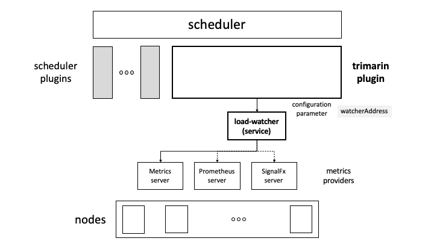

# Trimaran: Load-aware scheduling plugins

Trimaran is a collection of load-aware scheduler plugins described in [Trimaran: Real Load Aware Scheduling](https://github.com/kubernetes-sigs/scheduler-plugins/blob/master/kep/61-Trimaran-real-load-aware-scheduling).

Currently, the collection consists of the following plugins.

- `TargetLoadPacking`: Implements a packing policy up to a configured CPU utilization, then switches to a spreading policy among the hot nodes. (Supports CPU resource.)
- `LoadVariationRiskBalancing`: Equalizes the risk, defined as a combined measure of average utilization and variation in utilization, among nodes. (Supports CPU and memory resources.)
- `LowRiskOverCommitment`: Evaluates the performance risk of overcommitment and selects the node with lowest risk by taking into consideration (1) the resource limit values of pods (limit-aware) and (2) the actual load (utilization) on the nodes (load-aware). Thus, it provides a low risk environment for pods and alleviate issues with overcommitment, while allowing pods to use their limits.

The Trimaran plugins utilize a [load-watcher](https://github.com/paypal/load-watcher) to access resource utilization data via metrics providers. Currently, the `load-watcher` supports three metrics providers: [Kubernetes Metrics Server](https://github.com/kubernetes-sigs/metrics-server), [Prometheus Server](https://prometheus.io/), and [SignalFx](https://docs.signalfx.com/en/latest/integrations/agent/index.html).

There are two modes for a Trimaran plugin to use the `load-watcher`: as a service or as a library.

## load-watcher as a service

In this mode, the Trimaran plugin uses a deployed `load-watcher` service in the cluster as depicted in the figure below. A `watcherAddress` configuration parameter is required to define the `load-watcher` service endpoint. For example,

```yaml
watcherAddress: http://xxxx.svc.cluster.local:2020
```

Instructions on how to build and deploy the `load-watcher` can be found [here](https://github.com/paypal/load-watcher/blob/master/README.md). The `load-watcher` service may also be deployed in the same scheduler pod, following the tutorial [here](https://medium.com/paypal-engineering/real-load-aware-scheduling-in-kubernetes-with-trimaran-a8efe14d51e2).



## load-watcher as a library

In this mode, the Trimaran plugin embeds the  `load-watcher` as a library, which in turn accesses the configured metrics provider. In this case, we have three configuration parameters: `metricProvider.type`, `metricProvider.address` and `metricProvider.token`.


The configuration parameters should be set as follows.

- `metricProvider.type`: the type of the metrics provider
  - `KubernetesMetricsServer` (default)
  - `Prometheus`
  - `SignalFx`
- `metricProvider.address`: the address of the metrics provider endpoint, if needed. For the Kubernetes Metrics Server, this parameter may be ignored. For the Prometheus Server, an example setting is
  - `http://prometheus-k8s.monitoring.svc.cluster.local:9090`
- `metricProvider.token`: set only if an authentication token is needed to access the metrics provider.

The selection of the `load-watcher` mode is based on the existence of a `watcherAddress` parameter. If it is set, then the `load-watcher` is in the 'as a service' mode, otherwise it is in the 'as a library' mode.

In addition to the above configuration parameters, the Trimaran plugin may have its own specific parameters.

Following is an example scheduler configuration.

```yaml
apiVersion: kubescheduler.config.k8s.io/v1
kind: KubeSchedulerConfiguration
leaderElection:
  leaderElect: false
profiles:
- schedulerName: trimaran
  plugins:
    score:
      enabled:
       - name: LoadVariationRiskBalancing
  pluginConfig:
  - name: LoadVariationRiskBalancing
    args:
      metricProvider:
        type: Prometheus
        address: http://prometheus-k8s.monitoring.svc.cluster.local:9090
      safeVarianceMargin: 1
      safeVarianceSensitivity: 2
```

### Configure Prometheus Metric Provider under different environments

1. Invalid self-signed SSL connection error for the Prometheus metric queries
   The Prometheus metric queries may have invalid self-signed SSL connection error when the cluster environment disables the skipInsecureVerify option for HTTPs. In this case, you can configure `insecureSkipVerify: true` for `metricProvider` to skip the SSL verification.

   ```yaml
   args:
     metricProvider:
       type: Prometheus
       address: http://prometheus-k8s.monitoring.svc.cluster.local:9090
       insecureSkipVerify: true
    ```

2. OpenShift Prometheus authentication without tokens.
   The OpenShift clusters disallow non-verified clients to access its Prometheus metrics. To run the Trimaran plugin on OpenShift, you need to set an environment variable `ENABLE_OPENSHIFT_AUTH=true` for your trimaran scheduler deployment when run [load-watcher](https://github.com/paypal/load-watcher/blob/master/README.md) as a library.

## A note on multiple plugins

The Trimaran plugins have different, potentially conflicting, objectives. Thus, it is recommended not to enable them concurrently. As such, they are designed to each have its own load-watcher.
